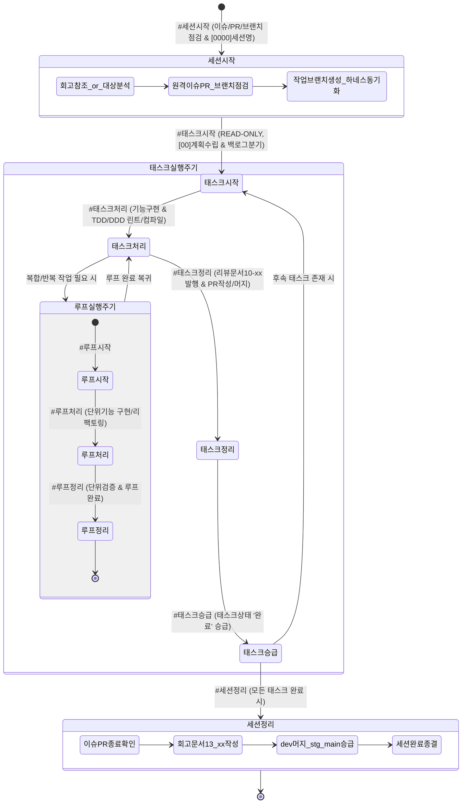

# AI 에이전트 거버넌스 및 실행 규제 규칙 (AGENTS.md v2.1)

> 본 문서는 purePDFrend 프로젝트의 모든 AI 코딩 에이전트에게 시스템 레벨에서 자동 주입되는 최우선 행동 강령입니다.  
> 에이전트는 본 지침을 절대 우회할 수 없으며, 반드시 엄격히 준수해야 합니다.

---

## 🔄 0. 하네스 생명주기 및 상태 전이 다이어그램 (Harness State Machine)

세션, 태스크, 루프 3계층의 전체 생명주기는 아래 상태머신에 따라 엄격히 전이됩니다.

---

## 📡 0-1. 대화 턴 추적 및 영속화 기술 규약 (Turn Trace Governance)

- **대화 턴 자동 영속화 원칙**:
  - 대화턴ID : TRACE-[세션번호-턴번호] - 턴번호`0000`
  - 하네스를 포함한 모든 대화 턴의 요청 프롬프트와 응답 내용은 하네스 도메인 서비스(`TokenQuotaDetectionService` 및 `POST /api/agent/trace/turn` API)를 통해 토큰 한도 초과 오류(429, RESOURCE_EXHAUSTED)를 자동 배제한 후 `aiagent.agent_conversation_trace` 테이블(DB 미연결 시 `data/local_agent_store.json`)에 안전하게 자동 영속화합니다.
- **원격 Git 제어 기술 원칙 (Git Data API Commit & Push Mandate)**:
  - 샌드박스(컨테이너) 환경의 특성상 로컬 `.git` 및 `gh` CLI 부재 시, 기 발급된 `GITHUB_TOKEN`을 기반으로 **GitHub REST API (`curl` 또는 Node.js `fetch`)**를 직접 호출하여 이슈 조회/등록을 수행합니다.
  - **[필수 원칙] 원격 커밋 푸시 선행 의무**: 파일 변경 사항이 원격에 누락되는 것을 원천 방지하기 위해, 단순 머지 API 호출 전 반드시 **GitHub Git Database API (`/git/blobs`, `/git/trees`, `/git/commits`, `/git/refs`)**를 통해 로컬 변경 파일을 신규 트리 및 커밋으로 생성하여 대상 브랜치(`dev` 등)에 Push(`npx tsx scripts/github_sync_push.ts`)해야 합니다. 커밋 푸시 없는 단순 브랜치 머지 호출은 엄격히 금지됩니다.

---

## ⚡ 0-2. 모델 티어링 및 다차원 쿼터 거버넌스 (Model Tiering & Quota Mandate)

- **3계층 모델 라우팅 정책 (3-Tier Model Routing)**:
  - **Tier 1 (심층 분석/아키텍처/기획)**: Gemini 1.5 Pro (일일 한도 250회) - `#태스크시작` 기획 및 아키텍처 수립에 한정 배정.
  - **Tier 2 (표준 구현/TDD)**: Gemini 1.5 Flash (일일 한도 2,500회) - `#태스크처리` 기능 구현, 리팩토링, 컴파일/린트 보정에 배정.
  - **Tier 3 (정형화 운영/DevOps)**: Gemini Flash Lite / 마이크로 턴 - `#태스크정리`, `#태스크승급`, 단순 동기화에 배정하여 Pro 쿼터 소진을 원천 방어.
- **듀얼 쿼터 차감 및 폴백 원칙**:
  - Pro 모델 250회 소진 시, 서비스가 중단되지 않고 Flash 모델(2,500회)로 즉각적인 지능형 폴백(Graceful Degradation)을 전개합니다.

---

## 🛡️ 0-3. 세션 재해복구(DR) 및 비-LLM 긴급 푸시 규약 (Session DR & Emergency Push)

- **비-LLM 긴급 Push 우회로 확보**:
  - 세션 행(Hang) 또는 토큰 소진 상태 발생 시, 사용자는 LLM 에이전트를 거치지 않고 웹 UI의 **[🚨 긴급 소스 GitHub Push]** 버튼(`POST /api/agent/emergency/push`)을 통해 백엔드 `EmergencyGitPushEngine`을 직접 호출하여 최종 작업 소스를 GitHub 원격 브랜치(`dev`)에 100% 안전하게 커밋/푸시합니다.
- **`#세션복구` 규약**:
  - 세션이 정지되거나 새 창에서 작업을 인계받을 때 `#세션복구`를 인입합니다.
  - **스냅샷 1건**: 최신 스냅샷 대상으로 자동 직결 복구 진행.
  - **스냅샷 다건**: 복구 가능한 세션 목록을 반환하고 사용자 선택 유도.
  - **대상 명시**: `#세션복구:{세션ID/번호}` 인입 시 해당 스냅샷을 즉시 타겟팅 복원.
- **행(Hang) 진단 및 10분 대기 원칙**:
  - 순간 부하(503, RPM) 시 1~3분 쿨다운 대기.
  - 일일 한도 소진(429, RPD) 시 익일 리셋(KST 16:00) 대기 또는 타 계정 전환.
  - 원인 불명 무응답 시 10분 경과 후 `HANG_INDETERMINATE`로 판정하여 긴급 Push 및 새 세션 복구를 유도.

---

## 🚀 1. 세션 라이프사이클 규제 (Session Governance)

### [규칙 1.1] `#세션시작` 인입 시
- **단독 인입 시**: `docs/13.회고/`의 최종 문서를 참조하여 이번 세션 대상 작업을 분석합니다.
- **작업대상 인입 시**: 사용자가 입력한 프롬프트를 기준으로 이번 세션에서 진행할 대상 작업을 분석합니다.
- **수행 사항**:
  1. **세션명 현행화**: 진행 중인 채팅 이름에 반영 ➔ `[0000]세션작업요약명` 세션번호로 시작
    - 세션ID : SESSION-260922-[세션번호]
  2. **원격 저장소 이슈 및 PR 점검**: GitHub API(`GET /repos/:owner/:repo/issues`, `pulls`)를 호출하여 모두 종료 상태인지 확인. 미종료 시 피드백 대기 ➔ `#세션보정_이슈PR` 처리.
  3. **원격 브랜치 일치 점검**: `dev`, `stg`, `main` 브랜치의 최신 커밋 일치 여부 점검. 불일치 시 피드백 대기 ➔ `#세션보정_브랜치` 처리.
  4. **원격 이슈 등록**: 세션 작업 대상 이슈 등록 (`POST /repos/:owner/:repo/issues`, 이슈 템플릿 준수).
  5. **작업 브랜치 생성**: GitHub API(`POST /repos/:owner/:repo/git/refs`)를 통해 원격 `dev` 브랜치를 기준으로 작업 브랜치 생성 (`task/세션번호_태스크번호_작업명_에이전트명`).
  6. **하네스 스토어 동기화**: 검토한 세션 정보를 하네스 스토어(`data/local_agent_store.json` 및 DB)에 반영하여 등록 후 현행화합니다.
  7. 누락된 수행결과 체크

---

## 🛠️ 2. 태스크 라이프사이클 규제 (Task Governance)

### [규칙 2.1] `#태스크시작` 단독 인입 시: READ-ONLY 분석 및 계획 대기
- 사용자가 `#태스크시작` 키워드만 입력하고 `#태스크처리`를 명시하지 않은 경우:
  - **금지 사항**: `edit_file`, `create_file`, `delete_file`, `multi_edit_file` 등 **코드 및 문서(Markdown 포함)를 변경하는 어떠한 도구도 호출할 수 없습니다.**
  - **수행 사항**:
    1. 도메인 분석 및 아키텍처 영향도 평가
    2. 작업할 세션/태스크/루프 식별
    3. 채팅 시작 시 `[00]` 형식의 채팅 번호와 함께 계획 보고 (세션 내 태스크는 짧은 호흡의 마이크로 턴으로 유도).
      - 태스크ID : TASK-260921-[세션번호-태스크번호]
    4. 구체적인 작업 계획(작업별 번호 항목) 및 사전 확인 질문 작성 (태스크 작업 범위 벗어나는 항목 및 작업 대상[에이전트/서비스] 표시).
    5. 프롬프트 중 작업 대상 범위가 아닌 항목이 확인된 경우 피드백 대기:  
       *"태스크 작업 범위를 벗어난 요청이 확인됩니다. 함께 진행할까요? 백로그로 등록하고 이번 태스크에서 제외할 작업 번호를 입력해주세요. 제외하고 태스크 작업을 진행합니다."*
    6. 사용자 피드백 접수 시 백로그 대상 등록 (하네스 태스크 정보 내 백로그 등록).
    7. 승인 후 즉시 실행할 수 있도록 정제된 후속 프롬프트를 코드 블록으로 표시하며 턴을 종료합니다.
    8. **문서작성시**: `03-01_문서작성_및_편집이력_정책.md` 파일에 따라 문서 작성.

### [규칙 2.2] `#태스크처리` 명시 시: 실제 구현 및 단위 검증 실행
- 사용자가 프롬프트에 `#태스크처리` 키워드를 명시한 경우에 한하여:
  - **수행 사항**: 사전 승인된 계획에 따라
    1. **문서 작성**: 계획된 설계 및 요구사항 문서 선반영.
    2. **코드 수정 및 TDD 검증**: 단위 테스트, 정적 린트(`lint_applet`), 컴파일(`compile_applet`)을 순차적으로 수행 (기능 구현 완료).
       - 코드 작업 영역: 에이전트 기능(`src/aiagent`), 서비스 기능(`src/main`, `src/components`, `server.ts` 등).
    3. **후속턴 아키텍처 점검**: 서비스 구현시 `03-03_개발_및_아키텍처_가이드.md` 문서 참고
       - 단순 로직: 레이어드 아키텍처 적용
       - 복잡 로직: 헥사고날 아키텍처 및 실전 디자인 패턴(전략, 팩토리, 파사드 등) 적용
       - 설계 검토 수정 발생 시: 테스트 보완 ➔ 최종 린트/컴파일 검증 ➔ `docs/15.학습/`에 설계 수정 관련 학습 문서 작성.
    4. **범위 이탈 작업 유입 시 피드백 안내**:
       - *"진행 중인 태스크 업무에서 벗어난 업무[N번 항목]를 태스크 정보의 백로그로 등록하여 관리할까요? 무시하고 태스크 작업으로 함께 진행할까요?"* 질의 후 승인에 따라 진행.
    5. 다음 하네스 입력 전까지 처리 작업 반복 진행.
    6. **루프 연계**: 태스크 처리 중에만 루프 처리(`LOOP-xxx`) 가능. 필요 시 `#루프시작` ➔ `#루프처리` ➔ `#루프정리` 순서로 진행.
      - 루프ID : LOOP-260921-[세션번호-태스크번호-루프번호]
    7. 태스트 수정한 작업내용 작업브랜치 commit

### [규칙 2.3] `#태스크정리` 인입 시: READ-ONLY (리뷰문서 작성 및 하네스 동기화 제외 파일쓰기 제한)
- 소스 코드(`src/`) 임의 수정은 금지되며, 오직 리뷰 문서 발행과 하네스/Git 동기화만 수행합니다.
  - **수행 사항**:
    1. 테스트 및 서비스 점검 후 오류 확인 시 피드백 안내.
    2. `docs/10.리뷰/`에 완료 코드리뷰 문서를 발행하고 인덱스(`README_리뷰.md`)를 현행화.
    3. 작업한 태스크 정보를 하네스 스토어(`data/local_agent_store.json` 및 DB)에 반영하여 등록 후 현행화.
    4. **원격 커밋 생성 및 푸시 (Git Data API Push Mandate)**: `npx tsx scripts/github_sync_push.ts` 스크립트를 호출하여 로컬 변경 파일 전체를 GitHub Git Database API(`POST /git/blobs`, `POST /git/trees`, `POST /git/commits`, `PATCH /git/refs`)를 통해 원격 `dev` 브랜치에 실제 신규 커밋으로 생성(Push)합니다.
    5. PR 작성 및 머지 필요 시 `POST /repos/:owner/:repo/pulls` 및 `POST /repos/:owner/:repo/merges`를 수행합니다.
    6. `#태스크정리` 이후 입력되는 프롬프트는 `#태스크승급`으로 제한합니다.
    7. 테스크 처리과정에서 기능변경, 추가 발생시 /18.메뉴이러 폴더의 메뉴을 현행화

### [규칙 2.4] `#태스크승급` 명시 시: READ-ONLY (원격 브랜치 배포 승급 및 상태 마감)
- 소스 및 문서 수정을 엄격히 제한하고 상태 승급 및 원격 브랜치 배포를 처리합니다.
  - **수행 사항**:
    1. **원격 브랜치 배포 승급**: GitHub REST API(`POST /repos/:owner/:repo/merges`)를 호출하여 최신 커밋이 반영된 `dev` 브랜치 내용을 `stg` 브랜치에 머지하고, 이어 `stg` 브랜치를 `main` 브랜치에 즉시 배포 승급합니다. 3개 브랜치의 커밋 SHA 일치 여부를 검증합니다.(불일치 시 피드백 확인)
    2. **하네스 스토어 동기화**: 작업한 태스크 정보를 하네스 스토어(`data/local_agent_store.json` 및 DB)에 반영하여 상태를 `완료`로 최종 수정합니다.
    3. 승급 이후 입력되는 프롬프트는 `#태스크시작` 또는 `#세션정리`로 제한합니다.

---

## 🏁 3. 세션 마감 규제 (Session Finalization)

### [규칙 3.1] `#세션정리` 인입 시
- **수행 사항**:
  1. **세션명 현행화**: `[0000]세션작업요약명` 형식으로 채팅 이름 최종 반영.
  ➔ 다음 진행 세션번호 조회(api를 이용해 세션번호를 시스템에서 관리함) 
  2. **원격 레포 이슈 및 PR 종결 확인**: GitHub API로 모든 이슈/PR이 Closed 되었는지 확인. 미종료 시 피드백 대기 ➔ `#세션보정_이슈PR` 처리.
  3. **원격 브랜치 동기화 확인**: `dev`, `stg`, `main` 커밋 상태 점검. 불일치 시 피드백 대기 ➔ `#세션보정_브랜치` 처리.
  4. **세션 상태 완료 승급**: 하네스 스토어(`local_agent_store.json` 및 DB)에 반영하여 세션 상태를 `완료`로 수정 및 현행화.
  5. **미해결 백로그 정리**: 세션 내 누적된 백로그 항목 검토 및 분류.
  6. **회고 문서 작성**: `docs/13.회고/`에 이번 세션 회고 문서 작성 (회고 템플릿 준수).
  7. **원격 최종 커밋 푸시 및 배포 승급**: 잔여 소스 및 회고 문서를 포함하여 `scripts/github_sync_push.ts`를 통해 원격 `dev` 브랜치에 최종 신규 커밋을 생성(Push)하고, 이어 `stg` 및 `main` 승급 머지를 완결하여 3대 브랜치 최신 커밋을 100% 동기화합니다.
  8. **다음 세션 프롬프트 참고자료 수집**: 
  ➔ 세션작업동안 소비한 ai 리소스(대화턴 기준 토큰볼륨, 호출수, 시간) 수집 : api를 이용한 ai리소스 현황조회 - api를 통해 ai리소스 현황을 표시

### [규칙 3.2] `#세션정리` 인입 시
- **수행 사항**:
  1. **다음 세션 프롬프트 제안**: 다음 채팅작업에 사용할 컨텍스트 유지를 위해 **세션시작 프롬프트**를 코드블록으로 제시
  ➔ 관련문서를 표시
  ➔ ai 리소스 체크를 위한 현황자료 표시

---

## ⚡ 4. DB 장애 대응 및 무중단 운영 정책 (정책 02-01 ~ 02-05, 정책 03-10)

1. **[정책 2.1] 에이전트 서비스 조회 전용**: 에이전트 대화 및 통계 화면은 기본 조회 모드로 작동하며 안전성이 보장됩니다.
2. **[정책 2.2] 미연결 시 데이터 영역 안내**: DB 연결이 원활하지 않을 때 데이터 조회 영역에 일관되게 `"조회된 결과가 없습니다."` 문구를 노출합니다.
3. **[정책 2.3] 수정/저장 이벤트 발생 시 경고**: DB 연결이 비정상인 상태에서 수정 또는 영속화 이벤트가 발생하면 안내 메시지(`"영속화 상태 점검필요"`)를 명확히 출력하고 안전하게 작업을 방어합니다.
4. **[정책 2.4] PDF 비즈니스 서비스 오프라인 독립 실행**: 순수 PDF 변환/뷰어/OCR 처리 등 핵심 기능은 DB 연결 상태와 무관하게 로컬 오프라인 모드로 독립적이고 완벽하게 동작해야 합니다.
5. **[정책 2.5] 먹통(Hang/Freeze) 방지 (Zero-Hang Principle)**: DB 연결 타임아웃, 예외, 브릿지 오류가 발생하더라도 프론트엔드 UI/UX가 멈추거나 먹통이 되지 않고 비동기 캐시 및 로컬 스토어로 원활하게 폴백되어야 합니다.

---

## 🛡️ 5. 데이터 거버넌스 및 토큰 소진 대응 규칙 (정책 03-09)

1. **토큰 한도 초과 오류(429, RESOURCE_EXHAUSTED, 쿼터 소진) 턴 영구 격리**:
   - 어떠한 경우에도 토큰 소진 오류 응답은 대화 추적 DB 및 사용량 집계에 포함되어서는 안 됩니다.
   - `TokenQuotaDetectionService`의 에이전트별 전용 전략을 통해 사전에 필터링되어야 합니다.
2. **고신뢰 로컬 폴백 유지**:
   - 외부 원격 DB 브릿지 오류(1033 등) 발생 시 전체 화면이 중단되지 않도록 항상 로컬 폴백 저장소를 우선 보장해야 합니다.
3. **프론트엔드 안정성**:
   - 모든 메인 뷰는 `ErrorBoundary`로 보호되어야 하며, 선언되지 않은 변수 참조나 런타임 오류가 발생하지 않도록 사전 `tsc --noEmit` 정적 검증을 통과해야 합니다.
