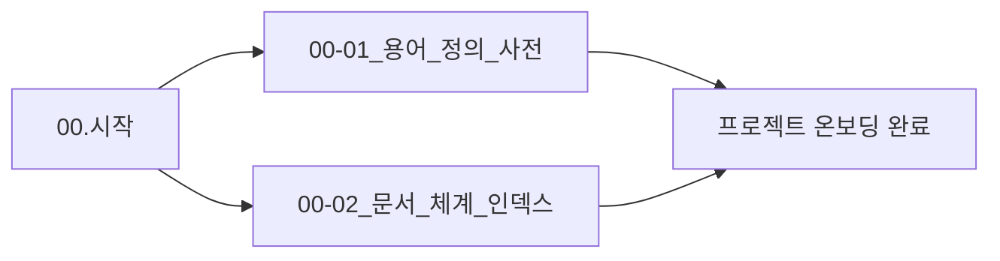

# 00. 시작 (Onboarding & Index) 요약 가이드

## 📋 폴더 개요
프로젝트에 처음 합류하는 작업자 및 AI 에이전트를 위한 시작 가이드, 핵심 용어 정의 및 전체 18대 문서 체계 인덱스를 제공합니다.

## 📑 하위 문서 목록
| 문서번호 | 파일명 | 문서 제목 | 주요 내용 요약 |
| :--- | :--- | :--- | :--- |
| `00-01` | `00-01_용어_정의_사전.md` | 용어 정의 & 커뮤니케이션 | 하네스 3계층(세션-태스크-루프) 및 PDF 스튜디오 핵심 도메인 용어 정의 |
| `00-02` | `00-02_문서_체계_인덱스.md` | 18대 기술문서 체계 인덱스 | 00.시작 ~ 17.참고에 이르는 전체 문서 분류 및 파일 현황 목록 |

