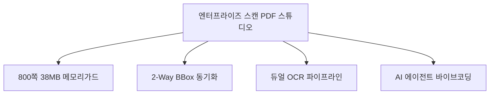

# 01. 프로젝트 (Project Overview) 요약 가이드

## 📋 폴더 개요
purePDFrend 프로젝트의 배경, 비전, 핵심 비즈니스 목표 및 엔터프라이즈 PDF 제작 스튜디오의 전체적인 범위를 다룹니다.

## 📑 하위 문서 목록
| 문서번호 | 파일명 | 문서 제목 | 주요 내용 요약 |
| :--- | :--- | :--- | :--- |
| `01-01` | `01-01_프로젝트_개요_및_범위.md` | 프로젝트 개요 및 범위 | 800쪽 대용량 가상화, 2-Way BBox, 듀얼 OCR, 바이브 코딩 하네스 비전 및 범위 |

