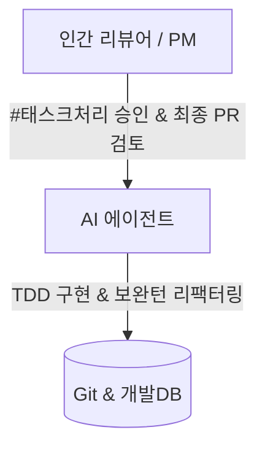

# 02. 조직 (Organization & Roles) 요약 가이드

## 📋 폴더 개요
인간 개발자(리뷰어)와 자율형 AI 에이전트 간의 역할 분담(R&R)과 거버넌스 체계를 정의합니다.

## 📑 하위 문서 목록
| 문서번호 | 파일명 | 문서 제목 | 주요 내용 요약 |
| :--- | :--- | :--- | :--- |
| `02-01` | `02-01_협업_조직_및_에이전트_역할_정의.md` | 협업 조직 및 에이전트 역할 정의 | 인간 리뷰어 승인 권한, 에이전트 자율 코딩 범위 및 감사 주체 |

