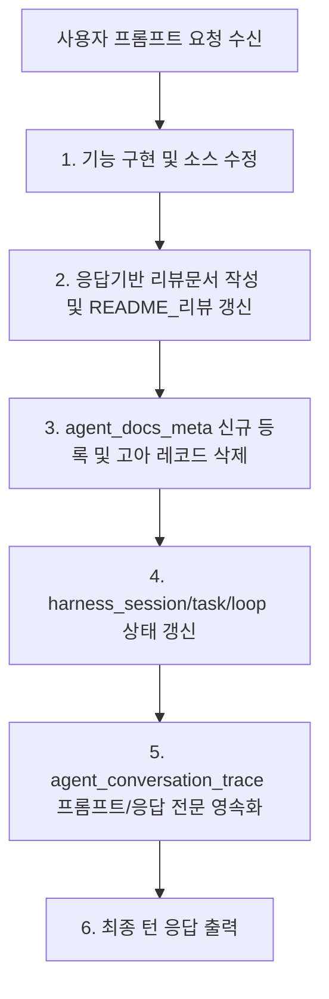

# 03-06. 매 턴 응답 자동 처리 및 보완턴 거버넌스 정책

## 📋 편집 이력 (Revision History)

| 버전 | 개정일자 | 개정자 | 작업 구분 | 주요 개정 내용 |
| :--- | :--- | :--- | :--- | :--- |
| v1.0 | 2026-09-17 | gemini | 최초 제정 | 매 턴 응답 필수 3대 자동처리(리뷰문서 작성/DB등록, 세션/태스크/루프 상태 갱신, 대화추적 등록) 및 실물 불일치 고아 문서 DB 자동 삭제 규정 수립 |
| v1.1 | 2026-09-17 | gemini | 규정 강화 | 매 턴 대화 100% 무누락 자동 저장 정책 강화(응답전문 마크다운 서식 100% 보존, response_summary 및 loop_id 필수화, 뷰어 서식 렌더링 규정), 18대 문서 doc_payload 본문(content) 전수 적재 및 PostgreSQL JSONB 검색 보장 규정 신설 |

---

## 1. 개요 및 목적
본 정책은 AI 에이전트가 사용자와의 대화 턴을 수행할 때, 응답 내용 및 개발 진행 결과가 누락 없이 거버넌스 문서와 개발 데이터베이스(`purepdfrend_dev`)에 실시간으로 반영되도록 보장하는 **절대 누락 불가(Zero-Loss)** 규정입니다.
매 세션, 매 턴마다 사용자 요청과 에이전트 응답 전문(Full Markdown), 문서 본문이 100% 보존되어 감사 및 뷰어 검색이 가능해야 합니다.

---

## 2. 매 턴 응답 시 필수 자동 처리 4대 원칙

모든 AI 에이전트는 사용자의 요청 프롬프트를 처리하고 응답을 생성할 때, 다음 4대 작업을 **반드시** 동시에 수행해야 합니다:

### 2.1 [원칙 1] 응답정보 기반 리뷰문서 실시간 작성 및 DB 등록
- **작성 위치**: `/docs/10.리뷰/`
- **파일명 체계**: `YYMMDD_순번_작업내용.md` (예: `260917_002_매턴응답_자동처리_및_고아문서정리_설계.md`)
- **필수 구성 항목**:
  1. 📌 리뷰 메타데이터 10대 항목 (제목, 일시, 작업자, 작업AI, 작업모델, 세션, 태스크, 작업내용, 리뷰내용, 이슈사항)
  2. 1. 구현 요약
  3. 2. 보완턴 6단계 프로세스 처리결과 표 (1단계~6단계 완료/생략/보완필요 명시)
  4. 3. DB 온전 반영 검증 결과 표 (문서 메타데이터, 대화 턴 추적, 하네스 상태 전이)
  5. 4. 종합 평가
- **DB 등록**: 작성된 리뷰문서는 즉시 SHA-256 해시를 산출하여 `aiagent.agent_docs_meta` 테이블에 등록/동기화한다.
- **폴더 요약 갱신**: `/docs/10.리뷰/README_리뷰.md`의 하위 문서 목록 표에도 신규 생성된 리뷰 문서를 즉시 등재한다.

### 2.2 [원칙 2] 세션, 태스크, 루프 상태 실시간 업데이트
- **하네스 3계층 생명주기 관리**:
  - `aiagent.harness_session_meta`: 현재 세션의 `updated_at`, `version`, `doc_payload` 갱신
  - `aiagent.harness_task_meta`: 진행 중인 태스크의 최근 활동 시간 및 작업 상태 갱신
  - `aiagent.harness_loop_meta`: 해당 턴에서 완결된 루프는 `status_cd = '완료'`, `ended_at = now()`로 상태 전이
- **작업그래프 일관성**: 작업그래프(`graphNodes`, `graphEdges`)에서 해당 노드의 상태가 실시간으로 일치하도록 유지한다.

### 2.3 [원칙 3] 매 턴 대화이력 100% 무누락 자동 저장 (서식 보존 및 전문 검색 보장)
- **대상 테이블**: `aiagent.agent_conversation_trace`
- **절대 원칙**: 매 세션마다 대화 턴이 한 건도 누락되지 않아야 하며, 응답 내용을 임의로 요약·축약하여 저장하는 행위를 엄격히 금지한다.
- **필수 기록 필드 규격**:
  - `trace_id`: 유니크 추적 키 (`TRACE-YYYYMMDD-NNN`)
  - `session_id`: 현재 세션 식별자 (`SESSION-YYYYMMDD-NNN`)
  - `task_id`: 현재 태스크 식별자 (`TASK-YYYYMMDD-NNN`)
  - `loop_id`: 매속된 루프 식별자 (`LOOP-YYYYMMDD-NNN`, 필수 연계)
  - `step_index`: 태스크 기준 턴 시퀀스 순번 (1부터 순차 증가)
  - `agent_name`: 실행 에이전트 명칭 (`gemini`)
  - `model_name`: 실행 모델 명칭 (`models/gemini-3.8-flash`)
  - `user_prompt`: 사용자 요청 원문 **전체 전문 (100% 원형 보존)**
  - `agent_response`: 에이전트 최종 응답 **전체 전문 (마크다운 표, JSON/SQL 코드블록, 체크리스트 표 등 서식 100% 보존)**
  - `response_summary`: 목록 뷰어 표시용 응답 1줄 요약
  - `prompt_tokens`, `completion_tokens`, `total_tokens`: 토큰 사용량
  - `created_at`: 기록 시각
- **뷰어 연동 규정**:
  - `AgentUsageViewer`(사용정보조회) 및 `TaskInfoManager`(작업정보관리)의 대화턴 모달에서 GFM 마크다운 표, 코드블록 서식을 온전히 렌더링해야 한다.
  - 검색창에서 요청 전문, 응답 전문 본문 키워드 검색이 즉시 지원되어야 한다.

### 2.4 [원칙 4] 18대 기술문서 doc_payload 본문(content) 전수 적재 및 PostgreSQL JSONB 검색 규정
- **대상 테이블**: `aiagent.agent_docs_meta`
- **본문 적재 의무**: `doc_payload` JSONB 객체 내부에 단순 크기/라인 메타데이터 외에 마크다운 파일의 전체 원문 텍스트를 `content` 키로 100% 온전히 적재한다:
  ```json
  {
    "folder": "10.리뷰",
    "fileName": "260917_007_대화턴_응답전문_저장_리뷰.md",
    "lines": 120,
    "size": 4520,
    "content": "# 마크다운 전체 본문...\n\n| 구분 | 내용 |...",
    "lastModified": "2026-09-17T09:40:00.000Z"
  }
  ```
- **PostgreSQL JSONB 검색 보장**:
  - `doc_payload->>'content' ILIKE '%키워드%'` 연산자를 사용하여 DB 본문 전문 검색 API(`/api/agent/docs/search-content`)가 상시 작동해야 한다.
  - 문서 거버넌스 관리자 UI에서 파일 메타데이터뿐 아니라 DB 본문 내용 검색 결과(`[본문 일치]`)가 실시간으로 하이라이트되어야 한다.

---

## 3. 실물 문서 불일치 고아 데이터(Orphan) 자동 정리 규정

문서 등록 초기화 이후 파일 이름 변경, 디렉터리 이동, 삭제 과정에서 발생한 잔류 DB 레코드는 시스템 정합성을 훼손하므로 다음과 같이 영구 삭제를 강제합니다:

1. **고아 레코드 판정 기준**:
   - `aiagent.agent_docs_meta`에 등록된 `file_path`에 해당하는 파일이 로컬 디스크 상에 `fs.existsSync(file_path) === false`인 경우.
2. **정리 주기 및 시점**:
   - 18대 문서 일괄 동기화(`/api/agent/docs/sync`) 시 자동으로 `DELETE FROM aiagent.agent_docs_meta WHERE file_path NOT IN (...)` 수행.
   - 고아 문서 전용 정리 엔드포인트(`/api/agent/docs/cleanup-orphans`)를 통해 언제든지 수동 또는 프로그래밍 방식으로 즉시 정화.
3. **무결성 보장**:
   - 디스크 상의 실제 물리 파일 수와 개발DB의 `agent_docs_meta` 레코드 수는 항상 1:1로 100% 일치해야 한다.

---

## 4. 보완턴 정책 이행 프로세스 다이어그램


