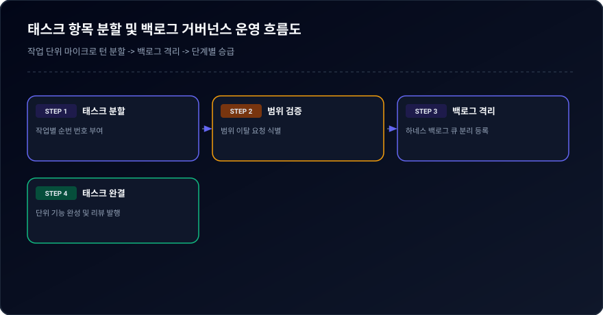
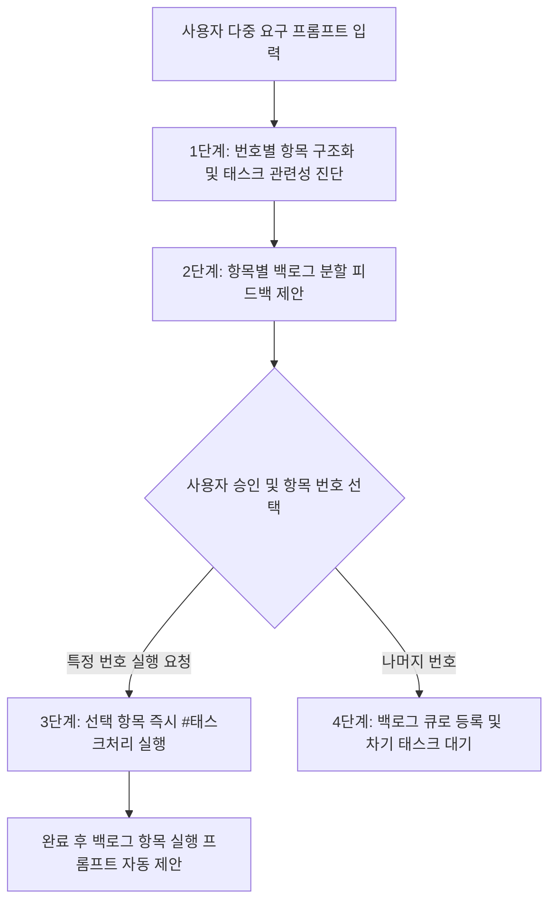

# 03-08. 태스크 항목분할 및 백로그 거버넌스 운영정책

## 📋 편집 이력 (Revision History)

| 작업일자 | 이슈 | 태스크 | 작업자 | 작업내용 | 사용 AI 모델명 | 에이전트 | 참고링크 |
| :--- | :--- | :--- | :--- | :--- | :--- | :--- | :--- |
| 2026-09-17 | #01 | TASK-001 | gemini | [v1.0] 최초 제정: 프롬프트 항목별 번호화 구조화, 피드백 기반 즉시 실행 및 백로그(Backlog) 분할 전환 거버넌스 운영정책 제정 | Gemini 2.5 Flash | Google AI Studio | [03-01. 문서 정책](../03.정책/03-01_문서작성_및_편집이력_정책.md) |
| 2026-09-21 | #14 | TASK-008 | gemini | v2.2 전면 개정: 8대 필드 편집이력, 상호 링크, 다이어그램 이미지화 및 DB 영속화 표준 반영 | Gemini 3.8 Flash | Google AI Studio | [03-01. 문서 정책](../03.정책/03-01_문서작성_및_편집이력_정책.md) |

---

## 1. 목적 및 배경

사용자의 프롬프트에 여러 요구사항이 포함되어 있을 때, 작업 범위가 불명확해지거나 장시간 반복 실행으로 통제력을 잃는 현상을 방지하기 위해 **프롬프트 항목 번호화 정리**, **해당 태스크 관련 여부 체크 및 백로그 피드백 수렴**, **선택 번호 즉시 실행 및 미선택 항목 백로그 자동 이관 프로세스**를 에이전트 표준 운영정책으로 규정합니다.

---

## 2. 4단계 항목분할 및 백로그 운영 프로세스

  
  
<em>[그림] 태스크 항목 분할 및 백로그 거버넌스 운영 흐름도</em>

### 2.1 [1단계] 번호별 항목 구조화 (Itemization)
- 사용자가 복수의 요구사항을 입력하면 에이전트는 계획 수립 단계에서 각 요구사항을 독립적인 번호(`1.`, `2.`, `1.1.`, ...)로 체계화하여 정리합니다.
- 각 항목별로 **태스크 관련 여부(직접 연관 / 독립 요구 / 부가 개선)**를 판별하여 명시합니다.

### 2.2 [2단계] 백로그 분할 피드백 수렴 (Feedback Loop)
- 에이전트는 정리된 항목에 대해 사용자에게 즉시 다음 질문을 제공합니다:
  > "이번 `#태스크처리`에서 즉시 실행할 항목 번호를 지정해 주시면, 나머지 항목은 안전하게 **[백로그(Backlog)]**로 분할 이관하여 다음 태스크에서 순차적으로 처리하겠습니다."
- 사용자가 직접 이번 턴에 진행할 항목을 통제할 수 있도록 선택권을 부여합니다.

### 2.3 [3단계] 선택 항목 즉시 실행 및 나머지 백로그 격리
- 사용자가 `#태스크처리`와 함께 항목 번호(예: `1번만 진행`, `1, 2번 처리`)를 지정하면, 에이전트는 선택된 항목만을 이번 루프의 실행 범위로 한정합니다.
- 선택되지 않은 항목은 즉시 **백로그(Backlog) 상태**로 전환되어 별도 큐(`harness_task_meta.doc_payload.backlog_items`)에 보존됩니다.

### 2.4 [4단계] 차기 태스크 자동 시작 연계
- 현재 태스크 처리가 완료되면 에이전트는 응답 하단의 **[다음작업 프롬프트]**에 백로그 항목 번호와 실행 명령어를 자동으로 기재하여, 사용자가 한 번의 복사-붙여넣기(`Next Prompt`)로 차기 태스크를 이어갈 수 있도록 지원합니다.

---

## 3. UI 및 상태머신 표준 규정

1. **테이블 헤더 정렬 3단계 순환 표준**:
   - 모든 목록 화면(`AgentUsageViewer`, `TaskInfoManager` 등)의 테이블 헤더는 클릭 시 `오름차순(asc) → 내림차순(desc) → 초기화(init)`의 3단계로 순환 정렬되어야 하며, 시각적인 정렬 화살표 아이콘을 표기합니다.
2. **헤더 고정(Sticky Header) 표준**:
   - 스크롤 시에도 테이블 헤더가 상단에 유지되도록 `sticky top-0 z-20` 및 불투명 배경색(`bg-slate-900`)을 일괄 적용합니다.
3. **대화 턴 100% 무누락 현행화**:
   - 매 턴마다 사용자 프롬프트, 에이전트 응답 전문, 요약본을 DB(`aiagent.agent_conversation_trace`)에 즉시 기록하며, 이번 세션의 전체 턴 이력을 항상 최신 상태로 유지합니다.
