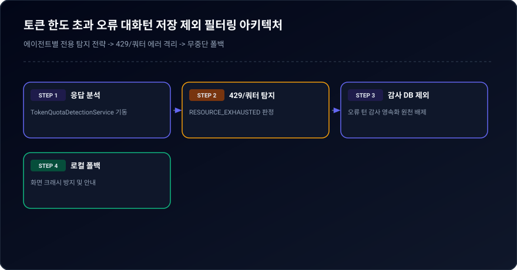
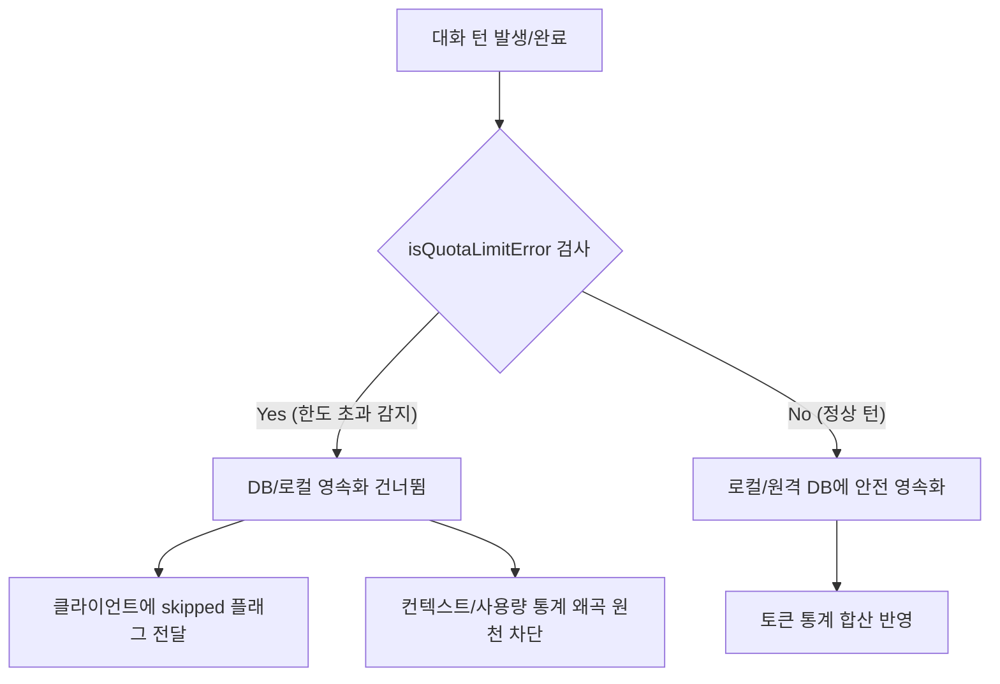

# 03-09. 토큰 한도 초과 대화 턴 저장 제외 및 에이전트 대응 정책

> **최초 작성일**: 2026-09-18  
> **최종 수정일**: 2026-09-18  
> **작성자**: gemini (AI Agent)  
> **문서 버전**: v1.0.0  
> **상태**: 승인 및 가동 (Approved & Active)

---

## 📝 1. 정책 목적 (Purpose)

LLM 및 AI 에이전트 서비스 운영 중 발생하는 **API Quota Exceeded / Rate Limit / Resource Exhausted (HTTP 429)** 오류 턴이 DB(PostgreSQL/SQLite)의 대화 추적 테이블(`agent_conversation_trace`) 및 분석 저장소에 무분별하게 적재되는 것을 방지합니다.  
본 정책을 통해:
1. 정상적인 대화 이력 및 컨텍스트의 오염 방지
2. 토큰 사용량 집계 시 무효/실패 요청으로 인한 메트릭 왜곡 차단
3. 상황 발생 시 에이전트가 예외를 우아하게 격리하고 사용자에게 명확하고 안정된 안내를 제공하는 행동 지침 표준화

---

## 📋 2. 토큰 한도 초과 감지 패턴 (Detection Patterns)

에이전트 백엔드(`server.ts`) 및 API 게이트웨이는 사용자 프롬프트(`user_prompt`), 에이전트 응답(`agent_response`), 응답 요약(`response_summary`)에 대해 다음 정규식 패턴을 실시간 검사합니다.

| 분류 | 패턴/키워드 (대소문자 무시) | 대표 발생 케이스 |
| :--- | :--- | :--- |
| **API 표준 오류** | `resource_exhausted`, `quota exceeded`, `rate-limit` | Google GenAI API Quota 소진 |
| **HTTP 코드** | `429 too many requests`, `exceeded your current quota` | 클라우드 엔드포인트 초당 요청 제한 |
| **도메인 오류** | `generativelanguage.googleapis.com.*quota` | Gemini API 특화 쿼터 소진 응답 |
| **한글 메시지** | `토큰 한도 초과`, `쿼터 초과`, `사용량 한도 초과` | 에이전트 내부 번역/시스템 에러 문구 |

---

## ⚙️ 3. 시스템 처리 및 거버넌스 규칙 (Rules)

<div align="center">
  
  <p><em>[그림] 토큰 한도 초과 오류 대화턴 저장 제외 필터링 아키텍처</em></p>
</div>



### 규칙 3.1: 저장 제외 (Zero Persistence)
- 토큰 한도 초과 오류로 판별된 턴은 `aiagent.agent_conversation_trace` 테이블 및 로컬 캐시 스토어(`local_agent_store.json`)의 `INSERT` / `UPDATE` 대상에서 **즉시 제외(Skip)**합니다.
- API 응답 구조:
  ```json
  {
    "success": true,
    "skipped": true,
    "reason": "TOKEN_LIMIT_QUOTA_EXCLUDED",
    "message": "토큰 한도 초과(Quota/Rate Limit Exceeded) 오류 턴은 거버넌스 정책(03-09)에 따라 저장 대상에서 자동 제외되었습니다."
  }
  ```

### 규칙 3.2: 사용량 통계 집계 격리 (Usage Isolation)
- `/api/agent/usage` 통계 산출 시 토큰 한도 초과 에러 턴은 집계 대상에서 제외합니다.
- 실패한 요청의 토큰 수가 전체 비용 메트릭을 왜곡시키지 않도록 보장합니다.

### 규칙 3.3: 기존 오류 턴 정제 지원 (Cleanup Routine)
- 이전 세션이나 일시적 장애 상황에서 기저장된 오류 턴은 `/api/agent/chat/traces/cleanup-quota-errors`를 통해 정기적으로 소각/정제합니다.

---

## 🤖 4. 상황 발생 시 에이전트 행동 지침 (Agent Action Protocol)

에이전트는 사용자 프롬프트 또는 모델 실행 중 한도 제한(429/Resource Exhausted)을 인지했을 때 다음과 같이 정형화된 대응을 수행합니다:

1. **불필요한 재시도 억제**:
   - 동일한 고부하 요청을 단시간 내에 연속 호출하지 않음
2. **명확하고 정중한 현황 안내**:
   - 현재 모델의 사용량 한도가 일시 도달했음을 사용자에게 알리고, 로컬 캐시 및 경량 모드로 전환되었음을 안내
3. **태스크 상태 보존**:
   - 작업 중이던 세션과 태스크의 진행 상태를 유실 없이 안전하게 유지하고, 복구 시점 이후 중단점부터 재개할 수 있도록 체크포인트를 기록

---

## 📜 5. 편집 이력 (Revision History)

| 버전 | 일자 | 작성자 | 변경 내용 |
| :--- | :--- | :--- | :--- |
| `v1.0.0` | 2026-09-18 | gemini | 최초 제정: 토큰 한도 초과 턴 저장 제외 및 에이전트 대응 정책 수립 |

---

## 📋 편집 이력 (Revision History)

| 작업일자 | 이슈 | 태스크 | 작업자 | 작업내용 | 사용 AI 모델명 | 에이전트 | 참고링크 |
| :--- | :--- | :--- | :--- | :--- | :--- | :--- | :--- |
| 2026-09-24 | #12 | TASK-0013 | gemini | 거버넌스 4대 ID 포맷 개선 및 18대 문서 체계 편집이력/다이어그램 표준화 | Gemini 1.5 Pro | Google Antigravity | [03-01. 문서 정책](../03.정책/03-01_문서작성_및_편집이력_정책.md) |
