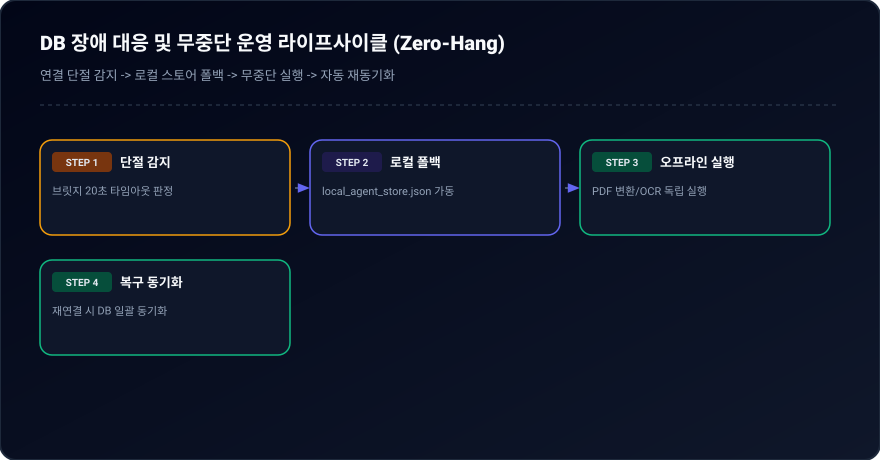
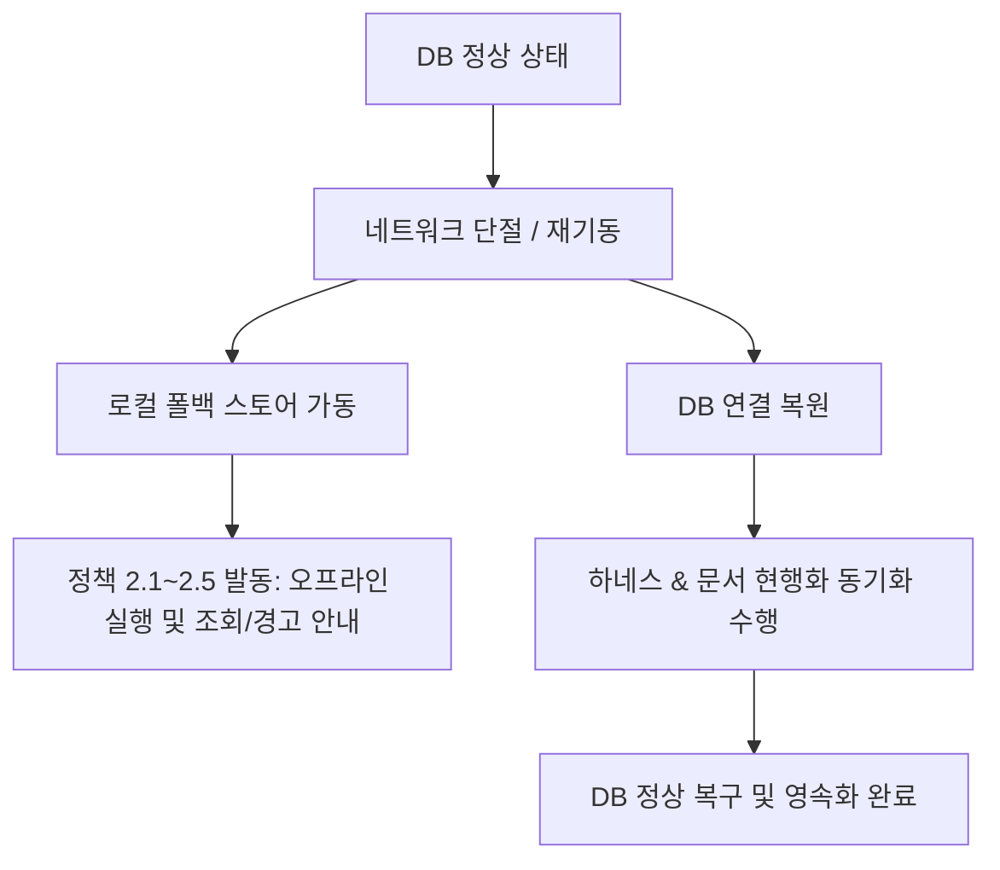

# 03-10. 데이터베이스 장애 대응 및 무중단 운영 정책 (DB Resilience & Offline Governance Policy)

> **정책 식별자**: POLICY-03-10  
> **최초 제정일**: 2026-09-20  
> **최종 개정일**: 2026-09-20 (v1.0.0)  
> **관리 책임**: purePDFrend 하네스 아키텍처 위원회 / Gemini AI 에이전트  
> **적용 범위**: 프론트엔드 UI/UX, 백엔드 API Gateway, 로컬 스토어 및 PostgreSQL DB
> - 관련 정책 문서:
>   - [03-01. 문서 작성 및 편집이력 관리 정책](../03.정책/03-01_문서작성_및_편집이력_정책.md)
>   - [03-13. UI/UX 디자인 시스템 운영 정책](../03.정책/03-13_UIUX_통일성_및_모바일반응형_디자인시스템_운영정책.md)
>   - [03-14. 모바일 반응형 디자인 가이드](../03.정책/03-14_모바일반응형_카드전환_및_가로스크롤_원천방지_디자인가이드.md)

---

## 📌 1. 제정 배경 및 목적

PostgreSQL 데이터베이스(로컬/원격 인스턴스)가 네트워크 단절, 호스트 머신 인터넷 연결 불안정 또는 재기동 등으로 일시적 연결 불가 상태가 되더라도, purePDFrend 시스템은 중단 없이 운영되어야 합니다.
본 정책은 DB 장애 시 사용자 화면의 일관된 안내 기준과 비즈니스 로직의 오프라인 무중단 실행 원칙을 명시합니다.

---

## 🛡️ 2. 5대 핵심 운영 정책 (정책 2.1 ~ 2.5)

### [정책 2.1] 에이전트 서비스 조회 전용 (Read-Only Safety)
- 에이전트 대화 및 하네스 관리 화면은 기본 조회 모드로 작동하며, 시스템 안정성을 최우선으로 보장합니다.

### [정책 2.2] 미연결 시 데이터 영역 안내 (`"조회된 결과가 없습니다."`)
- DB 연결이 원활하지 않거나 데이터가 없을 때, 데이터 테이블/목록/그리드 영역에 일관되게 `"조회된 결과가 없습니다."` 문구를 노출합니다.
- 부가적으로 DB 연결 상태 점검이 필요함을 안내합니다.

### [정책 2.3] 수정/저장 이벤트 발생 시 경고 (`"영속화 상태 점검필요"`)
- DB 연결이 비정상인 상태에서 수정, 저장, 동기화, 삭제 등 영속화 이벤트가 발생하면 사용자에게 `"영속화 상태 점검필요"` 경고 메시지를 명확히 출력하고 작업을 안전하게 차단/방어합니다.

### [정책 2.4] PDF 비즈니스 서비스 오프라인 독립 실행 (Offline Independence)
- 순수 PDF 변환, 문서 뷰어, 렌더링, 텍스트 추출, 로컬 OCR(Tesseract 등) 처리 등 핵심 PDF 비즈니스 서비스는 DB 연결 상태와 무관하게 로컬 오프라인 모드로 독립적이고 완벽하게 동작해야 합니다.

### [정책 2.5] 먹통(Hang/Freeze) 방지 (Zero-Hang Principle)
- DB 연결 타임아웃, 소켓 단절, 브릿지 오류가 발생하더라도 프론트엔드 UI/UX가 멈추거나 먹통(Freeze)이 되지 않고, 비동기 캐시 및 로컬 스토어로 원활하게 폴백되어야 합니다.

---

## 🔄 3. DB 장애 복구 및 현행화 라이프사이클

  
  
<em>[그림] DB 장애 대응 및 무중단 운영 라이프사이클 (Zero-Hang)</em>

---

## 📋 편집 이력 (Revision History)

| 작업일자 | 이슈 | 태스크 | 작업자 | 작업내용 | 사용 AI 모델명 | 에이전트 | 참고링크 |
| :--- | :--- | :--- | :--- | :--- | :--- | :--- | :--- |
| 2026-09-20 | #10 | TASK-005 | gemini | 최초 제정 및 도메인 거버넌스 수립 | Gemini 2.5 Flash | Google AI Studio | [03-01. 문서 정책](../03.정책/03-01_문서작성_및_편집이력_정책.md) |
| 2026-09-21 | #14 | TASK-008 | gemini | v2.2 전면 개정: 8대 필드 편집이력, 상호 링크, 다이어그램 이미지화 및 DB 영속화 표준 반영 | Gemini 3.8 Flash | Google AI Studio | [03-01. 문서 정책](../03.정책/03-01_문서작성_및_편집이력_정책.md) |
