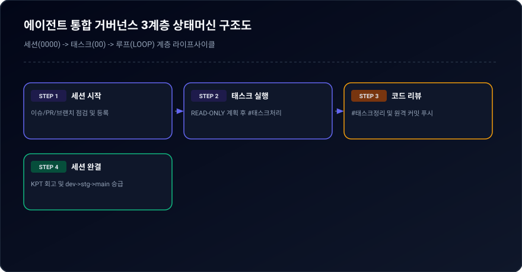
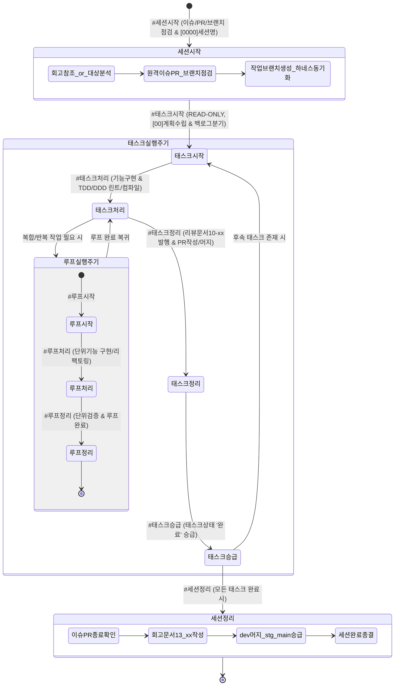

# 03-11. AI 에이전트 통합 거버넌스 및 실행 규제 정책 (AGENTS.md v2.1 Policy Standard)

> **정책 식별자**: POLICY-03-11  
> **최초 제정일**: 2026-09-20  
> **최종 개정일**: 2026-09-20 (v2.1.0)  
> **관리 책임**: purePDFrend 하네스 거버넌스 위원회 / Gemini AI 에이전트  
> **준거 표준**: AGENTS.md v2.1, GitHub REST API, TokenQuotaDetectionService

---

## 📌 1. 제정 배경 및 목적

AI 에이전트가 단독으로 코드를 임의 작성하거나 컨테이너 샌드박스의 한계(로컬 Git/CLI 부재)로 인해 작업이 중단되는 현상을 원천 방지하고, 세션 ➔ 태스크 ➔ 루프의 3계층 하네스 생명주기를 시스템 레벨에서 일관되게 규제하기 위해 본 정책을 제정합니다.

---

## 🔄 2. 3계층 하네스 상태머신 (State Machine)

  
  
<em>[그림] 에이전트 통합 거버넌스 3계층 상태머신 구조도</em>

---

## 🛡️ 3. 주요 규제 요약

1. **태스크 승급 시 원격 배포 (`dev` ➔ `stg` ➔ `main`)**: `#태스크승급` 수행 시 GitHub REST API를 호출하여 원격 `dev` 브랜치를 `stg`에 머지하고 즉시 `main` 브랜치에 배포 승급 처리.
2. **대화 턴 자동 영속화**: `TokenQuotaDetectionService` 및 `POST /api/agent/trace/turn`을 통해 429/쿼터 오류 배제 후 DB/스토어에 영속화.
3. **GitHub REST API 연동**: 로컬 `.git` 부재 샌드박스에서 `GITHUB_TOKEN`을 이용해 이슈/PR/머지 직접 제어.
4. **태스크 마이크로 턴 유도**: 세션/회고는 `[0000]`, 태스크는 `[00]` 채팅 식별 번호 사용.
5. **READ-ONLY 게이트**: `#태스크시작` 단독 인입 시 파일 수정 원천 차단.

---

## 📋 편집 이력 (Revision History)

| 작업일자 | 이슈 | 태스크 | 작업자 | 작업내용 | 사용 AI 모델명 | 에이전트 | 참고링크 |
| :--- | :--- | :--- | :--- | :--- | :--- | :--- | :--- |
| 2026-09-20 | #10 | TASK-005 | gemini | 최초 제정 및 도메인 거버넌스 수립 | Gemini 2.5 Flash | Google AI Studio | [03-01. 문서 정책](../03.정책/03-01_문서작성_및_편집이력_정책.md) |
| 2026-09-21 | #14 | TASK-008 | gemini | v2.2 전면 개정: 8대 필드 편집이력, 상호 링크, 다이어그램 이미지화 및 DB 영속화 표준 반영 | Gemini 3.8 Flash | Google AI Studio | [03-01. 문서 정책](../03.정책/03-01_문서작성_및_편집이력_정책.md) |
