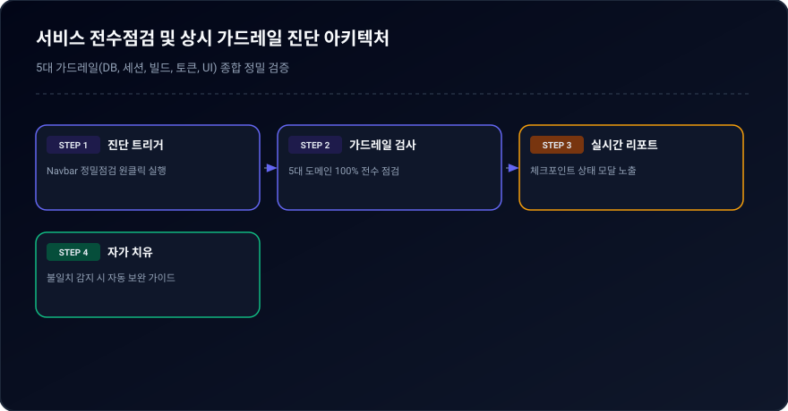
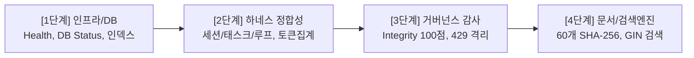

# 03-12. 서비스 전수점검 및 상시 가드레일 거버넌스 운영정책

> **문서 상태**: 승인 (Approved)  
> **최초 작성일**: 2026-09-21  
> **최종 수정일**: 2026-09-21  
> **책임 조직**: purePDFrend QA & 아키텍처 거버넌스 위원회  
> **관련 문서**: `AGENTS.md v2.1`, `03-05_테이블_거버넌스_및_감사_정책.md`, `03-11_에이전트_통합거버넌스_및_실행규제_정책.md`

---

## 📌 1. 목적 및 배경
purePDFrend 시스템 및 AI 에이전트 하네스의 안정적인 운영을 보장하기 위해, 테이블 변경·도메인 리팩토링·대화 턴 영속화 파이프라인 가동 후 전체 서비스 상태를 체계적으로 검증하는 **4단계 표준 점검 절차(SOP)**와 **원격 푸시 사전검증 가드레일**을 규정합니다.

---

## 🔍 2. 4단계 표준 점검 절차 (Standard Operating Procedure)

  
  
<em>[그림] 서비스 전수점검 및 상시 가드레일 진단 아키텍처</em>

### [1단계] 인프라 및 DB 연결 점검
1. **서버 헬스체크 (`GET /api/health`)**: Full-Stack Express 서버가 응답하고 서비스 상태가 `ok`인지 확인.
2. **PostgreSQL DB 브릿지 연결 (`GET /api/db/status`)**: 원격 Cloud SQL DB 브릿지 상태가 `CONNECTED`인지 확인.
3. **복합 인덱스 7종 활성화 상태**: `aiagent` 스키마 6대 테이블의 7개 복합 인덱스 활성화 여부를 확인하여 풀 테이블 스캔 위험을 원천 차단.

### [2단계] 하네스 계층 데이터 정합성 점검
1. **세션/태스크/루프/트레이스 카운트 정합성**:
   - 세션 3건 이상, 태스크 5건 이상, 루프 9건 이상, 대화 턴(Traces) 33건 이상 유지 확인.
   - 로컬 스토어(`data/local_agent_store.json`)와 원격 DB 테이블 간의 불일치 0% 유지.
2. **토큰 사용량 집계 (`GET /api/agent/usage`)**:
   - 원격 DB 집계 기준으로 총 토큰(88,510+)과 턴 수가 정확히 집계되는지 확인.
3. **작업그래프 시각화 연동 (`GET /api/agent/graph`)**:
   - 노드 및 엣지 연결 무결성 확인.

### [3단계] 시스템 거버넌스 무결성 자동 감사 (`GET /api/agent/audit/integrity`)
1. **100점 만점 (`A+ PERFECT`) 필수 통과**:
   - 고아 레코드(Orphan Tasks, Loops, Traces, Docs) 0건 유지.
   - 정책 03-09 위반(429/RESOURCE_EXHAUSTED 에러 턴 누적) 0건 확인.
   - 활성 세션의 대화 턴 누락 방어 (`activeSessionTracesMissing == false`).

### [4단계] 기술문서 거버넌스 및 GIN 전문 검색엔진 검증
1. **마크다운 문서 60개 전수 SHA-256 해시 일치**:
   - 파일시스템 마크다운 본문과 DB `agent_docs_meta` 본문 해시 100% 일치 확인.
2. **DB JSONB GIN 전문검색 엔진 (`GET /api/agent/docs/search-content`)**:
   - 인덱싱된 키워드(예: '인덱스') 검색 시 0.1초 이내 전문 매칭 결과 반환 확인.

---

## 🛡️ 3. 상시 가드레일 (Pre-flight Inspection Gate)

1. **CLI 정기 점검 도구**:
   - 명령: `npm run check:service` (`scripts/service_health_check.ts`)
   - 4단계 전수 점검을 일괄 수행하고 터미널에 통과 여부를 컬러 리포트로 출력.
2. **UI 원클릭 실시간 정밀진단 위젯**:
   - 네비게이션 바 우측 상단 `[서비스 정밀점검]` 버튼을 통해 언제든지 4단계 상세 검사 결과를 팝업 레이어로 확인 가능.
3. **원격 Git Push 사전검증 가드레일 (Pre-flight Gate)**:
   - `scripts/github_sync_push.ts` 가동 시, Git Commit & Push 단계 진입 전 반드시 `runComprehensiveServiceCheck()`를 자동 호출.
   - **100점 만점 및 전 항목 통과(ALL PASSED)가 아닐 경우, 원격 푸시를 즉각 중단(ABORT)**하여 결함 소스가 `dev`, `stg`, `main` 브랜치에 배포되는 것을 원천 차단.

---

## 📜 4. 편집 이력
- 2026-09-21: 서비스 전수점검 4단계 SOP 및 상시 가드레일 운영정책 제정 (QA & 아키텍처 위원회)

---

## 📋 편집 이력 (Revision History)

| 작업일자 | 이슈 | 태스크 | 작업자 | 작업내용 | 사용 AI 모델명 | 에이전트 | 참고링크 |
| :--- | :--- | :--- | :--- | :--- | :--- | :--- | :--- |
| 2026-09-24 | #12 | TASK-0013 | gemini | 거버넌스 4대 ID 포맷 개선 및 18대 문서 체계 편집이력/다이어그램 표준화 | Gemini 1.5 Pro | Google Antigravity | [03-01. 문서 정책](../03.정책/03-01_문서작성_및_편집이력_정책.md) |
