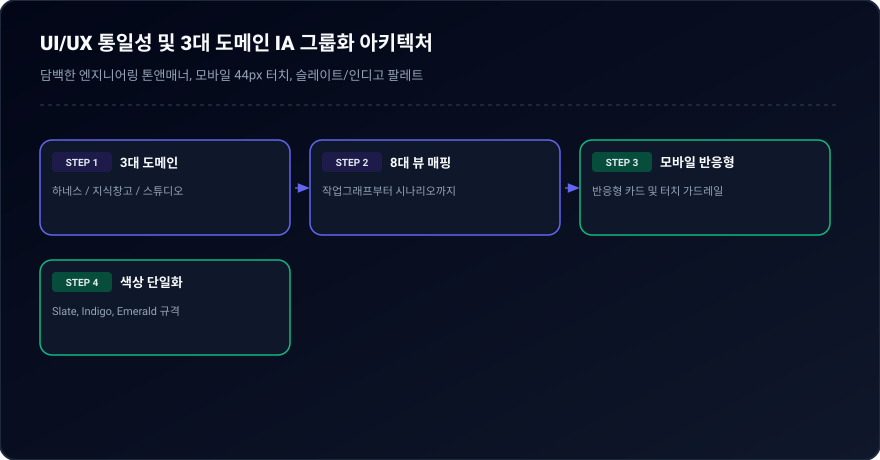
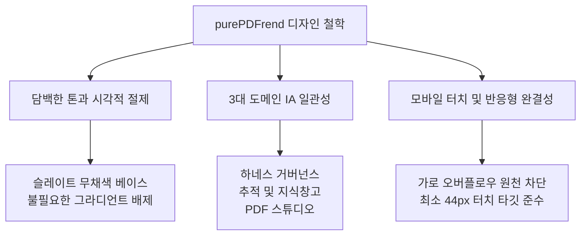

# 03-13. UI/UX 통일성 및 모바일 반응형 디자인 시스템 운영 정책

## 🎯 1. 목적 및 철학

본 문서는 purePDFrend 프로젝트의 프론트엔드 UI/UX 구축에 있어 **시각적 일관성, 담백한 신뢰감, 모바일 완결성**을 보장하기 위한 표준 정책입니다.
대용량 스캔 PDF와 OCR 교정, 에이전트 하네스를 다루는 엔지니어링 도구로서 화려한 장식이나 불필요한 시각적 효과를 배제하고, 정확한 데이터 인지와 오류 없는 인터랙션을 최우선으로 합니다.

<div align="center">
  
  <p><em>[그림] UI/UX 통일성 및 3대 도메인 IA 그룹화 아키텍처</em></p>
</div>



---

## 📱 2. 시각적 와이어프레임 구조 (Visual UI Wireframe)

### 2.1 데스크톱 레이아웃 (≥ 768px)

```text
+-------------------------------------------------------------------------------------------------------+
|  [purePDFrend 로고]  |  [하네스 거버넌스 ▼]   [추적/지식창고 ▼]   [PDF 스튜디오 ▼]  |  [DB정상]  [진단실행]  |
+-------------------------------------------------------------------------------------------------------+
|  ▶ 활성 도메인 퀵 바:  [작업그래프]  [태스크정보]  [에이전트통계]  [무결성감사]                              |
+-------------------------------------------------------------------------------------------------------+
|                                                                                                       |
|   +-- 메인 뷰 컨테이너 (max-w-7xl mx-auto, px-6 py-6) --------------------------------------------+   |
|   |  - 상단 요약 헤더 (타이틀, 상태 뱃지, 주요 액션 버튼)                                             |   |
|   |  - 데이터 카드 패널 (rounded-xl border border-slate-800 bg-slate-900/80 p-6)                   |   |
|   |  - 다이어그램 / 작업그래프 / 데이터 그리드 렌더링 영역                                            |   |
|   +-----------------------------------------------------------------------------------------------+   |
|                                                                                                       |
+-------------------------------------------------------------------------------------------------------+
```

### 2.2 모바일 레이아웃 및 우측 슬라이딩 드로어 (< 768px)

```text
+-------------------------------------------------------------+
|  [purePDFrend] [현재뷰뱃지]                 [☰ 햄버거(44px)]  | <- 상단 헤더 고정 (h-14)
+-------------------------------------------------------------+
|  [⚡그래프] [태스크] [통계] [감사] [문서] [설정] [OCR] [시나리오] | <- 가로 스와이프 퀵 칩 바 (h-11)
+-------------------------------------------------------------+
|                                                             |
|   +-- 모바일 뷰 컨테이너 (px-3 py-4 space-y-4) -----------+   |
|   |  - 뷰 헤더 (세로 스택, 텍스트 줄바꿈 방어)              |   |
|   |  - 모바일 맞춤 카드 패널 (p-4 rounded-xl)             |   |
|   |  +-- [가로 스크롤 방어 래퍼 (overflow-x-auto)] -----+ |   |
|   |  |   [광폭 데이터 테이블 / 차트 / 트레이스 목록]      | |   |
|   |  +--------------------------------------------------+ |   |
|   +-------------------------------------------------------+   |
|                                                             |
+-------------------------------------------------------------+
                  ▼ (햄버거 버튼 클릭 시 우측 드로어 슬라이딩)
+------------------------------------------------+------------+
|  우측 오프캔버스 슬라이딩 드로어 (w-72 bg-slate-900)   |  배경 딤   |
|  - [X 닫기 버튼 (44px)]                        |  (Dimmed)  |
|  - 1. 하네스 거버넌스 (그룹)                     |            |
|       * 작업그래프, 태스크정보, 에이전트통계, 무결성감사 |            |
|  - 2. 추적 및 지식창고                          |            |
|       * 문서거버넌스, 시스템설정                |            |
|  - 3. PDF 스튜디오                              |            |
|       * OCR엔진관리, 시나리오설계                |            |
|  - 하단: 서비스 전수진단 버튼 (44px) & DB 상태  |            |
+------------------------------------------------+------------+
```

---

## 🧭 3. 3대 도메인 8대 뷰 정보구조(IA) 거버넌스

모든 화면은 반드시 아래 정의된 3대 도메인 및 8대 뷰 ID 체계 내에 귀속되어야 하며, 임의의 중첩 하위 탭 생성을 금지합니다.

| 도메인 그룹 (`DomainGroupId`) | 뷰 ID (`ActiveViewId`) | 한글 명칭 | 주 관할 업무 및 컴포넌트 |
| :--- | :--- | :--- | :--- |
| **하네스 거버넌스** (`harness`) | `graph` | 작업그래프 | 세션-태스크-루프 실행 흐름 시각화 (`WorkGraphViewer`) |
| | `task` | 태스크 정보 | 태스크 생명주기, 백로그 분할/승급 관리 (`TaskInfoManager`) |
| | `usage` | 에이전트 통계 | 토큰 쿼터(429 분리) 및 턴 추적 (`AgentUsageViewer`) |
| | `audit` | 무결성 감사 | 100점 만점 3계층 무결성 감사 (`IntegrityAuditManager`) |
| **추적 및 지식창고** (`knowledge`) | `docs` | 문서 거버넌스 | 18대 문서 체계, SHA-256 해시, GIN 검색 (`DocsGovernanceManager`) |
| | `settings` | 시스템 설정 | DB 브릿지 연결 상태, 시스템 프로필 (`SystemSettingsView`) |
| **PDF 스튜디오** (`studio`) | `ocr` | OCR 엔진 관리 | Tesseract WASM vs Gemini 듀얼 엔진 설정 (`OcrEngineManager`) |
| | `scenarios` | 시나리오 설계 | PDF 변환/교정/출력 자동화 파이프라인 (`ScenarioDesignView`) |

---

## 📐 4. 5대 표준 오브젝트 사양

### [규칙 4.1] OBJ-01: 글로벌 네비게이션 (`Navbar.tsx`)
- 데스크톱: `h-16 px-6`, 3대 도메인 세그먼트 및 하위 뷰 접근, 우측 상단 DB/진단 뱃지.
- 모바일: `h-14 px-4` 상단 바 + `h-11` 가로 스와이프 퀵 칩 바 + `w-72` 우측 슬라이딩 드로어.
- 햄버거 메뉴 버튼: **최소 44px × 44px 터치 영역 보장**.

### [규칙 4.2] OBJ-02: 표준 카드 패널 (`CardPanel`)
- 패딩: 데스크톱 `p-6`, 모바일 `p-4` 통일.
- 모서리 반경: `rounded-xl` (12px), 내부 자식 요소는 `rounded-lg` (8px).
- 테두리: `border border-slate-800 bg-slate-900/80 backdrop-blur-xs`.

### [규칙 4.3] OBJ-03: 액션 버튼 (`Button`)
- 모바일 최소 규격: `min-h-[44px] min-w-[44px] px-4 py-2.5`.
- 데스크톱: `h-9 px-3.5 py-1.5 text-xs font-semibold rounded-lg`.
- 가로 패딩은 세로 패딩의 1.5~2배 유지.

### [규칙 4.4] OBJ-04: 상태 뱃지 (`BadgePill`)
- `h-6 px-2.5 text-xs rounded-full whitespace-nowrap` 단일 라인 표기.
- 텍스트 중간 줄바꿈이나 하이픈 분리 절대 금지.

### [규칙 4.5] OBJ-05: 반응형 가로스크롤 래퍼 (`ScrollWrapper`)
- 광폭 데이터(테이블, 그래프, 로그 목록)는 부모 컨테이너를 절대 밀어내지 않도록 `w-full overflow-x-auto -webkit-overflow-scrolling-touch` 클래스로 격리.

---

## ⚡ 5. 가드레일 및 검증 기준

1. **가로 스크롤(Overflow-x) 0건 가드레일**:
   - 모바일 뷰포트(360px ~ 768px)에서 페이지 전체 가로 스크롤 발생 시 빌드 및 배포 불가.
2. **터치 타깃 44px 전수 검증**:
   - 모바일 상단 햄버거, 닫기 버튼, 퀵 칩, 주요 액션 버튼의 터치 바운딩 박스가 44px 미만일 경우 즉시 수정.
3. **무결성 감사 100점 연동**:
   - UI 개편 후에도 `npm run check:service`의 4단계 가드레일 전 항목 통과(A+ PERFECT)를 필수 조건으로 함.

---

## 📋 편집 이력 (Revision History)

| 작업일자 | 이슈 | 태스크 | 작업자 | 작업내용 | 사용 AI 모델명 | 에이전트 | 참고링크 |
| :--- | :--- | :--- | :--- | :--- | :--- | :--- | :--- |
| 2026-09-21 | #01 | TASK-001 | gemini | [v1.0] 최초 제정: 3대 도메인 8대 뷰 IA 규격, 모바일 44px 터치 가드레일, 5대 표준 오브젝트 규격 정의 | Gemini 2.5 Flash | Google AI Studio | [03-01. 문서 정책](../03.정책/03-01_문서작성_및_편집이력_정책.md) |
| 2026-09-21 | #14 | TASK-008 | gemini | v2.2 전면 개정: 8대 필드 편집이력, 상호 링크, 다이어그램 이미지화 및 DB 영속화 표준 반영 | Gemini 3.8 Flash | Google AI Studio | [03-01. 문서 정책](../03.정책/03-01_문서작성_및_편집이력_정책.md) |
