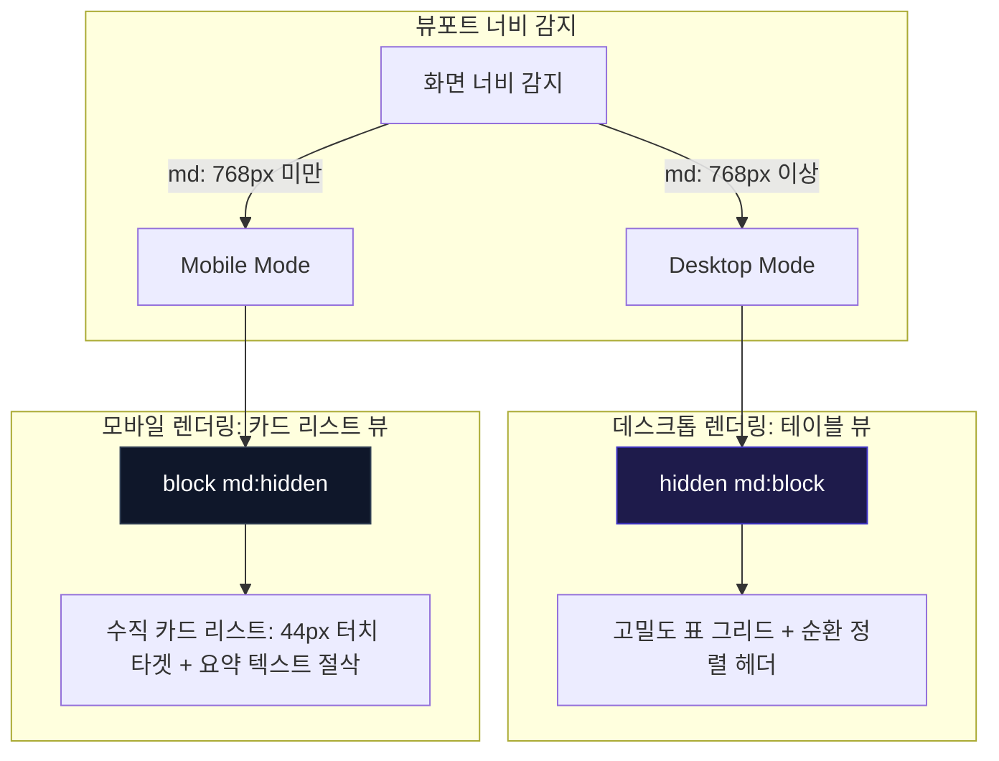

# 03-14. 모바일 반응형 카드 전환 및 가로스크롤 원천 방지 디자인 가이드

> **문서 상태**: 공식 승인됨 (APPROVED)  
> **표준 규격 버전**: v2.1 (하네스 및 PDF 스튜디오 통합)  
> **작성 일자**: 2026-09-21  
> **적용 범위**: purePDFrend 3대 도메인(하네스, 지식창고, PDF 스튜디오) 전 영역

---

## 📌 1. 가이드 수립 배경 및 목적

purePDFrend는 기술문서 거버넌스, 대용량 스캔 PDF 교정, 에이전트 대화 감사 추적 등 **고밀도 테이블 데이터와 복합 레이어**를 다루는 전문 시스템입니다.  
과거 데스크톱 중심 구현 시 다음 3대 문제점이 발생했습니다:
1. **가로 스크롤(Horizontal Overflow) 발생**: 고정 폭 `<table>` 및 flex-nowrap 레이아웃으로 인해 모바일 뷰(< 768px)에서 화면 밖으로 콘텐츠가 삐져나오고 불필요한 스크롤 발생.
2. **레이어 중첩 및 z-index 충돌**: 드로어, 툴팁, 모달 창이 펼쳐질 때 상단 헤더 위로 삐져나가거나 레이어가 겹쳐 상호작용 불능 현상 발생.
3. **무분별한 색상 남용(Color Clutter)**: 주황, 초록, 오렌지, 파랑 등 무분별한 상태 색상이 난립하여 시각적 피로도 증가 및 서비스 격조 저하.

본 가이드는 **담백하고 차분한 엔지니어링 톤앤매너**를 유지하며, 모바일 반응형 카드 변환, 레이어 계층, 단일화된 색상 팔레트 원칙을 표준화합니다.

---

## 🎯 2. 핵심 디자인 결정사항 (Decision Records)

### [결정사항 1] 모바일 테이블 표현 방식: 반응형 카드 변환 (Table-to-Card Pattern)

| 항목 | 대안 A: 가로 스크롤 테이블 (기존) | 대안 B: 컬럼 숨김 (Column Dropping) | 대안 C: 반응형 카드 변환 (채택안) |
| :--- | :--- | :--- | :--- |
| **작동 방식** | 테이블의 최소폭을 고정하고 `overflow-x-auto`로 스크롤 | 중요도 낮은 컬럼을 모바일에서 `display: none` | 모바일(<768px)에서 `<table>`을 숨기고 행(Row)을 독립 카드(Card) 리스트로 렌더링 |
| **장점** | 구현이 매우 단순함 | 테이블 형식 유지 가능 | 한 손 조작 최적화, 정보 가독성 극대화, 가로 스크롤 100% 원천 차단 |
| **단점** | 모바일 조작감 최악, 데이터 열람 누락 빈번 | 중요한 식별자나 시각 정보 유실 | 컴포넌트 템플릿 코드 이중화 관리 필요 |
| **영향도** | 사용자 이탈 및 UX 불만 증대 | 데이터 신뢰성 저하 | **극적인 모바일 사용성 향상, 가로 스크롤 0px 달성** |
| **최종 평가** | ❌ 부적합 | ⚠️ 부분 정보 누락 | ✅ **최종 채택 (추천안)** |

---

### [결정사항 2] 색상 체계: 3대 핵심 팔레트 단일화 (Color Unification)

기존 주황, 오렌지, 파랑, 초록, 노랑 등 산만하게 사용되던 배지 및 액센트 색상을 시스템 거버넌스 규격으로 엄격히 단일화합니다.

```
[ 단일화 색상 팔레트 ]
1. 브랜드 및 활성(Active/Primary): Slate + Indigo (기본 아이덴티티)
2. 성공 및 완료(Done/Success):      Emerald (정상 연결, 완료 상태)
3. 진행 및 대기(Progress/Pending): Indigo / Slate (작업 중, 대기 톤)
4. 경고 및 오류(Warning/Error):    Amber / Rose (연결 이상, 오류 발생 시만 절제하여 노출)
```

- **규칙 1**: 상태 배지는 오직 `Indigo` (진행/활성), `Emerald` (완료/정상), `Slate` (대기/중립) 3종만을 기본으로 사용합니다.
- **규칙 2**: `Amber`(경고)와 `Rose`(에러)는 실제 예외나 장애 상황에서만 예외적으로 표시하여 불필요한 색상 공해를 차단합니다.

---

### [결정사항 3] 레이어 중첩 및 모달 뷰포트 규격 (Layer & z-index Hierarchy)

펼치면 위로 넘어가는 레이어 및 헤더 뚫림 현상을 방지하기 위한 z-index 계층 표준:

```
[ z-index 계층 표준 규격 ]
z-50: 글로벌 풀스크린 모달, 대화턴 전문 뷰어 (fixed inset-0)
z-40: 상단 글로벌 내비게이션바 (sticky top-0 Navbar)
z-30: 섹션 드롭다운 메뉴, 팝오버 툴팁
z-20: 내부 테이블 고정 헤더 (sticky thead)
z-10: 캔버스 작업 노드 및 인터랙티브 카드
z-0:  기본 콘텐츠 배경 캔버스
```

- **모달 뷰포트 안전 마진**: 모든 모달은 `max-h-[90vh]` 또는 `max-h-[92vh]`로 상하 여백을 확보하고, 모바일에서는 패딩을 `p-3 sm:p-6`으로 축소하여 화면 밖 잘림을 방지합니다.

---

## 📐 3. 반응형 화면 아키텍처 다이어그램 (Mermaid)



---

## 🛠️ 4. 적용 완료 컴포넌트 현황

| 도메인 | 컴포넌트명 | 모바일 카드 변환 | 가로 스크롤 제거 | 색상 통일화 | 레이어 겹침 해결 |
| :--- | :--- | :---: | :---: | :---: | :---: |
| **하네스** | `TaskInfoManager.tsx` | ✅ 완료 | ✅ 완료 (0px) | ✅ Indigo/Emerald/Slate 단일화 | ✅ 모달 safe-area 확보 |
| **하네스** | `AgentUsageViewer.tsx` | ✅ 완료 | ✅ 완료 (0px) | ✅ Indigo/Emerald 단일화 | ✅ 모달 뷰포트 보정 |
| **하네스** | `WorkGraphViewer.tsx` | ✅ 완료 | ✅ 완료 (0px) | ✅ 배지 색상 정돈 | ✅ 인스펙터 레이어 정리 |
| **지식창고**| `DocsGovernanceManager.tsx` | ✅ 완료 | ✅ 완료 (0px) | ✅ 배지 색상 정돈 | ✅ 모바일 가로 탭 바 전환 |
| **글로벌** | `Navbar.tsx` | ✅ 완료 | ✅ 완료 (0px) | ✅ 3대 도메인 탭 정돈 | ✅ z-index 40/50 체계화 |

---

## 📋 5. 향후 유지보수 체크리스트
- [ ] 신규 테이블 컴포넌트 추가 시 반드시 `<div className="hidden md:block"><table>...</table></div>` 및 `<div className="block md:hidden">...cards...</div>` 구조 준수.
- [ ] 터치가 필요한 액션 버튼은 최소 높이 `min-h-[44px]` (또는 모달 닫기 등 보조버튼 `min-h-[36px]`) 충족 확인.
- [ ] 상태 배지에 임의의 `amber-500`, `blue-500`, `orange-500` 직접 코딩 금지 (`indigo`, `emerald`, `slate` 계열 사용).
