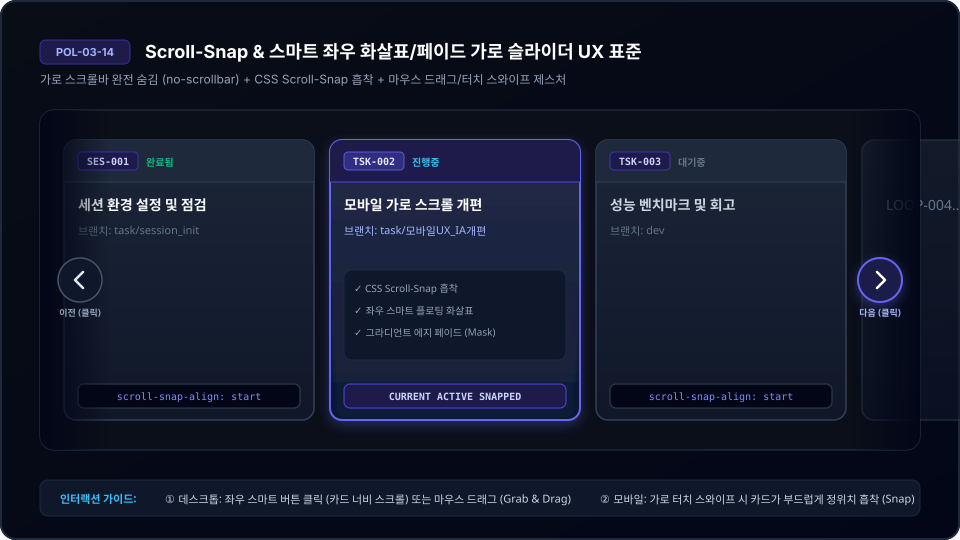
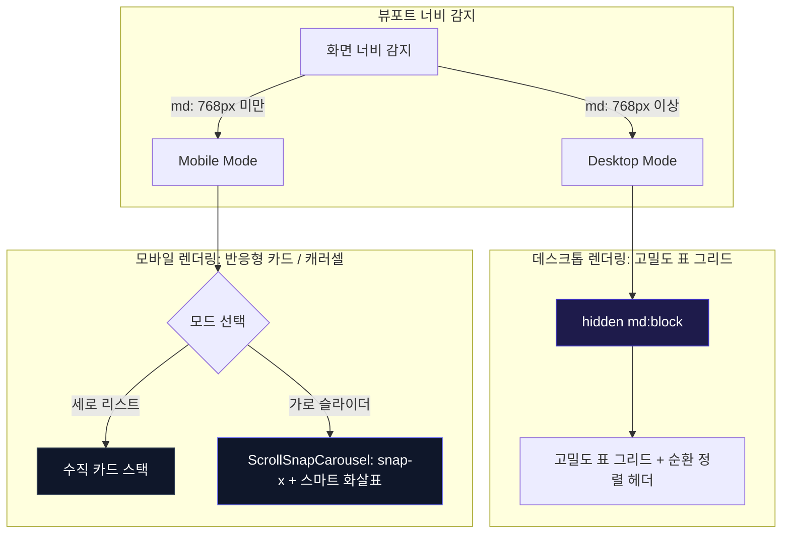

# 03-14. 모바일 반응형 카드 전환 및 가로스크롤 원천 방지 디자인 가이드

> **문서 상태**: 공식 승인됨 (APPROVED)  
> **표준 규격 버전**: v2.2 (Scroll-Snap 스마트 캐러셀 및 제스처 인터랙션 표준화)  
> **최근 개정일**: 2026-09-21  
> **적용 범위**: purePDFrend 3대 도메인(하네스, 지식창고, PDF 스튜디오) 전 영역  
> **관련 정책 문서**:  
> - [03-01. 문서 작성 및 편집이력 관리 정책](./03-01_문서작성_및_편집이력_정책.md)  
> - [03-09. 데이터 거버넌스 및 토큰 소진 대응 규칙](./03-09_데이터_거버넌스_및_토큰_소진_대응_정책.md)  
> - [03-10. DB 장애 대응 및 무중단 운영 정책](./03-10_DB장애_대응_및_무중단_운영_정책.md)  
> - [03-13. 대화내역 추적 영속화 아키텍처 규약](./03-13_대화내역_추적_영속화_아키텍처_규약.md)

---

## 📌 1. 가이드 수립 배경 및 목적

purePDFrend는 기술문서 거버넌스, 대용량 스캔 PDF 교정, 에이전트 대화 감사 추적 등 **고밀도 테이블 데이터와 복합 레이어**를 다루는 전문 시스템입니다.  
과거 데스크톱 중심 구현 시 다음 4대 문제점이 발생했습니다:
1. **가로 스크롤(Horizontal Overflow) 발생**: 고정 폭 `<table>` 및 `flex-nowrap` 레이아웃으로 인해 모바일 뷰(< 768px)에서 화면 밖으로 콘텐츠가 삐져나오고 둔탁한 네이티브 스크롤바가 레이아웃을 훼손.
2. **스크롤 어포던스 결여**: 단순 `overflow-hidden`이나 숨김 처리 시 우측에 추가 콘텐츠가 존재하는지 인지하기 어려워 핵심 기능 열람 누락 발생.
3. **레이어 중첩 및 z-index 충돌**: 드로어, 툴팁, 모달 창이 펼쳐질 때 상단 헤더 위로 삐져나가거나 레이어가 겹쳐 상호작용 불능 현상 발생.
4. **무분별한 색상 남용(Color Clutter)**: 주황, 초록, 오렌지, 파랑 등 무분별한 상태 색상이 난립하여 시각적 피로도 증가 및 서비스 격조 저하.

본 가이드는 **담백하고 차분한 엔지니어링 톤앤매너**를 유지하며, 모바일 반응형 카드 변환, Scroll-Snap 기반 제스처 캐러셀, 레이어 계층, 단일화된 색상 팔레트 원칙을 표준화합니다.

---

## 🎯 2. 핵심 디자인 결정사항 (Decision Records)

### [결정사항 1] 모바일 테이블 표현 방식: 반응형 카드 변환 (Table-to-Card Pattern)

| 항목 | 대안 A: 가로 스크롤 테이블 (기존) | 대안 B: 컬럼 숨김 (Column Dropping) | 대안 C: 반응형 카드 변환 (채택안) |
| :--- | :--- | :--- | :--- |
| **작동 방식** | 테이블의 최소폭을 고정하고 `overflow-x-auto`로 스크롤 | 중요도 낮은 컬럼을 모바일에서 `display: none` | 모바일(<768px)에서 `<table>`을 숨기고 행(Row)을 독립 카드(Card) 리스트로 렌더링 |
| **장점** | 구현이 매우 단순함 | 테이블 형식 유지 가능 | 한 손 조작 최적화, 정보 가독성 극대화, 가로 스크롤 100% 원천 차단 |
| **단점** | 모바일 조작감 최악, 데이터 열람 누락 빈번 | 중요한 식별자나 시각 정보 유실 | 컴포넌트 템플릿 코드 이중화 관리 필요 |
| **영향도** | 사용자 이탈 및 UX 불만 증대 | 데이터 신뢰성 저하 | **극적인 모바일 사용성 향상, 가로 스크롤 0px 달성** |
| **최종 평가** | ❌ 부적합 | ⚠️ 부분 정보 누락 | ✅ **최종 채택 (추천안)** |

---

### [결정사항 2] 가로 연속 콘텐츠 탐색: Scroll-Snap 마그네틱 슬라이드 (Magnetic Slide Interaction)

가로 슬라이드나 다중 칩 탭 바 등 가로 배치가 불가피한 영역에서 둔탁한 OS 네이티브 스크롤바와 영역을 침범하는 거추장스러운 고정 화살표 버튼을 배제하고, 마우스 드래그와 모바일 터치 스와이프 및 마그네틱 흡착(Scroll-Snap)을 지원하는 스마트 슬라이드 인터랙션으로 통일합니다.

| 비교 항목 | 대안 1: 네이티브 스크롤바 | 대안 2: 고정 화살표 버튼 (기각) | 대안 3: 마그네틱 슬라이드 + 스마트 페이드 (채택안) |
| :--- | :--- | :--- | :--- |
| **스크롤바/버튼 노출** | OS 기본 두꺼운 스크롤바 노출 | 40px 거대 버튼이 콘텐츠를 침범/가림 | **화살표 배제, 스크롤바 완전 숨김 (`no-scrollbar`)** |
| **정렬 흡착** | 자유 스크롤 (카드 잘림 빈번) | 이동 단계가 부자연스러움 | **CSS Scroll-Snap (`snap-x snap-mandatory`, 카드별 `snap-start`)** |
| **시각적 어포던스** | 투박한 스크롤바로만 유추 | 화살표 버튼이 상시 노출되어 가림 | **끝단 도달 시 완전 숨김 처리되는 은은한 그라디언트 에지 페이드** |
| **제스처 제어** | 마우스 휠 또는 작은 바 클릭 | 버튼 클릭에만 과도하게 의존 | **모바일 터치 스와이프 + PC 마우스 Grab & Drag 제스처 통일** |
| **버튼/칩 스타일** | 기본 브라우저 처리 | 과도한 아이콘과 여백으로 찝힘 발생 | **아이콘 배제, 작업그래프 계층 탭 스타일(`rounded-lg`) 텍스트 칩** |
| **최종 평가** | ❌ 디자인 격조 저하 | ❌ 버튼 가림 및 공간 낭비 | ✅ **최종 채택 (`ScrollSnapCarousel` 슬라이드 단일화 표준)** |

---

### [결정사항 3] 색상 체계: 3대 핵심 팔레트 단일화 (Color Unification)

기존 주황, 오렌지, 파랑, 초록, 노랑 등 산만하게 사용되던 배지 및 액센트 색상을 시스템 거버넌스 규격으로 엄격히 단일화합니다.

```
[ 단일화 색상 팔레트 ]
1. 브랜드 및 활성(Active/Primary): Slate + Indigo (기본 아이덴티티)
2. 성공 및 완료(Done/Success):      Emerald (정상 연결, 완료 상태)
3. 진행 및 대기(Progress/Pending): Indigo / Slate (작업 중, 대기 톤)
4. 경고 및 오류(Warning/Error):    Amber / Rose (연결 이상, 오류 발생 시만 절제하여 노출)
```

- **규칙 1**: 상태 배지는 오직 `Indigo` (진행/활성), `Emerald` (완료/정상), `Slate` (대기/중립) 3종만을 기본으로 사용합니다.
- **규칙 2**: `Amber`(경고)와 `Rose`(에러)는 실제 예외나 장애 상황에서만 예외적으로 표시하여 불필요한 색상 공해를 차단합니다.

---

### [결정사항 4] 레이어 중첩 및 모달 뷰포트 규격 (Layer & z-index Hierarchy)

펼치면 위로 넘어가는 레이어 및 헤더 뚫림 현상을 방지하기 위한 z-index 계층 표준:

```
[ z-index 계층 표준 규격 ]
z-50: 글로벌 풀스크린 모달, 대화턴 전문 뷰어 (fixed inset-0)
z-40: 상단 글로벌 내비게이션바 (sticky top-0 Navbar)
z-30: 섹션 드롭다운 메뉴, 팝오버 툴팁
z-20: 내부 테이블 고정 헤더 (sticky thead)
z-10: 캔버스 작업 노드 및 인터랙티브 카드
z-0:  기본 콘텐츠 배경 캔버스
```

- **모달 뷰포트 안전 마진**: 모든 모달은 `max-h-[90vh]` 또는 `max-h-[92vh]`로 상하 여백을 확보하고, 모바일에서는 패딩을 `p-3 sm:p-6`으로 축소하여 화면 밖 잘림을 방지합니다.

---

### [결정사항 5] 세로 스크롤 제어: 상단 헤더 고정/해제 모드 및 우하단 접이식 상단 점프(FAB)

투박하고 거대한 OS 기본 세로 스크롤바를 전면 배제하고, 효율적인 뷰포트 활용을 위한 상단 고정 제어와 원터치 복귀 기능을 구현합니다.

| 비교 항목 | 고정 모드 (Pinned - 기본값) | 고정 해제 모드 (Unpinned) | 우하단 접이식 상단 점프 (FAB) |
| :--- | :--- | :--- | :--- |
| **작동 원리** | Navbar 상단 완전 고정, `main` 본문만 독립 스크롤 (`no-scrollbar`) | Navbar가 본문과 함께 위로 스크롤되어 전체화면 공간 극대화 | 첫 표시영역(260px 초과 시) 우하단에 플로팅 렌더링 |
| **장점** | 도메인 전환 및 상태 탭을 상시 즉시 조작 가능 | 세로 공간이 부족한 환경에서 온전한 전체화면 몰입 열람 | 긴 대화록, 작업그래프 탐색 중 1-클릭으로 최상단 복귀 |
| **영역 확보 대책** | 우측 상단 `헤더고정 / 고정해제` 토글 버튼으로 1-클릭 전환 | 필요 시 언제든 다시 상단 고정으로 복귀 가능 | **우측 가장자리로 접고 펴는(Collapse/Expand) 독 기능**으로 콘텐츠 가림 0% |
| **스크롤바 정돈** | 브라우저 기본 스크롤바 배제, 중첩 컨테이너는 4px 슬림 인디고 틴트 | 전체화면 스크롤바 숨김 처리 및 부드러운 스무스 스크롤 | 부드러운 `scrollTo({ top: 0, behavior: 'smooth' })` |

---

## 📐 3. 인터랙션 및 화면 아키텍처 다이어그램

### 3.1. Scroll-Snap 스마트 캐러셀 인터랙션 아키텍처

아래 다이어그램은 마우스 드래그, 터치 스와이프, 동적 화살표 및 그라디언트 페이드 마스크의 동작 메커니즘을 나타냅니다.

<div align="center">
  
  <p><em>[그림 3-1] Scroll-Snap 스마트 캐러셀 및 제스처 인터랙션 구조도 (images/03-14_01_scroll_snap_interaction.svg)</em></p>
</div>

```mermaid
graph TD
    subgraph UI_Viewport[캐러셀 뷰포트 (Relative Overflow-Hidden)]
        L_Fade[좌측 에지 그라디언트 페이드] -.->|canScrollLeft > 4px 일 때만| L_Arrow[좌측 스마트 버튼 ChevronLeft]
        Track[Scroll Track: snap-x snap-mandatory, no-scrollbar]
        R_Arrow[우측 스마트 버튼 ChevronRight] <-.->|scrollLeft + width < scrollWidth - 4px| R_Fade[우측 에지 그라디언트 페이드]
    end

    subgraph Gesture_Handling[제스처 및 정렬 메커니즘]
        Track --> C1[카드 1: snap-start, w-84vw]
        Track --> C2[카드 2: snap-start, w-84vw]
        Track --> C3[카드 3: snap-start, w-84vw]
        Mouse[마우스 드래그 이벤트: onMouseDown / onMouseMove] -->|dx 계산| Track
        Touch[모바일 터치 이벤트: touch-pan-x] --> Track
        DragGuard[onClickCapture: hasMoved 감지 시 click 전파 방지] --> Track
    end

    style Track fill:#0f172a,stroke:#6366f1,color:#ffffff
    style L_Arrow fill:#1e1b4b,stroke:#818cf8,color:#ffffff
    style R_Arrow fill:#1e1b4b,stroke:#818cf8,color:#ffffff
```

### 3.2. 반응형 테이블-카드 분기 다이어그램



---

## 🛠️ 4. 적용 완료 컴포넌트 현황

| 도메인 | 컴포넌트명 | 모바일 카드 변환 | Scroll-Snap 캐러셀 | 가로 스크롤 제거 | 색상 통일화 | 레이어 겹침 해결 |
| :--- | :--- | :---: | :---: | :---: | :---: | :---: |
| **공통** | `ScrollSnapCarousel.tsx` | - | ✅ 표준화 완료 | ✅ 완료 (no-scrollbar) | ✅ Slate/Indigo/Emerald | ✅ z-index 10/20 정리 |
| **공통** | `ScrollToTopFab.tsx` | - | - | ✅ 완료 (세로스크롤 감지) | ✅ Indigo/Slate 단일화 | ✅ z-index 50, 접이식 독 |
| **하네스** | `WorkGraphViewer.tsx` | ✅ 완료 | ✅ 완료 (세션/태스크/루프) | ✅ 완료 (0px) | ✅ Indigo/Emerald/Slate | ✅ 슬라이더/리스트 토글 지원 |
| **글로벌** | `Navbar.tsx` | ✅ 완료 | ✅ 완료 (8개 뷰 퀵 칩바) | ✅ 완료 (0px) | ✅ Indigo/Slate 단일화 | ✅ z-index 40/50 체계화 |
| **하네스** | `TaskInfoManager.tsx` | ✅ 완료 | - | ✅ 완료 (0px) | ✅ Indigo/Emerald/Slate | ✅ 모달 safe-area 확보 |
| **하네스** | `AgentUsageViewer.tsx` | ✅ 완료 | - | ✅ 완료 (0px) | ✅ Indigo/Emerald 단일화 | ✅ 모달 뷰포트 보정 |
| **지식창고**| `DocsGovernanceManager.tsx` | ✅ 완료 | - | ✅ 완료 (0px) | ✅ Indigo/Slate 단일화 | ✅ 모바일 가로 탭 바 전환 |

---

## 📋 5. 향후 유지보수 체크리스트

- [x] 신규 테이블 컴포넌트 추가 시 반드시 `<div className="hidden md:block"><table>...</table></div>` 및 `<div className="block md:hidden">...cards...</div>` 구조 준수.
- [x] 가로 스크롤 영역 발생 시 `overflow-x-auto` 직접 사용을 지양하고 공용 `<ScrollSnapCarousel>` 컴포넌트로 감싸기.
- [x] 터치가 필요한 액션 버튼은 최소 높이 `min-h-[44px]` (보조 칩/버튼 `min-h-[36px]`) 충족 확인.
- [x] 상태 배지에 임의의 `amber-500`, `blue-500`, `orange-500` 직접 코딩 금지 (`indigo`, `emerald`, `slate` 계열 사용).
- [x] 마우스 드래그 시 의도치 않은 자식 카드 클릭이 발생하지 않도록 `onClickCapture` 핸들러 유지.

---

## 📝 편집 이력 (Revision History)

| 작업일자 | 이슈 | 태스크 | 작업자 | 작업내용 | 사용 AI 모델명 | 에이전트 | 참고링크 |
| :--- | :--- | :--- | :--- | :--- | :--- | :--- | :--- |
| 2026-09-21 | #12 | TASK-007 | gemini | 최초 제정: 모바일 반응형 카드 변환, z-index 계층, 3대 색상 단일화 정책 수립 | Gemini 2.5 Flash | Google AI Studio | [03-01. 문서 정책](./03-01_문서작성_및_편집이력_정책.md) |
| 2026-09-21 | #14 | TASK-008 | gemini | v2.2 개정: Scroll-Snap 스마트 캐러셀, 양단 그라디언트 페이드, 드래그 제스처 및 `ScrollSnapCarousel` 공용 컴포넌트 표준화, SVG 다이어그램 연계 | Gemini 2.5 Flash | Google AI Studio | [ScrollSnapCarousel.tsx](../../src/shared/components/ScrollSnapCarousel.tsx) |
| 2026-09-21 | #14 | TASK-008 | gemini | v2.3 개정: 거대 화살표 버튼 배제 및 순수 마그네틱 슬라이드 단일화, 양 끝 도달 시 페이드 자동 숨김, 작업그래프 탭 스타일 텍스트 칩 전환 | Gemini 3.8 Flash | Google AI Studio | [ScrollSnapCarousel.tsx](../../src/shared/components/ScrollSnapCarousel.tsx) |
| 2026-09-21 | #14 | TASK-008 | gemini | v2.4 개정: 1단 메뉴 좌측 여백(ml-3.5) 보강으로 그림자 겹침 원천 방지, 상단 헤더 고정/해제 토글, 세로 스크롤바 정돈, 우하단 접이식 상단 점프 FAB 구현 | Gemini 3.8 Flash | Google AI Studio | [ScrollToTopFab.tsx](../../src/shared/components/ScrollToTopFab.tsx) |
