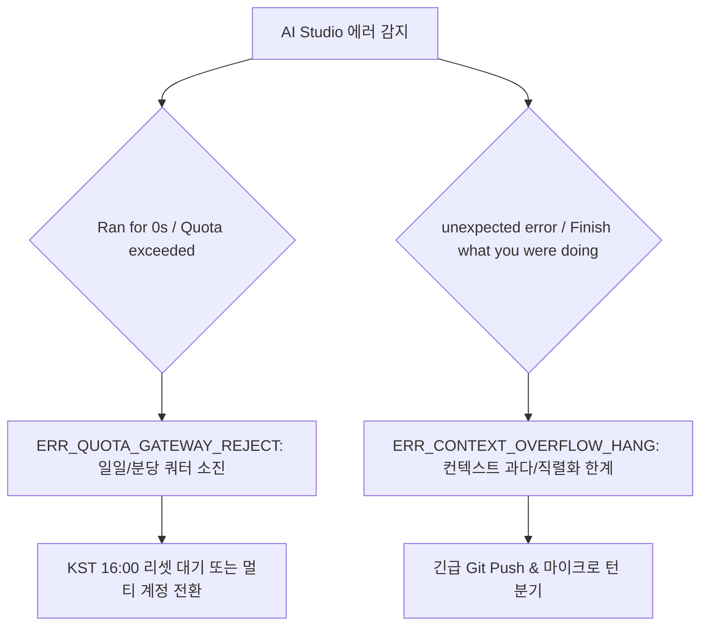

# [03-19] AI Studio 토큰 소진 모니터링 및 적응형 쿼터 운영정책

> **문서 식별자**: `03-19`  
> **최초 작성일**: 2026-09-30  
> **최종 수정일**: 2026-09-30  
> **적용 범위**: AI Studio 환경의 전 에이전트, 백엔드 하네스 쿼터 엔진 및 대화 턴 영속화 파이프라인  
> **준수 책임**: AI Agent, Full-Stack Engine, DevOps Engineer

---

## 1. 제정 목적

Google AI Studio 환경에서 발생하는 일일 호출 한도(RPD) 소진 및 대화 컨텍스트 비대화에 따른 장애를 선제적으로 방어하고, 에이전트와 사용자 간의 대화 턴(Turn)을 손실 없이 100% 원문 서식 그대로 영속화하기 위한 기술 및 운영 표준을 규정합니다.

---

## 2. Google AI Studio 2대 고유 에러 패턴 및 원인 분류

AI Studio 웹 콘솔 및 API Gateway에서 발생하는 주요 에러 메시지를 아래와 같이 표준 코드로 분류하여 격리 및 분석합니다.



### 2.1 [유형 1] `Gemini 3.8 Flash Ran for 0s error / Quota exceeded`
- **표준 에러 코드**: `ERR_QUOTA_GATEWAY_REJECT`
- **발생 원인**: 실행 시간 0초만에 반환되는 게이트웨이 차단 에러로, 계정의 일일 호출 한도(RPD, Flash 2,500회 / Pro 250회) 또는 분당 토큰 속도(TPM) 한도를 초과했을 때 발생합니다.
- **대응 정책**:
  1. 정책 03-09에 따라 해당 오류 응답은 대화 추적 DB 및 사용량 집계에서 **영구 격리(제외)**합니다.
  2. 순간 과부하(RPM)인 경우 1~3분 쿨다운을 적용하고, 일일 한도(RPD)인 경우 한국시간 매일 16:00 리셋 타이머를 사용자에게 안내합니다.

### 2.2 [유형 2] `There was an unexpected error. Finish what you were doing.`
- **표준 에러 코드**: `ERR_CONTEXT_OVERFLOW_HANG`
- **발생 원인**: 채팅 턴이 15~20턴 이상 지속되면서 시스템 프롬프트 및 이전 턴의 파일 내용이 수십만 토큰으로 비대화(**Context Bloat**)되어 WebSocket/HTTP 직렬화 메모리 한계를 초과하거나 백엔드 타임아웃이 발생할 때 나타납니다.
- **대응 정책**:
  1. 즉각적인 강제 리프레시는 컨텍스트 단절을 초래하므로, **작업 중인 소스의 안전성을 확인한 후 단계적으로 마이크로 턴을 분기**합니다.
  2. 백엔드 `EmergencyGitPushEngine`을 통해 작업 소스를 원격 `dev`에 우선 보존합니다.

---

## 3. KST 16:00 기준 적응형 쿼터 소진 예측 알고리즘 (Adaptive Quota Tracker)

단순한 '턴 수' 기반 예측의 한계(질문 1,000토큰 vs 컴파일 검증 30,000토큰)를 극복하기 위해, **계정별 실사용 누적 토큰과 소진 이벤트 기반 지수이동평균(EMA) 보정 모델**을 적용합니다.

### 3.1 일일 슬라이딩 윈도우 계산
- Google AI 일일 쿼터 리셋 시점: **매일 16:00:00 KST (00:00:00 UTC/PST)**
- 당일 윈도우 시작 시각:
  $$\text{CycleStart} = \begin{cases} \text{어제 16:00:00 (KST)}, & \text{현재 시각 } < 16:00 \\ \text{오늘 16:00:00 (KST)}, & \text{현재 시각 } \ge 16:00 \end{cases}$$
- 당일 누적 토큰:
  $$\text{DailyTokensToday} = \sum_{\text{created\_at} \ge \text{CycleStart}} (\text{prompt\_tokens} + \text{completion\_tokens})$$

### 3.2 소진 임계값($T_{critical}$) 지수이동평균(EMA) 학습 보정
- 계정별 소진 이벤트(429 발생)가 기록될 때마다 실측 소진 토큰량($T_{observed}$)을 수집하여 임계값을 갱신합니다.
  $$T_{critical}^{(n)} = \alpha \cdot T_{observed} + (1 - \alpha) \cdot T_{critical}^{(n-1)} \quad (\alpha = 0.3)$$
- **소진 시점 예측치**:
  $$\text{RemainingTokens} = \max(0, T_{critical} - \text{DailyTokensToday})$$
  $$\text{ExpectedRemainingTurns} = \left\lfloor \frac{\text{RemainingTokens}}{\text{RecentAvgTokensPerTurn}} \right\rfloor$$

---

## 4. 대화 턴 전수 영속화 및 Markdown 전문 100% 보존 규정

### 4.1 원문 무손실 적재 원칙 (Lossless Trace Persistence)
1. **입력 프롬프트 (`user_prompt`)**: 사용자가 입력한 지시어, 코드 블록, 프로그램ID, 태스크 번호 일체를 단 한 글자의 축약이나 누락 없이 **원문 전문(Raw String)**으로 영속화합니다.
2. **응답 내용 (`agent_response`)**: 에이전트가 생성한 응답의 마크다운 헤더(`#`), 목록(`-`), 코드 블록(` ``` `), 표(`|`), 취소선, Mermaid 다이어그램 서식을 100% 완벽히 보존하여 뷰어 화면에서 원형 그대로 복원될 수 있도록 UTF-8 정밀 인코딩으로 저장합니다.
3. **토큰 산정 무결성**: 프롬프트 토큰과 응답 토큰을 분리 기록하고, 합산 토큰을 원장에 동기화합니다.

---

## 5. 세션 마이크로 턴 및 백로그 거버넌스

1. **단일 세션 내 짧은 호흡 유지**: 1개 태스크는 1~3개의 마이크로 턴 내에서 완료하는 것을 원칙으로 합니다.
2. **작업 범위 이탈 시 백로그 즉시 분리**: 진행 중인 태스크의 핵심 목표(예: 모니터링 기준 개선)에서 벗어나는 부가 요청(예: 외부 결제 API, UI 전체 개편)은 세션 턴을 낭비하지 않도록 즉시 하네스 백로그(`doc_payload.backlog_items`)로 등록하고 차기 태스크로 이관합니다.
