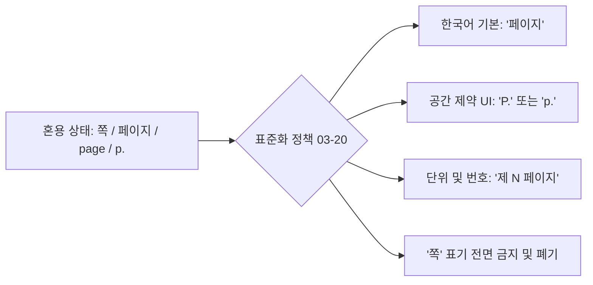
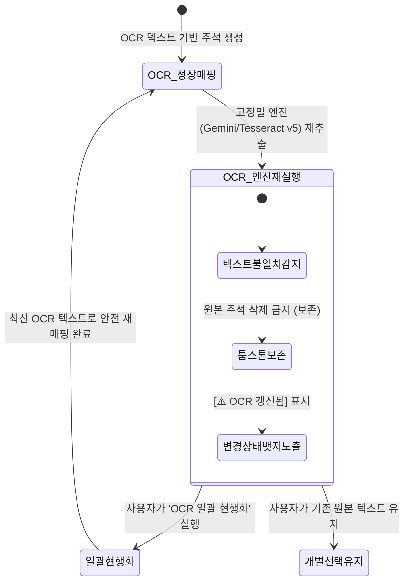

# [03-20] UI/UX 용어 표준화 및 페이지 표기 운영정책 (Terminology Standard Policy)

> **문서 번호**: `03-20`  
> **프로젝트**: purePDFrend (AI Agent Governance Engine & PDF Studio)  
> **작성 일자**: 2026-10-02  
> **상태**: 공식 채택 및 전사 적용 (Active Standard)  
> **우선순위**: 최우선 (P0)  
> **관련 문서**: `docs/03.정책/03-13_UIUX_통일성_및_모바일반응형_디자인시스템_운영정책.md`, `docs/06.기획/06-01_모바일반응형_UIUX_오브젝트_표준기획서.md`

---

## 📌 1. 제정 목적 및 배경

purePDFrend의 화면 전반에서 문서 위치를 나타내는 용어가 **'쪽'**, **'페이지'**, **'page'**, **'p.'** 등으로 혼용되어 발생하던 사용자 인지 부하와 어색함을 해소하고, 글로벌 및 국내 표준 전자문서 소프트웨어 규격에 부합하도록 **'페이지'로 단일 표준화**합니다.

---

## 📐 2. 표준 용어 사전 및 표기 규칙

### 2.1. 핵심 용어 매핑 규칙

| 기존 혼용 표현 | 표준 용어 (권장) | 영문/축약 표기 | 비고 |
| :--- | :--- | :--- | :--- |
| **쪽** (예: 42쪽, 몇 쪽) | **페이지** (예: 42 페이지) | `Page`, `P.`, `p.` | **'쪽' 전면 사용 금지** |
| **현재 쪽** | **현재 페이지** | `Current Page` | 쪽수 입력창, 필터 등에 통일 |
| **총 N쪽** | **총 N 페이지** | `Total N Pages` | 서재 및 뷰어 정보 표기 |
| **쪽순 / 최신순** | **페이지순 / 최신등록순** | `By Page / By Latest` | 정렬 드롭다운/버튼 표준화 |
| **제 N 쪽** | **제 N 페이지** | `p.N` / `P.N` | 목차, 북마크, 주석 헤더 표준화 |

### 2.2. 공간 제약별 적용 가이드
1. **일반 텍스트 및 라벨**: 반드시 한글 전체 표기인 **'페이지'**를 사용합니다.
   - 예: `현재 페이지 (P.42)`, `총 840 페이지`, `페이지 번호 입력`
2. **모바일 좁은 너비 및 칩/배지 (Badge)**: 영문 축약형 **`p.XX`** 또는 **`P.XX`**를 사용합니다.
   - 예: `p.42`, `p.1~12`
3. **정렬 방향 표현**:
   - `오름차순 (오름)` / `내림차순 (내림)`으로 명시하여 사용자 직관성 극대화.

---

## 🔄 3. 주석(Annotation)과 OCR 연계 거버넌스 규약

사용자가 PDF 본문 위에 생성한 주석(형광펜, 밑줄, 스티키노트 등)과 OCR 엔진의 텍스트 레이어 간의 정합성을 보장하기 위해 아래 3대 원칙을 엄격히 준수합니다.

1. **[보존의 원칙] OCR 변경 시 주석 삭제 절대 금지 (Tombstone Preservation)**:
   - OCR 엔진이 재실행되거나 인식 텍스트가 변경되더라도 사용자가 작성한 기존 주석을 임의로 삭제하지 않습니다.
2. **[상태 가시성] 변경 상태 뱃지 노출**:
   - OCR 텍스트 변경으로 인해 기존 주석의 원문 텍스트와 좌표가 불일치할 경우, 주석 아이템에 `[⚠️ OCR 갱신됨]` 경고 뱃지를 노출하여 사용자에게 알립니다.
3. **[일괄 현행화] 원클릭 일괄 적용 기능 제공 (OCR 변경 한정)**:
   - OCR이 갱신된 주석들에 한하여, 사용자가 **[🔄 최신 OCR 텍스트로 일괄 현행화]** 버튼을 클릭하면 최신 OCR 텍스트 레이어로 일괄 갱신 및 재앵커링(Re-anchoring)을 수행합니다.

---

## 🛡️ 4. 데이터 안전 가드레일 (주석 전체 삭제 정책)

1. **접근성 격리**:
   - 주석 전체 삭제 버튼은 주요 탐색 툴바에 배치하지 않고, 하단 유틸리티 관리 영역에 배치합니다.
2. **2중 확인 모달 (Confirmation Modal)**:
   - 클릭 즉시 삭제되지 않고, 삭제 대상 주석 건수를 명시한 확인 창을 호출합니다.
3. **실행취소(Undo) 스택 연동**:
   - 삭제 즉시 이전 상태 전체를 `undoStack`에 보존하여, 실수로 삭제하더라도 `Ctrl + Z` 단축키 또는 실행취소 버튼으로 100% 즉시 복구할 수 있도록 안전장치를 의무화합니다.
