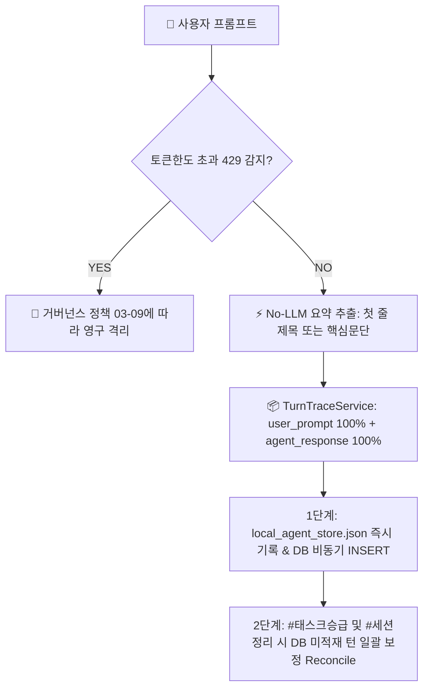

# 03-21. 계정 전환 원격 소스 자동 풀(Pull) 및 대화 턴 전수 영속화 운영정책

## 📋 편집 이력 (Revision History)

| 작업일자 | 이슈 | 태스크 | 작업자 | 작업내용 | 사용 AI 모델명 | 에이전트 | 참고링크 |
| :--- | :--- | :--- | :--- | :--- | :--- | :--- | :--- |
| 2026-10-02 | #58 | TASK-0022-01 | gemini | [v1.0] 최초 제정: 계정 전환/샌드박스 초기화 시 원격 dev 소스 자동 풀(Auto-Pull) 규약, 대화 턴 전문(Full Markdown) 100% 무손실 영속화, No-LLM 경량 요약 추출(토큰 소모 0), 2단계 하이브리드 등록(실시간 로컬/DB + 태스크승급 일괄 보정) 표준 수립 | Gemini 3.8 Flash | Google AI Studio | [AGENTS.md](../../AGENTS.md) |

---

## 1. 개요 및 목적 (Overview & Purpose)

본 문서는 AI 코딩 에이전트가 다중 계정 전환, 신규 브라우저 창 생성, 또는 샌드박스(컨테이너) 재기동 환경에서 작업할 때 발생할 수 있는 **원격 소스 덮어쓰기 참사(Overwrite Disaster)**와 **대화 턴 유실(Conversation Loss)**을 시스템 레벨에서 원천 차단하기 위한 최상위 운영 정책입니다.

특히, 구 컨테이너 스냅샷이 탑재된 신규 샌드박스에서 최신 원격 소스를 내려받지 않은 채 로컬 파일을 원격에 Push하는 문제를 방지하기 위해 **원격 dev 최신 소스 자동 풀(Auto-Pull)을 의무화**하고, 감사 및 마크다운 조회를 위한 **대화 턴 전문(Full Markdown) 100% 무손실 보존과 No-LLM 요약 추출 원칙**을 규정합니다.

---

## 2. 계정 전환 및 샌드박스 초기화 대응 원격 소스 자동 풀(Auto-Pull) 규약

### 2.1 샌드박스 환경 격리 문제의 본질
1. **동일 계정 새 채팅**: AI Studio 워크스페이스가 거의 유지되어 브랜치 전환 및 파일 상태가 보존됨.
2. **다른 계정 새 채팅 (또는 샌드박스 재생성)**: 완전히 격리된 신규 컨테이너가 기동되며, 초기 파일 트리는 과거의 로컬 스냅샷 상태로 초기화됨.
3. **치명적 위험**: 최신 커밋이 반영된 원격 `dev` 브랜치를 확인하지 않고 이전 스냅샷 상태에서 커밋 푸시를 진행하면 이전 작업 내용이 강제 덮어쓰기(Revert)되어 코드 및 문서가 대량 유실됨.

### 2.2 [원칙 1] #세션시작 시 원격 dev 자동 풀 선행 의무
- 모든 AI 에이전트는 `#세션시작` 인입 시 작업 브랜치를 생성하기 전, 반드시 다음 스크립트를 즉시 실행하여 원격 `dev`의 최신 소스를 로컬 작업공간에 무손실 동기화해야 합니다:
  ```bash
  npx tsx scripts/pull_remote_dev.ts
  ```
- **동작 원칙**:
  1. GitHub REST API(`GET /repos/:owner/:repo/git/ref/heads/dev`)를 통해 최신 커밋 SHA를 동적으로 조회합니다.
  2. GitHub Tarball 스트림을 임시 디렉터리에 수신 후 압축을 해제합니다.
  3. 보호 대상(`node_modules`, `.env*`, `.git`)을 엄격히 보존하며, 원격의 신규 및 갱신 파일을 로컬 작업공간으로 안전하게 병합 적용합니다.
  4. 동기화 완료 후 SHA, 추가 파일 수, 갱신 파일 수, 유지 파일 수를 로그로 출력하고 세션 하네스에 기록합니다.

---

## 3. 대화 턴 전수 영속화 3대 절대 원칙 (Zero-Loss Turn Trace)

대화 이력은 단순 로그가 아니라 감사, 재해복구(DR), 마크다운 뷰어 조회의 단일 진실 원천(SSOT)입니다.



### 3.1 [원칙 1] user_prompt 입력 전문 100% 무손실 보존
- 사용자가 입력한 모든 프롬프트 텍스트, 코드블록, 마크다운 표, 특수기호, 줄바꿈을 단 1글자도 축약하거나 생략하지 않고 원형 그대로 보존합니다.

### 3.2 [원칙 2] agent_response 응답 전문 100% 보존
- 에이전트가 응답한 마크다운 문서 전체(제목 `#`, 본문, Mermaid 다이어그램, 인라인 코드, GFM 표, 체크리스트, 구분선 등)를 100% 온전히 저장합니다.
- 프론트엔드 관리자 뷰어(`AgentUsageViewer`, `TaskInfoManager`)에서 마크다운 렌더러가 온전한 문서 구조로 시각화할 수 있어야 합니다.

### 3.3 [원칙 3] response_summary No-LLM 경량 추출 (토큰 소모 0)
- `response_summary` 작성을 위해 추가로 LLM(Gemini) API를 호출하는 행위를 엄격히 금지합니다.
- `TurnTraceService.extractResponseSummary()`를 통해 `agent_response`의 첫 번째 헤딩(`#+ (.*)`) 또는 첫 번째 유효 문단을 최대 140자 이내로 정규식 자동 추출하여 토큰 소모를 0으로 차단합니다.

### 3.4 하네스 외 자유 대화(`TASK-FREE`) 전수 등록
- 하네스 단계 키워드(`#세션시작`, `#태스크시작` 등)가 포함되지 않은 자유 질의응답, 아이디어 논의, 단순 점검 요청도 시스템에 누락 없이 등록합니다.
- `task_id`는 활성 태스크가 있는 경우 해당 태스크에 귀속시키고, 활성 태스크가 없거나 완전한 자유 대화인 경우 `TASK-FREE` 식별자를 부여하여 `step_index` 순번을 유지합니다.

---

## 4. 턴 등록 주기 2단계 하이브리드 거버넌스 (Hybrid Persistence)

단일 방식의 한계(매 턴 DB 지연 vs 승급 시점 일괄 저장의 유실 위험)를 극복하기 위해 2단계 하이브리드 방식을 적용합니다.

| 단계 | 시점 | 저장 대상 | 주요 역할 |
| :--- | :--- | :--- | :--- |
| **1단계 (실시간)** | 매 턴 응답 완료 즉시 | `data/local_agent_store.json` 및 원격 DB `aiagent.agent_conversation_trace` | 세션 중간 Hang이나 브라우저 닫힘 발생 시에도 최신 대화까지 100% 보존 (RPO=0) |
| **2단계 (정합성 보정)** | `#태스크승급` 및 `#세션정리` 인입 시 | 원격 DB 미적재 턴 일괄 Reconcile (`POST /api/agent/trace/reconcile`) | 네트워크 지연이나 DB 브릿지 일시 오류로 누락된 턴을 발견하여 일괄 INSERT 완료 |

---

## 5. 표준 실행 체크리스트

모든 세션 시작 및 종료 시 에이전트는 아래 체크리스트를 준수해야 합니다:

- [ ] **[세션시작]** `npx tsx scripts/pull_remote_dev.ts` 실행하여 원격 `dev` 최신 파일 로컬 동기화
- [ ] **[세션시작]** 원격 3대 브랜치(`dev`, `stg`, `main`) 최신 SHA 일치 검증
- [ ] **[매 턴]** `user_prompt` 및 `agent_response` 100% 전문 보존 및 No-LLM 요약 추출 확인
- [ ] **[태스크승급]** `POST /api/agent/trace/reconcile` 호출하여 원격 DB 미적재 턴 전수 보정
- [ ] **[세션정리]** 최종 커밋 Push 전 18대 문서 및 대화 턴 전수 DB 정합성 100% 확인
