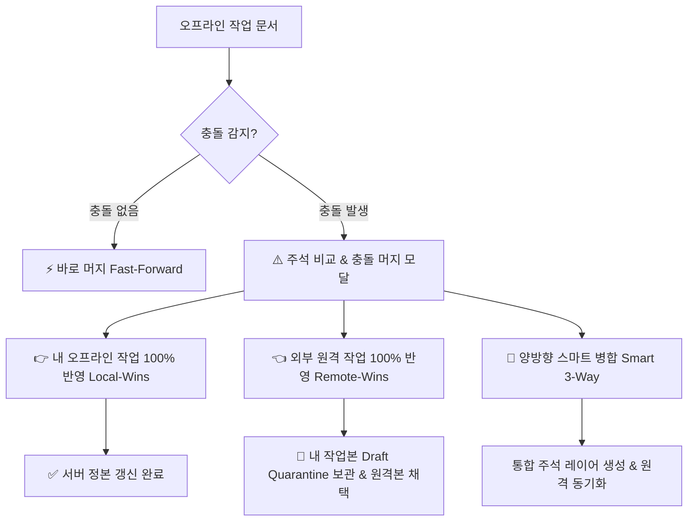

# 03-22. 오프라인 작업 정리 및 충돌 머지 거버넌스 운영정책

## 📋 편집 이력 (Revision History)

| 작업일자 | 이슈 | 태스크 | 작업자 | 작업내용 | 사용 AI 모델명 | 에이전트 | 참고링크 |
| :--- | :--- | :--- | :--- | :--- | :--- | :--- | :--- |
| 2026-10-05 | #66 | TASK-0024-01 | gemini | [v1.1] 오프라인 작업 정리 화면(PG-USR-08) 메뉴명 확정, 리소스모드 vs 문서모드 2대 전환 시나리오 수립, 문서모드 PDF 히든 주석(시작/수정/종료일시, 수정자, 문서번호, 문서버전) 규약 제정, 리소스모드 캐시 준비 범위 제한 정책, 문서 단위 관리 목록 표준화, 한쪽 반영(Local-Wins/Remote-Wins) 및 스마트 병합 기준 명문화 | Gemini 3.8 Flash | Google AI Studio | [AGENTS.md](../../AGENTS.md) |
| 2026-10-05 | #66 | TASK-0024-01 | gemini | [v1.0] 최초 제정: PG-USR-08 오프라인 모드 & 충돌머지 운영정책, Draft Quarantine 로컬 격리 원칙, IndexedDB 이벤트 소싱 큐 거버넌스, 3-Way diff 충돌 해소 표준 수립 | Gemini 3.8 Flash | Google AI Studio | [AGENTS.md](../../AGENTS.md) |

---

## 1. 개요 및 목적 (Overview & Purpose)

purePDFrend 시스템은 브라우저 기반의 전문 PDF 제작 및 OCR 교정 스튜디오로서, 네트워크 단절(이동 중, 비행기, 오프라인 현장 등)이나 서버 통신 장애 환경에서도 사용자의 편집 작업이 절대로 중단되거나 유실되지 않는 **오프라인 무중단 운영(Zero-Interruption Guarantee)**을 핵심 가치로 추구합니다.

본 정책은 오프라인 전환 시나리오(리소스 모드 vs 문서 모드), 디바이스 준비 범위에 따른 작업 통제, 오프라인 작업 결과의 안전한 로컬 보존(Draft Quarantine 및 PDF 히든 주석), 온라인 재연결 시 **오프라인 작업 정리(PG-USR-08)** 화면을 통한 **문서 단위 관리 및 주석 충돌 머지(한쪽 반영 / 스마트 병합)** 프로세스를 규정합니다.

---

## 2. 오프라인 전환 2대 시나리오 규약

### 2.1 [시나리오 1] 리소스 모드 (온라인 문서작업 중 오프라인 전환)
- **정의**: 온라인 환경에서 서버의 PDF 리소스(페이지 타일 이미지, 텍스트 레이어, 주석 메타)를 동적으로 스트리밍받아 뷰어에서 작업하던 중 네트워크가 두절된 경우.
- **동작 규칙**:
  1. **준비 범위(캐시 범위) 내 작업 허용**: 이미 로컬 메모리 및 IndexedDB에 사전 다운로드된 페이지만 편집 및 로컬 저장이 가능합니다.
  2. **미캐시 영역 오프라인 작업 불가 차단**: 디바이스에 준비되지 않은 페이지(예: 10p까지만 캐시된 경우 11p 이상)에 접근할 경우 화면에 `🚫 오프라인 작업불가 (네트워크 단절로 리소스 미다운로드)` 워터마크 안내를 노출하고 신규 조작을 안전하게 차단합니다.
  3. **네트워크 재연결 및 뷰어 이탈 시**: 작업 중단 시점의 변경 사항은 '오프라인 작업 정리' 대상으로 등록되며, 온라인 복구 시 서버 원본과의 충돌 여부를 검사하여 자동 머지 또는 수동 선택 머지를 수행합니다.

### 2.2 [시나리오 2] 문서 모드 (오프라인 시작 & 디바이스 PDF 파일 직접 열기)
- **정의**: 앱 시작 시점부터 네트워크가 오프라인이거나 서버 리소스 다운로드가 불가하여, 사용자가 로컬 디바이스에 저장된 독립 PDF 파일을 직접 열어서 작업하는 경우.
- **동작 규칙**:
  1. **PDF 히든 주석(Hidden Annotation Metadata) 자동 각인**: 사용자가 로컬 PDF를 열어 주석을 작성/수정할 때, 시스템은 PDF의 메타데이터(XMP 및 비표시 Annotation 레이어)에 다음 감사 정보를 실시간 기록합니다:
     - `startTime` (작업 시작일시)
     - `updateTime` (수정일시)
     - `modifier` (수정자 계정)
     - `docNo` (문서번호)
     - `docTitle` (문서명)
     - `docVersion` (문서버전)
     - `endTime` (수정 종료일시)
     - `annotationCount` (작성 주석 수)
  2. **온라인 재연결 시 오프라인 작업 정리 등록**: 디바이스에 보존된 PDF 파일을 바탕으로 온라인 복구 시 시스템 정본 라이브러리에 신규 정본으로 일괄 머지 등록합니다.

---

## 3. 오프라인 작업 정리(PG-USR-08) 화면 거버넌스

### 3.1 메뉴명 표준화
- 기존 기술 용어인 `오프라인 모드 & 충돌머지`를 사용자 중심의 직관적 표준 명칭인 **`오프라인 작업 정리`**로 단일화합니다.

### 3.2 작업 단위(문서 단위) 관리 원칙
- 오프라인 작업 정리 화면 목록은 개별 주석 이벤트 단위가 아니라 **오프라인 전환되어 진행된 작업 문서 단위**로 표기합니다.
- **목록 헤더 컬럼 표준**:
  1. **문서 ID** (예: `DOC-0091`)
  2. **문서명** (예: `2026_아키텍처_설계_표준서.pdf`)
  3. **문서 버전** (예: `v2.1`)
  4. **작업 모드** (`리소스모드` / `문서모드`)
  5. **오프라인 시간** (네트워크 단절 감지 시각)
  6. **작업 시작 시간** (최초 주석 수정 시각)
  7. **작업 종료 시간** (로컬 저장 시각)
  8. **작업자** (사용자 이메일)
  9. **상태 및 정리 액션** (`[주석 비교 & 충돌 머지]`, `[바로 머지]`, `[히든주석 정본 등록]`)
- **[원칙] 주석 내용 목록 노출 배제**: 수정한 세부 주석 텍스트나 BBox 좌표는 목록 테이블에 나열하지 않으며, 상세 머지 팝업에서만 시각적으로 비교하도록 하여 가독성과 반응형 테이블 정돈을 유지합니다.

---

## 4. 충돌 머지 및 한쪽 반영(One-Sided Apply) 규약

### 4.1 충돌 없는 경우 (Fast-Forward)
- 외부에서의 원격 변경이 없는 문서는 **[바로 머지]** 원클릭으로 서버 원본에 즉시 커밋됩니다.

### 4.2 충돌 발생 시 주석 비교 및 한쪽 반영
- 외부 동시 수정자와 충돌 발생 시 팝업에서 **오프라인 작업내용 vs 외부 작업내용**을 비교합니다.
- **한쪽 반영 기능(One-Sided Apply)**:
  1. **내 오프라인 작업 100% 반영 (Local-Wins)**: 로컬 변경분을 원격 서버에 강제 덮어쓰기.
  2. **외부 원격 작업 100% 반영 (Remote-Wins)**: 원격 변경분을 정본으로 수용하고, 내 오프라인 작업본은 로컬 격리 보관소(Draft Quarantine)에 안전 백업.
  3. **양방향 스마트 병합 (Smart 3-Way)**: 비충돌 속성은 자동 취합하고 충돌 속성만 선별 통합.
