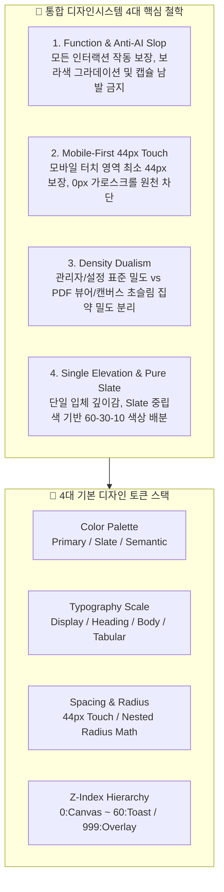

# 03-23. 통합 디자인시스템 및 기준요소 UI 표준가이드

> **문서 식별자**: `DOC-POL-03-23`  
> **표준화 버전**: `v1.0.0` (2026-10-07)  
> **상태**: 정식 채택 (APPROVED)  
> **적용 대상**: `purePDFrend` 전역 UI (사용자서비스 PG-USR, 시스템서비스 PG-ADM, 에이전트 PG-AGN)  
> **벤치마킹 모델**: moabogo 디자인 패턴 & Universal Frontend Design Constitution

---

## 🎨 1. 제정 배경 및 설계 원칙

본 정책 문서는 `purePDFrend`의 파편화된 UI 스타일을 단일 체계로 통합하고, 데스크톱과 모바일 환경 모두에서 최고의 사용성과 반응형 가드레일을 보장하기 위해 제정되었습니다.

---

## 🌈 2. 색상 팔레트 (Color Palette System)

### 2.1. 60-30-10 규칙 기반 색상 배분
- **60% Dominant Neutral Canvas**: `slate-950` (어두운 배경), `slate-900` (서피스 패널)
- **30% Structural Surfaces**: `slate-800` (카드 배경, 모달, 디바이더 `border-slate-800`), `slate-700` (입력창 테두리)
- **10% Accent Budget**: `blue-600` / `indigo-600` (Primary CTA, 활성 탭, 포커스 링)

### 2.2. 상태 색상 (Semantic Status Palette)
| 구분 (Semantic) | 배지/텍스트 색상 | 서피스 배경 | 테두리 (Border) | 용도 및 의미 |
| :--- | :--- | :--- | :--- | :--- |
| **Success** | `text-emerald-400` | `bg-emerald-950/40` | `border-emerald-800/60` | 정상, 활성, CIDR 허용, 완료 |
| **Warning** | `text-amber-400` | `bg-amber-950/40` | `border-amber-800/60` | 대기, 주의, 휴면, 순환참조 경고 |
| **Danger** | `text-rose-400` | `bg-rose-950/40` | `border-rose-800/60` | 차단, 오류, 정지, 삭제, 실패 |
| **Info** | `text-sky-400` | `bg-sky-950/40` | `border-sky-800/60` | 안내, 시스템 정보, 신규 개정판 |
| **Neutral** | `text-slate-400` | `bg-slate-900/60` | `border-slate-800` | 기본 메타데이터, 부가정보 |

---

## 🔤 3. 타이포그래피 스케일 (Typography & Font Hierarchy)

- **The 2+1 Font Rule**:
  - 기본 본문: `Pretendard`, `Plus Jakarta Sans`, system-ui
  - 코드 및 숫자: `JetBrains Mono`, `font-mono tabular-nums` (고정폭 숫자 엄격 준수)
- **스케일 계층**:
  - `Display / Hero`: `20px` ~ `32px` (`font-bold`, `tracking-tight`)
  - `Section Heading`: `16px` ~ `18px` (`font-semibold`)
  - `Body Standard`: `13px` ~ `15px` (`leading-relaxed`)
  - `Caption / Micro`: `11px` ~ `12px` (`text-slate-400`, `font-medium`)

---

## 📐 4. 간격 및 터치 타깃 (Spacing & Touch Target)

1. **44px 모바일 터치 타깃 (Mobile WCAG 준수)**:
   - 모바일(화면 폭 $\le 768px$) 환경에서 클릭 가능한 모든 버튼(`Button`), 인풋(`Input`), 선택기(`Select`), 탭 컨트롤은 `min-height: 44px` 또는 터치 패딩(`py-2.5 px-4`)을 필수로 유지합니다.
2. **중첩 반경 수학 (Nested Radius Math)**:
   - $r_{\text{inner}} = r_{\text{outer}} - \text{padding}$
   - 예: 카드의 $r_{\text{outer}} = 12px$ (`rounded-xl`), 내부 패딩이 `8px`일 때 내부 요소의 $r_{\text{inner}} = 4px$ (`rounded`).

---

## 📶 5. Z-Index 계층 스케일 (Z-Index Hierarchy)

| Z-Index 계층 | 클래스 | 적용 요소 | 비고 |
| :---: | :---: | :--- | :--- |
| **0** | `z-0` | 기본 문서 캔버스, 배경 격자 | 최하단 바탕 레이어 |
| **10** | `z-10` | 카드 컨테이너, 텍스트 레이어, 페이지 썸네일 | 기본 서피스 레이어 |
| **20** | `z-20` | 하위 툴바, 인라인 액션바, 고정 목록 헤더 | 스크롤 시 부유 제어 |
| **30** | `z-30` | 상단 전역 내비게이션 바 (`Navbar`), 글로벌 탭바 | 최상단 고정 헤더 |
| **40** | `z-40` | 드롭다운 메뉴, 툴팁, 플로팅 칩, 팝오버 | 컨텍스트 오버레이 |
| **50** | `z-50` | 모달 팝업 (`Modal / Dialog`), 설정 모달 | 전체 화면 차단 대화상자 |
| **60** | `z-60` | 시스템 토스트 알림, 비상 알림 배너 | 글로벌 피드백 레이어 |
| **999** | `z-[999]` | 캔버스 주석 드로잉 중 BBox 가이드라인, 인라인 교정 팝업 | 캔버스 인터랙션 특수 레이어 |

---

## 💡 6. 4대 특이케이스 명문화 (Special Case Rules)

### 6.1. 특이케이스 ①: 밀도 이원화 (Density Dualism)
- **일반 관리자 / 설정 폼 (`standard`)**:
  - 모바일 편의성 및 가독성 중심: 인풋 높이 `38px`~`44px`, 폰트 `13px`~`14px`, 넉넉한 여백 (`p-4`, `p-6`).
- **PDF 뷰어 / 도구상자 (`compact`)**:
  - 데스크톱 대화면 작업 집약도 중심: 버튼 높이 `28px`~`32px`, 초슬림 아이콘 `16px`, 폰트 `11px`~`12px`, 집약 여백 (`p-1.5`, `gap-1`).

### 6.2. 특이케이스 ②: 캔버스 오버레이 계층 분리
- 캔버스 뷰포트 내에서는 텍스트 레이어(`pointer-events-none`), 벡터 BBox 레이어, 주석 선택 팝오버, 플로팅 쪽수 칩의 z-index를 엄격히 분리하여 마우스 드래그 및 휠 이벤트 간섭을 원천 차단합니다.

### 6.3. 특이케이스 ③: 모바일 Table-to-Card 변환 (정책 03-14 준수)
- 화면 폭 `768px` 미만에서는 테이블(`<table>`)을 모바일 카드 목록(`div`)으로 자동 전환합니다.
- `overflow-x-hidden` 및 `max-w-full`을 적용하여 0px 가로스크롤을 보장합니다.

### 6.4. 특이케이스 ④: 복합키 Keycap 및 규격화 ToolIcon
- 단축키 표기는 일반 텍스트가 아닌 입체형 키캡 컴포넌트(`KeyCap`)를 적용합니다 (`Ctrl`, `Shift`, `F` 등).
- 툴바 아이콘은 `14px`, `16px`, `20px` 3단계로 표준화된 `ToolIcon`을 사용하여 일관된 터치 및 시각 규격을 유지합니다.

---

## 🧱 7. 기준 컴포넌트 풀 (Standard Component Pool) 사양

`src/shared/components/ui/` 경로에 다음 8종의 기준 컴포넌트를 독립 개발하여 공급합니다:

1. **`Button`**:
   - `variant`: `primary`, `secondary`, `outline`, `ghost`, `danger`, `success`
   - `size`: `sm` (32px), `md` (38px), `lg` (44px)
   - `touchTarget`: 모바일 환경에서 자동 터치 영역 최적화
   - `isLoading`, `leftIcon`, `rightIcon` 지원
2. **`Input`**:
   - 라벨, 에러 메시지, 힌트, 전/후면 아이콘, 클리어 버튼 지원
3. **`Textarea`**:
   - 다중 행 에디터, 높이 자동 조절, 글자 수 카운터 지원
4. **`Card`**:
   - `Card`, `CardHeader`, `CardTitle`, `CardDescription`, `CardContent`, `CardFooter`
5. **`Badge`**:
   - `variant`: `neutral`, `primary`, `success`, `warning`, `danger`, `info`
   - 점(Dot) 인디케이터 지원
6. **`Modal`**:
   - ESC 키 닫기, 백드롭 블러, 모바일 하단 시트 / 데스크톱 중앙 팝업 자동 전환
7. **`KeyCap`**:
   - 단일 또는 복수 키캡 렌더링, 입체 음영(`border-b-2`) 적용
8. **`ToolIcon`**:
   - 규격화된 아이콘 컨테이너, 툴팁 연계, 활성/비활성 상태

---

## 📋 편집 이력 (Revision History)

| 개정일자 | 버전 | 변경 내용 | 작성자 | 승인자 |
| :---: | :---: | :--- | :---: | :---: |
| 2026-10-07 | v1.0.0 | moabogo 벤치마킹 통합 디자인 정책 수립 및 4대 특이케이스 명문화 | AI Agent (Gemini) | jkoogit |
