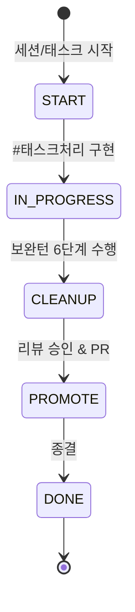

# 03. 정책 (Policies & Standards) 요약 가이드

## 📋 폴더 개요
코드 작성 표준, 문서 거버넌스, 편집이력 표기, 보완턴 프로세스, 테이블 감사 및 하네스 상태머신 정책을 규정합니다.

## 📑 하위 문서 목록
| 문서번호 | 파일명 | 문서 제목 | 주요 내용 요약 |
| :--- | :--- | :--- | :--- |
| `03-01` | `03-01_문서작성_및_편집이력_정책.md` | 문서작성 및 편집이력 정책 | 18대 분류체계, 한글 파일명, 편집이력 헤더 표준 |
| `03-02` | `03-02_코드리뷰_작성_가이드.md` | 코드리뷰 작성 가이드 | 10대 헤더 표준, 보완턴 6단계 프로세스(완료/생략/보완필요) 규정 |
| `03-03` | `03-03_개발_및_아키텍처_가이드.md` | 개발 및 아키텍처 가이드 | OOP DDD, 심플 레이어, 헥사고날 전환 기준, 보완턴 6단계 규칙 |
| `03-04` | `03-04_하네스_생명주기_및_상태머신_정책.md` | 하네스 생명주기 및 상태머신 | 세션-태스크-루프 3계층 및 5단계(START~DONE) 상태 전이 |
| `03-05` | `03-05_테이블_거버넌스_및_감사_정책.md` | 테이블 거버넌스 및 감사 정책 | 6대 감사 컬럼, 낙관적 락(version), 스키마 변경 감사 절차 |

