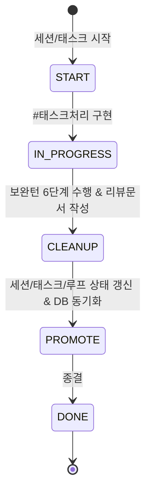

# 03. 정책 (Policies & Standards) 요약 가이드

## 📋 폴더 개요
코드 작성 표준, 문서 거버넌스, 편집이력 표기, 보완턴 프로세스, 테이블 감사 및 하네스 상태머신 정책을 규정합니다.

## 📑 하위 문서 목록
| 문서번호 | 파일명 | 문서 제목 | 주요 내용 요약 |
| :--- | :--- | :--- | :--- |
| `03-01` | `03-01_문서작성_및_편집이력_정책.md` | 문서작성 및 편집이력 정책 | 18대 분류체계, 한글 파일명, 편집이력 헤더 표준 |
| `03-02` | `03-02_코드리뷰_작성_가이드.md` | 코드리뷰 작성 가이드 | 10대 헤더 표준, 보완턴 6단계 프로세스(완료/생략/보완필요) 규정 |
| `03-03` | `03-03_개발_및_아키텍처_가이드.md` | 개발 및 아키텍처 가이드 | OOP DDD, 심플 레이어, 헥사고날 전환 기준, 보완턴 6단계 규칙 |
| `03-04` | `03-04_하네스_생명주기_및_상태머신_정책.md` | 하네스 생명주기 및 상태머신 | 세션-태스크-루프 3계층 및 5단계(START~DONE) 상태 전이 |
| `03-05` | `03-05_테이블_거버넌스_및_감사_정책.md` | 테이블 거버넌스 및 감사 정책 | 6대 감사 컬럼, 낙관적 락(version), 스키마 변경 감사 절차 |
| `03-06` | `03-06_매턴응답_자동처리_및_보완턴_거버넌스_정책.md` | 매턴 응답 자동처리 및 보완턴 정책 | 리뷰문서 실시간작성, 세션/태스크/루프 갱신, 대화추적 등록, 고아문서 DB 삭제 |
| `03-07` | `03-07_에이전트_운영피드백_및_세션정리_거버넌스_정책.md` | 에이전트 운영 피드백 및 세션정리 거버넌스 정책 | [0000] 시작체계, #태스크처리 원칙, 그룹 영속화, 성능대응 |
| `03-08` | `03-08_태스크_항목분할_및_백로그_거버넌스_운영정책.md` | 태스크 항목분할 및 백로그 거버넌스 정책 | 프롬프트 항목별 번호화, 백로그 분할 피드백 루프, 선택 항목 즉시 실행 및 백로그 연계 |
| `03-09` | `03-09_토큰한도초과_대화턴저장제외_정책.md` | 토큰 한도 초과 대화 턴 저장 제외 정책 | Quota Exceeded/429 턴 저장 자동 제외, 통계 격리, 에이전트 행동 지침 |
| `03-10` | `03-10_DB장애대응_및_무중단운영_정책.md` | DB 장애 대응 및 무중단 운영 정책 | 조회전용 안전성, 조회결과없음 안내, 영속화경고 방어, PDF오프라인 실행, 프리징방지 |
| `03-11` | `03-11_에이전트_통합거버넌스_및_실행규제_정책.md` | 에이전트 통합 거버넌스 및 실행 규제 정책 | AGENTS.md v2.1 준거, 3계층 상태머신, GitHub REST API 제어, 턴추적 영속화 |
| `03-12` | `03-12_서비스_전수점검_및_상시_가드레일_거버넌스_운영정책.md` | 서비스 전수점검 및 상시 가드레일 거버넌스 정책 | 4단계 점검 SOP, npm run check:service, GitHub Push 사전검증 가드레일 |
| `03-13` | `03-13_UIUX_통일성_및_모바일반응형_디자인시스템_운영정책.md` | UI/UX 통일성 및 모바일 반응형 디자인 정책 | 3대 도메인 8대 뷰 IA, 모바일 44px 터치 가드레일, 5대 표준 오브젝트 규격 |
| `03-16` | `03-16_사용자_복수AI계정_토큰정책_및_세션자원현행화_운영정책.md` | 사용자 복수 AI 계정 토큰 정책 및 세션 자원 현행화 정책 | 사용자 계정별 토큰 분배, 3계층 모델 라우팅, DB/로컬 스토어 현행화 |
| `03-17` | `03-17_메타거버넌스_백오피스_및_스냅샷_파일영속화_운영정책.md` | 메타거버넌스 백오피스 및 스냅샷 파일 영속화 운영정책 | 하네스 메타원장 백오피스, 계정/모델/요금제 CRUD, 스냅샷 파일 백업 |
| `03-18` | `03-18_목록헤더_너비조절_및_정렬버튼_분리_UI정책.md` | 목록 헤더 너비 조절, 정렬 버튼 분리 및 타이틀 중앙 정렬 UI 정책 | 정렬 아이콘 격리, 드래그 컬럼 리사이징, 타이틀 가운데 정렬 표준 |
| `03-19` | `03-19_AI_Studio_토큰_소진_모니터링_및_적응형_쿼터_운영정책.md` | AI Studio 토큰 소진 모니터링 및 적응형 쿼터 운영정책 | KST 16:00 일일 윈도우, AI Studio 2대 고유에러(Ran for 0s / unexpected error) 분류, EMA 적응형 임계값($T_{critical}$) 소진 예측, 대화턴 원문/Markdown 전문 100% 무손실 영속화 |
| `03-20` | `03-20_UIUX_용어_표준화_및_페이지_표기_운영정책.md` | UI/UX 용어 표준화 및 페이지 표기 운영정책 | '쪽' 사용 금지 및 '페이지'/'p.' 단일 표준화, OCR 변경 시 주석 보존 및 일괄 현행화, 주석 전체삭제 2중 안전 가드레일 |
| `03-21` | `03-21_계정전환_원격소스자동풀_및_대화턴전수영속화_운영정책.md` | 계정 전환 원격 소스 자동 풀(Pull) 및 대화 턴 전수 영속화 운영정책 | 계정 전환/샌드박스 초기화 시 원격 dev 소스 자동 풀(Auto-Pull), 대화 턴 Full Markdown 100% 무손실 영속화, No-LLM 요약 추출 |
| `03-22` | `03-22_오프라인_동기화_및_충돌머지_거버넌스_운영정책.md` | 오프라인 작업 정리 및 충돌 머지 거버넌스 운영정책 | PG-USR-08 오프라인 작업 정리 운영정책, 리소스모드 vs 문서모드 2대 시나리오, PDF 히든 주석 규약, 캐시 준비범위 가드레일, 문서 단위 목록 및 한쪽 반영(Local/Remote) 표준 |
| `03-23` | `03-23_통합_디자인시스템_및_기준요소_UI_표준가이드.md` | 통합 디자인시스템 및 기준요소 UI 표준가이드 | moabogo 벤치마킹 디자인 토큰 스택, 44px 모바일 터치타깃, Z-Index 계층화, 밀도 이원화/캔버스오버레이/Table-to-Card/복합키 4대 특이케이스 표준 |

```mermaid
stateDiagram-v2
    [*] --> START: 세션/태스크 시작
    START --> IN_PROGRESS: #태스크처리 구현
    IN_PROGRESS --> CLEANUP: 보완턴 6단계 수행 & 리뷰문서 작성
    CLEANUP --> PROMOTE: 세션/태스크/루프 상태 갱신 & DB 동기화
    PROMOTE --> DONE: 종결
    DONE --> [*]
```
