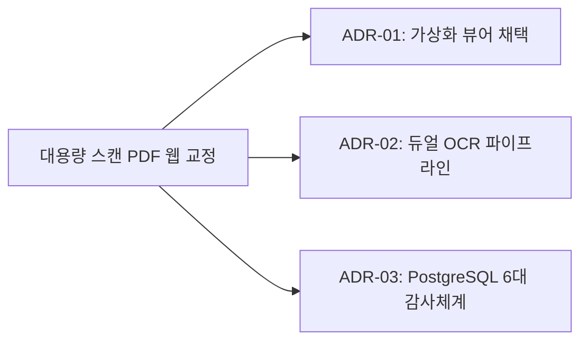

# 04. 결정 (Architecture Decision Records) 요약 가이드

## 📋 폴더 개요
시스템 아키텍처, 기술 스택, 프레임워크 선정 및 주요 엔지니어링 의사결정의 배경과 근거(ADR)를 보관합니다.

## 📑 하위 문서 목록
| 문서번호 | 파일명 | 문서 제목 | 주요 내용 요약 |
| :--- | :--- | :--- | :--- |
| `04-01` | `04-01_아키텍처_결정_기록_ADR_인덱스.md` | 아키텍처 결정 기록(ADR) 인덱스 | Express+Vite 풀스택, Tailwind, Tesseract+Gemini 듀얼 OCR 선정 근거 |

