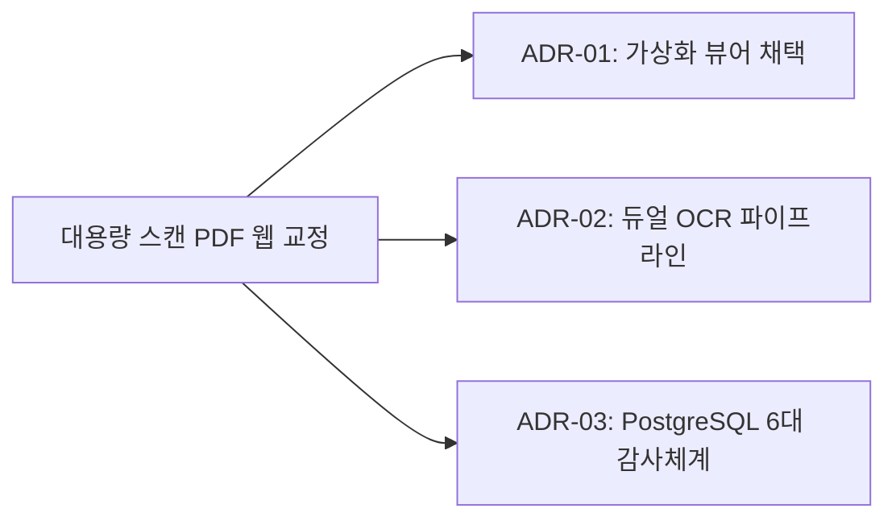

# 04. 결정 (Architecture Decision Records) 요약 가이드

## 📋 폴더 개요
시스템 아키텍처, 기술 스택, 프레임워크 선정 및 주요 엔지니어링 의사결정의 배경과 근거(ADR)를 보관합니다.

## 📑 하위 문서 목록
| 문서번호 | 파일명 | 문서 제목 | 주요 내용 요약 |
| :--- | :--- | :--- | :--- |
| `04-01` | `04-01_모바일반응형_UX_및_내비게이션_구조_의사결정록.md` | 모바일 반응형 UX 및 내비게이션 구조 의사결정록 | 모바일 햄버거 드로어+퀵 칩 바, 데스크톱 2단 도메인 탭, 가로스크롤 래퍼 격리 채택 |
| `04-02` | `04-02_토큰소진방지_및_자가적응형_쿼터관리_의사결정.md` | 토큰 소진 방지 및 자가 적응형 쿼터 관리 의사결정록 | 4계층 텔레메트리, EMA 적응형 학습 보정치(α), 무손실 인계 도시에, E-기능 터미널 압축기 채택 |

  
  
<em>[그림] 04. 결정 (Architecture Decision Records) 요약 가이드 - 아키텍처 및 상태 흐름도 다이어그램 1</em>

