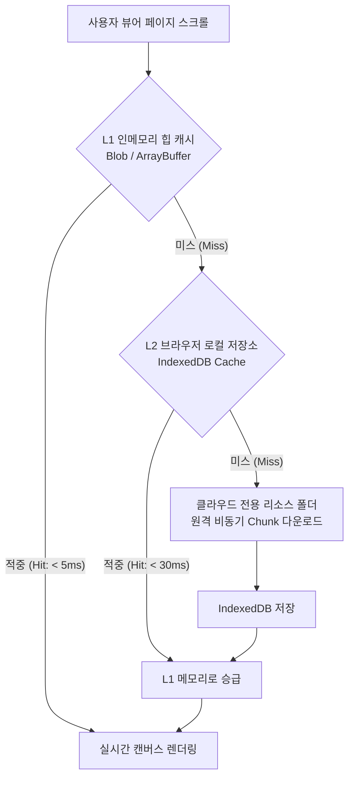

# [설계 문서] 클라우드 스토리지 전용 리소스 폴더 격리, 유효 쿼터 초과 방어 및 하이브리드 캐싱 아키텍처 (04-09)

> **문서 번호**: DOC-04-설계-04-09  
> **관련 백로그**: `[BACKLOG-0018-01]`  
> **버전**: v1.0.0 (2026-09-29)  
> **상태**: 백로그 등록 및 개념 아키텍처 승인 (Pending Implementation)  
> **작성자**: purePDFrend AI 에이전트

---

## 1. 개요 및 설계 목표

purePDFrend의 멀티 클라우드 스토리지(Google Drive, Dropbox, OneDrive, AWS S3) 연동 시, 시스템의 안정성과 응답 성능을 극대화하기 위해 다음 3대 핵심 요구사항을 충족하는 아키텍처를 정의합니다:
1. **클라우드별 전용 리소스 폴더 지정 및 격리 (`Designated Resource Folder`)**
2. **유효 사용량 상한(Quota Enforcer) 및 초과 시 안전 예외 격리 (Zero-Corruption Principle)**
3. **성능 극대화를 위한 하이브리드 인메모리(RAM) 및 브라우저 로컬 스토리지 2계층 캐싱 (Tiered Caching Engine)**

---

## 2. 세부 설계 명세

### 2-1. 전용 리소스 폴더 지정 규약 (Designated Resource Folder)
- **목적**: 사용자의 전체 클라우드 드라이브를 무차별 스캔하지 않고, 지정된 전용 샌드박스 폴더만을 리소스 루트로 사용하여 프라이버시 보호 및 I/O 속도 극대화.
- **폴더 명명 규칙**:
  - Google Drive: `/MyDrive/purePDFrend_Resources/`
  - Dropbox: `/Dropbox/Apps/purePDFrend/`
  - OneDrive: `/OneDrive/문서/purePDFrend_Lib/`
  - AWS S3: `s3://purepdf-archive-bucket/prod/`
- **구조**:
  ```text
  /purePDFrend_Resources/
  ├── originals/       # 원본 PDF 파일 보관소
  ├── ocr_layers/      # OCR 투명 텍스트 및 JSON 메타데이터 레이어
  ├── thumbnails/     # 빠른 그리드 조회를 위한 경량 썸네일 캐시 (WebP)
  └── exports/         # 변환/압축/병합 완료된 최종 산출물
  ```

### 2-2. 유효 사용량 상한 및 초과 예외 처리 (Storage Quota Enforcer)
1. **플랜별 하드 리밋(Hard Limit) 규정**:
   - 무료 회원: 활성 클라우드당 최대 **2.0 GB**
   - Pro 회원: 활성 클라우드당 최대 **15.0 GB**
   - Enterprise: 사용자 지정 S3 버킷 무제한 (Soft Quota 감시)
2. **사전 쓰기 검증 (Pre-Flight Quota Check)**:
   - 신규 문서 업로드 또는 OCR 처리 전 `(현재 사용량 + 신규 파일 크기) <= 유효 사용량` 검증.
3. **초과 시 3단계 Graceful Degradation (예외 격리 정책)**:
   - **80% 도달 (경고)**: UI 게이지 Amber 색상 전환, 불필요한 썸네일 자동 정리(Purge).
   - **95% 도달 (주의)**: UI 게이지 Rose 색상 전환, "저장소 여유 공간 부족" 토스트 안내.
   - **100% 초과 (방어)**: 신규 업로드 즉시 일시 차단(`STORAGE_QUOTA_EXCEEDED` 에러 코드), 작업 중인 문서는 로컬 브라우저 세션에 안전 격리 보존 후 클라우드 동기화 보류 상태로 전환. 기존 데이터 손상 원천 방지.

### 2-3. 하이브리드 2계층 캐싱 성능 아키텍처 (Tiered Caching)
네트워크 지연 시간을 극복하고 800쪽 이상의 대용량 PDF를 실시간 60fps로 렌더링하기 위해 2계층 캐시를 채택합니다.



1. **L1 Cache (인메모리 RAM)**:
   - 활성 열람 중인 페이지 앞뒤 ±5페이지를 `ArrayBuffer` 형태로 메모리에 상주시켜 스크롤 즉시 0ms 렌더링.
   - 메모리 부족(OOM) 방지를 위해 LRU(Least Recently Used) 알고리즘으로 자동 축출.
2. **L2 Cache (브라우저 IndexedDB)**:
   - 한 번 열람한 문서의 페이지 비트맵과 OCR 텍스트 레이어를 클라이언트 로컬 IndexedDB에 암호화 보관.
   - 오프라인 상태에서도 동일 문서 즉시 재열람 가능.

---

## 3. 백로그 등록 정보

- **백로그 ID**: `[BACKLOG-0018-01]`
- **우선순위**: HIGH (와이어프레임 리뷰 완료 후 실서비스 구현 단계 반영)
- **추진 태스크**: `[TASK-0019-xx] 클라우드 스토리지 전용 리소스 폴더 및 하이브리드 캐싱 엔진 구현`
