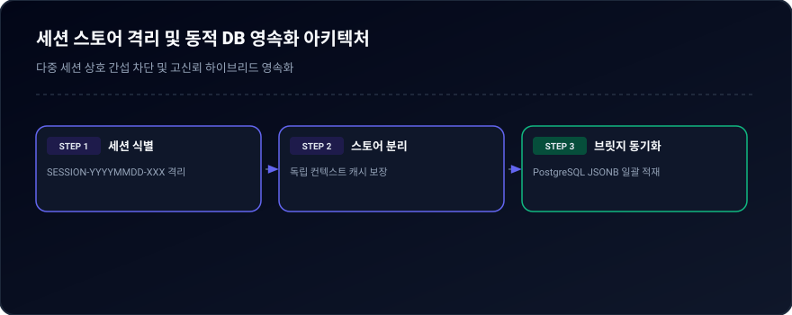
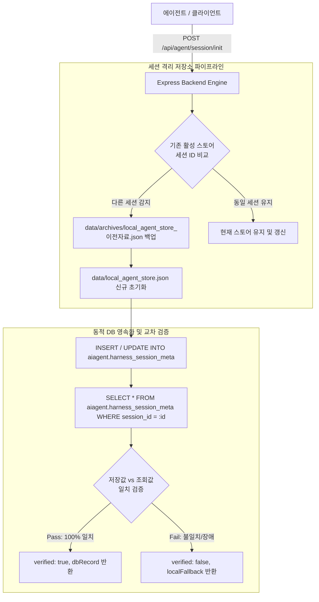

# 05-04. 세션 스토어 격리 및 동적 DB 영속화 설계

> **문서 번호**: `05-04`  
> **표준 분류**: 05.설계 (Architecture & Detailed Design)  
> **최초 작성일**: 2026-09-20  
> **상태**: 승인완료 (Approved)  
> **관련 정책**: 03-04(하네스 생명주기), 03-05(테이블 거버넌스), 03-09(토큰제외), 03-10(무중단 DB)

---

## 1. 개요 및 배경

기존 하네스 시스템은 `data/local_agent_store.json` 단일 파일에 다수의 세션 데이터가 누적되어 세션 간 상태 오염(State Pollution) 및 비대화의 위험이 있었습니다. 또한 백엔드 API 내부에 일부 세션/태스크 ID의 하드코딩 기본값이 잔재하여, 신규 세션 진입 시 명시적 파라미터가 누락되었을 때 과거 세션으로 잘못 귀속되는 잠재적 결함이 존재했습니다.

본 설계는 **세션단위 로컬 스토어 안전 격리(Isolation)**와 **100% 동적 파라미터 기반 DB 영속화 및 교차 검증(Self-Cross Check)** 체계를 구축하는 것을 목적으로 합니다.

---

## 2. 세션단위 스토어 격리 아키텍처

<div align="center">
  
  <p><em>[그림] 세션 스토어 격리 및 동적 DB 영속화 아키텍처</em></p>
</div>



---

## 3. 동적 파라미터 API 규격

### 3.1 세션 초기화 및 격리 (`POST /api/agent/session/init`)
- **목적**: 신규 세션 진입 시 기존 스토어를 안전하게 아카이브하고, 신규 세션 전용 격리 스토어 생성 및 DB 등록/검증.
- **Request Body**:
  ```json
  {
    "session_id": "SESSION-20260920-002",
    "session_name": "에이전트-프로세스-혁신",
    "work_group": "purePDFrend",
    "ai_agent": "gemini",
    "ai_model": "models/gemini-3.8-flash",
    "status_cd": "진행중",
    "doc_payload": { "description": "세션 설명..." }
  }
  ```
- **Response**:
  ```json
  {
    "success": true,
    "archived_old_session": "SESSION-20260917-001",
    "archive_path": "data/archives/local_agent_store_SESSION-20260917-001.json",
    "session_id": "SESSION-20260920-002",
    "verified": true,
    "dbRecord": { ... }
  }
  ```

### 3.2 태스크 동적 등록 및 교차 검증 (`POST /api/agent/task/save`)
- **Request Body**:
  ```json
  {
    "task_id": "TASK-20260920-006",
    "session_id": "SESSION-20260920-002",
    "task_name": "세션단위 로컬 스토어 격리 및 동적 DB 영속화 API 구축",
    "git_branch": "task/0004_에이전트프로세스혁신_gemini",
    "status_cd": "진행중",
    "doc_payload": { ... }
  }
  ```
- **교차 검증 절차**:
  1. `aiagent.harness_task_meta` INSERT/UPDATE 수행
  2. 즉시 `SELECT * FROM aiagent.harness_task_meta WHERE task_id = $1` 조회
  3. 요청 파라미터의 `task_name`, `status_cd`, `git_branch`가 DB 조회 결과와 완전히 일치하는지 비교 검증
  4. 일치 시 `verified: true`, 불일치 시 `verified: false`와 상세 로그 반환

### 3.3 루프 동적 등록 및 교차 검증 (`POST /api/agent/loop/save`)
- **Request Body**:
  ```json
  {
    "loop_id": "LOOP-20260920-013",
    "task_id": "TASK-20260920-006",
    "session_id": "SESSION-20260920-002",
    "loop_name": "세션단위-로컬스토어-격리-초기화",
    "status_cd": "진행중",
    "doc_payload": { ... }
  }
  ```

### 3.4 대화 턴 동적 등록 및 교차 검증 (`POST /api/agent/trace/turn`)
- 고정 기본값(Default fallback string)을 완전 배제하고, 클라이언트가 명시적으로 지정한 `session_id`, `task_id`, `loop_id`를 의무화합니다.
- 토큰 초과 오류 턴 자동 배제(정책 03-09) 및 DB 즉시 교차 검증을 연계합니다.

---

## 4. 데이터 정합성 및 무결성 감사 규칙

1. **하드코딩 배제 원칙**: 모든 API 라우트 핸들러에서 하드코딩된 세션/태스크/루프 문자열 기본값을 금지하며, 누락 시 유효성 검증 오류(HTTP 400 Bad Request)를 반환합니다.
2. **원자적 아카이빙**: 활성 세션 변경 시 기존 `data/local_agent_store.json`은 삭제되지 않고 타임스탬프와 세션 ID가 명시된 `data/archives/` 디렉터리로 안전하게 이동/복사됩니다.
3. **교차 검증 (Self-Cross Check)**: 백엔드는 DB INSERT 성공 여부뿐만 아니라, 실제 저장된 데이터의 스냅샷을 재조회하여 클라이언트에 함께 반환함으로써 100% 무결성을 증명합니다.

---

## 📋 편집 이력 (Revision History)

| 작업일자 | 이슈 | 태스크 | 작업자 | 작업내용 | 사용 AI 모델명 | 에이전트 | 참고링크 |
| :--- | :--- | :--- | :--- | :--- | :--- | :--- | :--- |
| 2026-09-20 | #10 | TASK-005 | gemini | 최초 제정 및 도메인 거버넌스 수립 | Gemini 2.5 Flash | Google AI Studio | [03-01. 문서 정책](../03.정책/03-01_문서작성_및_편집이력_정책.md) |
| 2026-09-21 | #14 | TASK-008 | gemini | v2.2 전면 개정: 8대 필드 편집이력, 상호 링크, 다이어그램 이미지화 및 DB 영속화 표준 반영 | Gemini 3.8 Flash | Google AI Studio | [03-01. 문서 정책](../03.정책/03-01_문서작성_및_편집이력_정책.md) |
