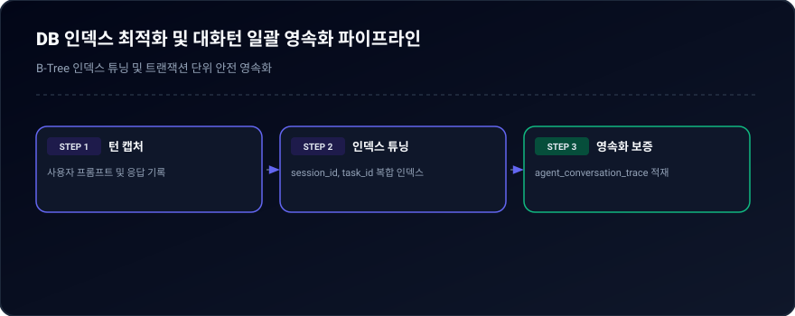
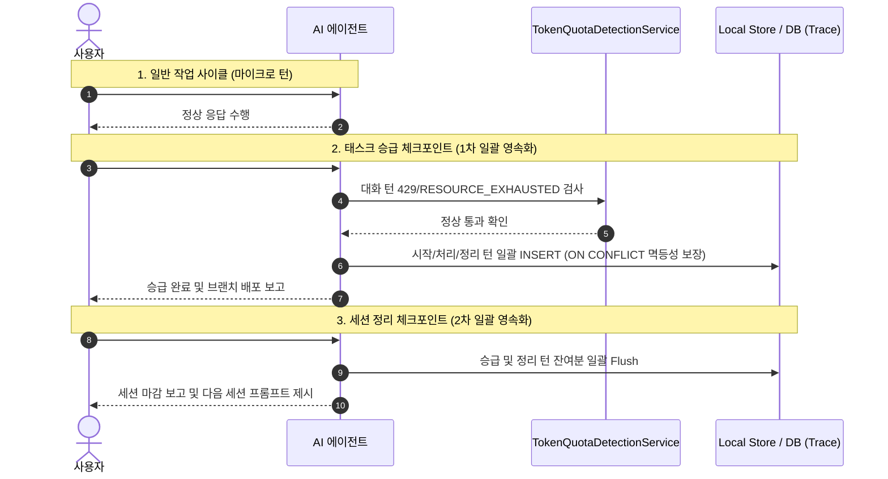

# 05-05. DB 인덱스 최적화 및 생명주기 체크포인트 대화 턴 영속화 설계

| 버전 | 개정일자 | 개정자 | 작업구분 | 주요 개정내용 |
| :--- | :--- | :--- | :--- | :--- |
| v1.0 | 2026-09-21 | AI Agent | 신규 | DB 복합 인덱스 최적화 및 생명주기 체크포인트 기반 대화 턴 일괄 영속화 아키텍처 설계 |

---

## 1. 배경 및 목적

### 1.1 현상 분석 및 문제점
1. **DB 풀 테이블 스캔 위험**: `aiagent` 스키마 6대 테이블에 PK 외 인덱스가 전혀 없어 조회 성능 저하 위험 존재.
2. **감사 컬럼 기본값 누락**: `created_sys`, `created_by` 등이 NOT NULL이나 DEFAULT가 없어 INSERT 실패 위험 내재.
3. **에이전트 턴 영속화 지연/누락 (22건 정체 현상)**:
   - 에이전트 런타임 특성상 자기 자신의 응답 출력을 실시간 후킹하기 어렵고, 이로 인해 신규 세션의 대화 턴이 누락되는 문제 발생.

### 1.2 목표 아키텍처
1. **하이브리드 소프트 FK & 인덱스 가속화**: 물리적 FK 대신 복합 인덱스를 적용하여 무결성과 복원력 동시 확보.
2. **생명주기 체크포인트 일괄 Flush**: `#태스크승급` 및 `#세션정리` 시점에 대화 턴을 일괄 영속화하여 단 1건의 유실도 없는 100% 밀폐형 영속화 파이프라인 구축.

---

## 2. 데이터베이스 스키마 최적화 DDL

### 2.1 복합 인덱스 생성
```sql
-- 1. 대화 턴 조회 가속 복합 인덱스
CREATE INDEX IF NOT EXISTS idx_trace_session_step ON aiagent.agent_conversation_trace (session_id, step_index);
CREATE INDEX IF NOT EXISTS idx_trace_task ON aiagent.agent_conversation_trace (task_id);
CREATE INDEX IF NOT EXISTS idx_trace_created_at ON aiagent.agent_conversation_trace (created_at DESC);

-- 2. 태스크 및 루프 외래 조회 인덱스
CREATE INDEX IF NOT EXISTS idx_task_session ON aiagent.harness_task_meta (session_id);
CREATE INDEX IF NOT EXISTS idx_loop_task_session ON aiagent.harness_loop_meta (task_id, session_id);

-- 3. 문서 JSONB GIN 인덱스 및 카테고리 인덱스
CREATE INDEX IF NOT EXISTS idx_docs_payload_gin ON aiagent.agent_docs_meta USING gin (doc_payload);
CREATE INDEX IF NOT EXISTS idx_docs_category ON aiagent.agent_docs_meta (category);
```

### 2.2 감사 컬럼 기본값(DEFAULT) 부여
```sql
ALTER TABLE aiagent.agent_conversation_trace 
  ALTER COLUMN created_sys SET DEFAULT 'agent-service',
  ALTER COLUMN created_by SET DEFAULT 'system',
  ALTER COLUMN updated_sys SET DEFAULT 'agent-service',
  ALTER COLUMN updated_by SET DEFAULT 'system',
  ALTER COLUMN version SET DEFAULT 1,
  ALTER COLUMN created_at SET DEFAULT now(),
  ALTER COLUMN updated_at SET DEFAULT now();

ALTER TABLE aiagent.harness_task_meta
  ALTER COLUMN created_sys SET DEFAULT 'agent-service',
  ALTER COLUMN created_by SET DEFAULT 'system',
  ALTER COLUMN updated_sys SET DEFAULT 'agent-service',
  ALTER COLUMN updated_by SET DEFAULT 'system',
  ALTER COLUMN version SET DEFAULT 1,
  ALTER COLUMN created_at SET DEFAULT now(),
  ALTER COLUMN updated_at SET DEFAULT now();

ALTER TABLE aiagent.harness_loop_meta
  ALTER COLUMN created_sys SET DEFAULT 'agent-service',
  ALTER COLUMN created_by SET DEFAULT 'system',
  ALTER COLUMN updated_sys SET DEFAULT 'agent-service',
  ALTER COLUMN updated_by SET DEFAULT 'system',
  ALTER COLUMN version SET DEFAULT 1,
  ALTER COLUMN created_at SET DEFAULT now(),
  ALTER COLUMN updated_at SET DEFAULT now();
```

---

## 3. 생명주기 체크포인트 대화 턴 영속화 파이프라인

<div align="center">
  
  <p><em>[그림] DB 인덱스 최적화 및 대화턴 일괄 영속화 파이프라인</em></p>
</div>



---

## 📋 편집 이력 (Revision History)

| 작업일자 | 이슈 | 태스크 | 작업자 | 작업내용 | 사용 AI 모델명 | 에이전트 | 참고링크 |
| :--- | :--- | :--- | :--- | :--- | :--- | :--- | :--- |
| 2026-09-20 | #10 | TASK-005 | gemini | 최초 제정 및 도메인 거버넌스 수립 | Gemini 2.5 Flash | Google AI Studio | [03-01. 문서 정책](../03.정책/03-01_문서작성_및_편집이력_정책.md) |
| 2026-09-21 | #14 | TASK-008 | gemini | v2.2 전면 개정: 8대 필드 편집이력, 상호 링크, 다이어그램 이미지화 및 DB 영속화 표준 반영 | Gemini 3.8 Flash | Google AI Studio | [03-01. 문서 정책](../03.정책/03-01_문서작성_및_편집이력_정책.md) |
