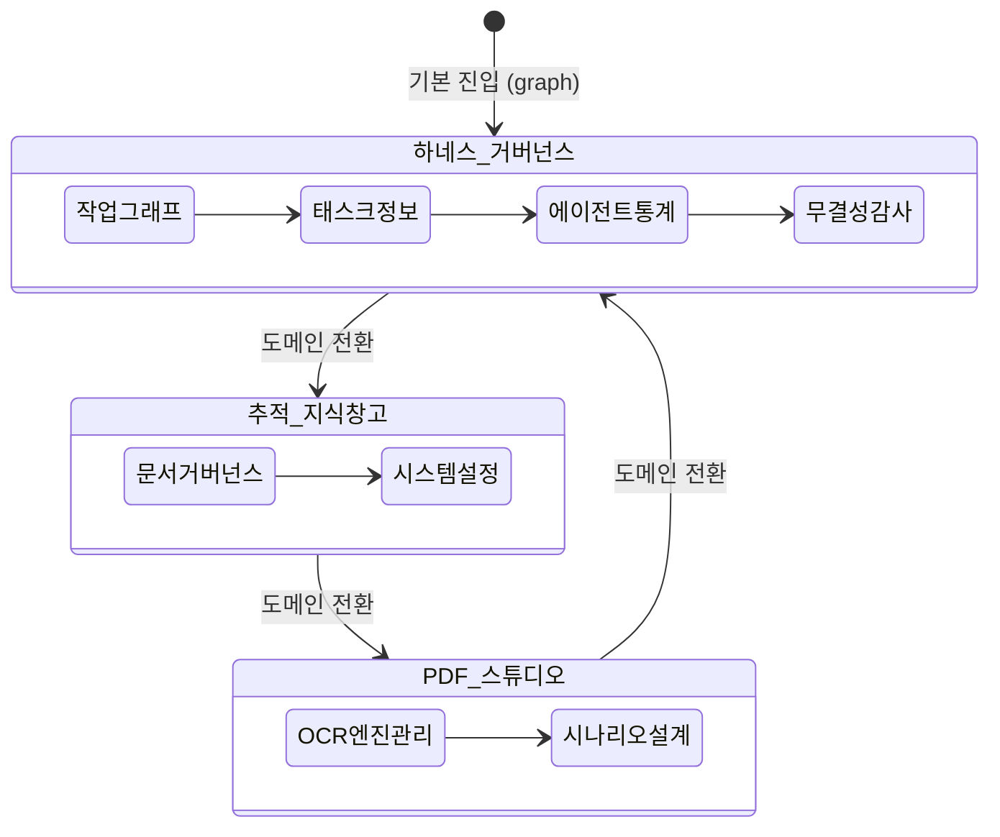

# 05-06. 모바일 반응형 UX 및 3대 도메인 IA 그룹화 설계서

## 🏛️ 1. 시스템 아키텍처 및 상태 흐름도

3대 도메인(`harness`, `knowledge`, `studio`)과 8대 뷰(`ActiveViewId`)의 상태 전이 흐름은 최상위 `App.tsx`에서 단일 진실 공급원(SSOT)으로 관리됩니다.

<div align="center">
  
  <p><em>[그림] 모바일 반응형 UX 및 3대 도메인 상태 전이도</em></p>
</div>



---

## 🧩 2. 도메인 및 뷰 명세표

```typescript
export type DomainGroupId = 'harness' | 'knowledge' | 'studio';

export type ActiveViewId =
  | 'graph'
  | 'task'
  | 'usage'
  | 'audit'
  | 'docs'
  | 'settings'
  | 'ocr'
  | 'scenarios';
```

| 도메인 ID | 도메인 명칭 | 소속 뷰 ID | 컴포넌트 매핑 | 모바일 퀵 칩 아이콘 |
| :--- | :--- | :--- | :--- | :--- |
| `harness` | 하네스 거버넌스 | `graph` | `WorkGraphViewer` | Network |
| | | `task` | `TaskInfoManager` | Layers |
| | | `usage` | `AgentUsageViewer` | BarChart3 |
| | | `audit` | `IntegrityAuditManager` | ShieldCheck |
| `knowledge` | 추적 및 지식창고 | `docs` | `DocsGovernanceManager` | FileText |
| | | `settings` | `SystemSettingsView` | Settings |
| `studio` | PDF 스튜디오 | `ocr` | `OcrEngineManager` | Cpu |
| | | `scenarios` | `ScenarioDesignView` | Layout |

---

## 📱 3. 모바일 반응형 내비게이션 인터페이스 설계

### 3.1 반응형 Breakpoint 및 레이아웃 제약
- **Desktop (≥ 768px)**:
  - Header: `h-16 border-b border-slate-800 px-6`
  - 3대 도메인 세그먼트 버튼 + 서브 퀵 칩 바 (`h-10 border-b border-slate-800/60 bg-slate-950/60 px-6`)
  - 우측 유틸리티: DB 연결 상태 알약 뱃지(호버 팝업), 서비스 정밀점검 진단 버튼
- **Mobile (< 768px)**:
  - Header: `h-14 border-b border-slate-800 px-4`
  - 좌측: 로고 + 현재 뷰 미니 뱃지
  - 우측: **최소 44px × 44px 햄버거 메뉴 버튼 (`p-2.5`)**
  - Sub-Bar: **가로 스와이프 모바일 퀵 칩 바 (`h-11 px-3 space-x-1.5 overflow-x-auto`)**
  - Drawer: **우측 슬라이딩 오프캔버스 드로어 (`w-72 bg-slate-900 shadow-2xl z-50 fixed inset-y-0 right-0`)**
    - 백드롭: `fixed inset-0 bg-black/60 backdrop-blur-xs z-40`

---

## 🛡️ 4. 가로 오버플로우 방지 및 터치 타깃 가드레일 설계

1. **최상위 컨테이너 가드레일**:
   - `html, body, #root`: `overflow-x-hidden w-full min-w-0`
   - `main`: `w-full max-w-7xl mx-auto px-3 sm:px-6 py-3 sm:py-6 overflow-x-hidden min-w-0`
2. **데이터 테이블 및 차트 가드레일**:
   - 테이블을 감싸는 패널 내부: `<div className="w-full overflow-x-auto -webkit-overflow-scrolling-touch">`
   - 테이블 자체에 최소 너비(`min-w-[640px]`) 부여하되 부모 컨테이너가 스크롤을 흡수하여 페이지 전체 밀림 방지.
3. **모바일 터치 접근성**:
   - 닫기 버튼, 탭 전환 버튼, 칩, 액션 버튼의 패딩을 `px-3.5 py-2.5` 이상으로 지정하여 터치 영역 **44px 이상** 확보.

---

## 📋 편집 이력 (Revision History)

| 작업일자 | 이슈 | 태스크 | 작업자 | 작업내용 | 사용 AI 모델명 | 에이전트 | 참고링크 |
| :--- | :--- | :--- | :--- | :--- | :--- | :--- | :--- |
| 2026-09-21 | #01 | TASK-001 | gemini | [v1.0] 최초 제정: 3대 도메인 8대 뷰 아키텍처, Navbar 인터랙션 컴포넌트, 모바일 터치 가드레일 설계 | Gemini 2.5 Flash | Google AI Studio | [03-01. 문서 정책](../03.정책/03-01_문서작성_및_편집이력_정책.md) |
| 2026-09-21 | #14 | TASK-008 | gemini | v2.2 전면 개정: 8대 필드 편집이력, 상호 링크, 다이어그램 이미지화 및 DB 영속화 표준 반영 | Gemini 3.8 Flash | Google AI Studio | [03-01. 문서 정책](../03.정책/03-01_문서작성_및_편집이력_정책.md) |
