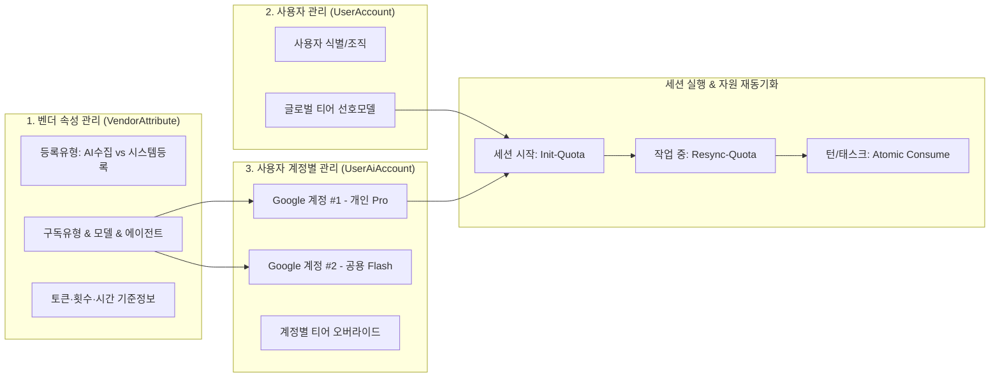

# 05-08. 시스템설정 3대 영역 및 세션 자원 재동기화 상세 설계

> **문서 상태**: 확정 및 구현 반영 (Approved)  
> **최초 작성일**: 2026-09-23  
> **관련 도메인**: `aiagent` 시스템 설정, 다차원 쿼터 거버넌스, 세션 스토어

---

## 1. 아키텍처 개요

본 문서는 사용자의 복수 AI 계정(Google Gemini 등)과 벤더 속성(AI 수집 vs 시스템 등록), 요금제 및 토큰 정책을 체계적으로 관리하고, 세션 실행 중 자원 상태를 실시간 재동기화(Re-sync)하는 구조를 기술합니다.

<div align="center">
  
  <p><em>[그림] 05-08. 시스템설정 3대 영역 및 세션 자원 재동기화 상세 설계 - 아키텍처 및 상태 흐름도 다이어그램 1</em></p>
</div>



---

## 2. 시스템 설정 3대 영역 데이터 스키마

### 2.1 벤더 속성 모델 (`VendorAttribute`)
```typescript
export interface VendorAttribute {
  vendorId: string; // GOOGLE, ANTHROPIC, OPENAI
  vendorName: string;
  originType: 'AI_COLLECTED' | 'SYSTEM_CONFIRMED'; // 등록 유형
  status: 'ACTIVE' | 'STAGING' | 'DEPRECATED';
  subscriptionPlans: {
    planId: string;
    planName: string;
    billingType: 'FREE' | 'SUBSCRIPTION' | 'USAGE_BASED';
    allowedModels: string[];
    quotaLimits: {
      maxTpm: number;
      maxRpm: number;
      maxRpd: number; // 일일 요청 한도 (예: Pro 250회, Flash 2500회)
      resetHourKst: number; // 16 (KST 16:00)
    };
  }[];
  agentEngines: {
    agentId: string;
    agentName: string;
    targetTier: 'TIER_1_PRO' | 'TIER_2_FLASH' | 'TIER_3_LITE';
    defaultModel: string;
  }[];
}
```

### 2.2 사용자 복수 계정 바인딩 모델 (`UserAiAccount`)
```typescript
export interface UserAiAccount {
  accountId: string; // ACC-GEMINI-PERSONAL-01
  userId: string;
  vendorId: string; // GOOGLE
  accountEmail: string; // user.personal@gmail.com
  accountLabel: string; // 개인 Gemini Pro 계정
  planId: string; // PLAN-GEMINI-ADVANCED
  isDefault: boolean; // 기본 활성 계정 여부
  tierOverride?: {
    tier1Model?: string; // 오버라이드 없을 시 사용자 글로벌 선호 상속
    tier2Model?: string;
    tier3Model?: string;
  };
  createdAt: string;
  updatedAt: string;
}
```

---

## 3. 세션 자원 생명주기 API 파이프라인

### 3.1 세션 시작 (`POST /api/agent/session/init-quota`)
- **입력**: `{ sessionId, userId, accountId?, promptTierConfig? }`
- **동작**:
  1. `accountId`가 전달되지 않은 경우 사용자의 `isDefault === true` 계정을 조회.
  2. 사용자의 글로벌 선호 및 계정 오버라이드 취합.
  3. `promptTierConfig`가 존재하면 프롬프트 지정값을 최우선 적용.
  4. 계정 요금제의 허용 모델 및 RPD 한도 검증.
  5. 세션 스토어(`local_agent_store.json`)의 세션 객체에 `tier_model_policy`와 `resource_baseline` 주입.

### 3.2 작업 중 자원 현황 재동기화 (`POST /api/agent/session/resync-quota`)
- **입력**: `{ sessionId }`
- **동작**:
  1. 현재 세션의 `active_ai_account_id` 조회.
  2. PostgreSQL `agent_account_quota_ledger`에서 최신 잔여 토큰, 금일 RPD 소모량, 리셋 시각 검증.
  3. 다른 세션이나 외부 사용에 의해 변경된 잔여 수치를 세션 메모리에 갱신.
  4. 갱신 결과(변동량, 현재 잔여 RPD/Token)를 반환하여 UI에 즉각 반영.

### 3.3 결정론적 토큰 차감 (`POST /api/agent/quota/consume`)
- **입력**: `{ sessionId, promptTokens, completionTokens, tier }`
- **동작**:
  1. 서버가 정확한 정수 덧셈으로 소비량 산출 (`total = prompt + completion`).
  2. `agent_account_quota_ledger`를 원자적으로 차감하고 `agent_quota_transaction_log`에 기록.
  3. 현재 세션 누적 소비량 갱신 후 반환.

---

## 📋 편집 이력 (Revision History)

| 작업일자 | 이슈 | 태스크 | 작업자 | 작업내용 | 사용 AI 모델명 | 에이전트 | 참고링크 |
| :--- | :--- | :--- | :--- | :--- | :--- | :--- | :--- |
| 2026-09-24 | #12 | TASK-0013 | gemini | 거버넌스 4대 ID 포맷 개선 및 18대 문서 체계 편집이력/다이어그램 표준화 | Gemini 1.5 Pro | Google Antigravity | [03-01. 문서 정책](../03.정책/03-01_문서작성_및_편집이력_정책.md) |
