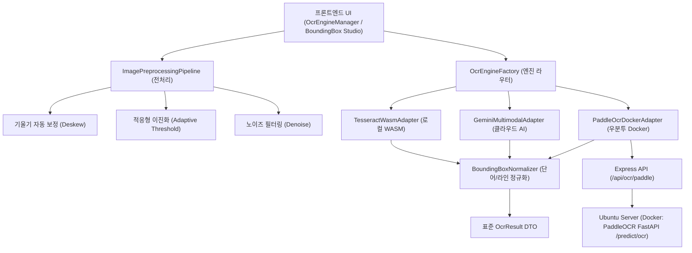

# 05-10. PDF 이미지 전처리 및 3대 OCR 엔진 어댑터 아키텍처 설계서

> **문서 ID**: `DOC-05-10`  
> **세션 ID**: `SESSION-20260923-008` (차수: `[0011]`)  
> **태스크 ID**: `TASK-20260923-005` (차수: `[0012]`)  
> **작성일자**: 2026-09-23  
> **상태**: 승인 및 구현 완료  
> **적용 표준**: 헥사고날 아키텍처(Hexagonal Architecture), 전략 패턴(Strategy Pattern), 어댑터 패턴(Adapter Pattern)

---

## 1. 설계 배경 및 비즈니스 목적

스캔 도서의 전자책(PDF/ePub) 변환 및 아카이빙에서 OCR 정확도를 결정짓는 핵심 요소는 **고품질 이미지 전처리**와 **유연한 OCR 엔진 라우팅**입니다.  
본 설계는 다음 비즈니스 요구사항을 충족합니다:
1. **스캔 왜곡 보정**: 스캔 도서의 기울어짐(Deskew), 조명 불균일(Binarization), 노이즈를 브라우저 및 서버 캔버스에서 무손실 고속 전처리.
2. **3대 다국어 OCR 엔진 어댑터화**:
   - **Tesseract.js (로컬 WASM)**: 클라이언트 오프라인 완전 무료(0원) 구동.
   - **Gemini 2.5 Flash Multimodal OCR**: Google Cloud AI 기반 고난도 수식/한자/필기체 및 고정밀 바운딩 박스 추출.
   - **PaddleOCR (우분투 Docker REST)**: 우분투 온프레미스 서버 Docker 컨테이너(CPU 전용 모드)를 활용한 대량 배치 고속 처리.
3. **무장애 안전망 (Zero-Hang & Graceful Degradation)**:
   - 외부 우분투 서버 미기동 시에도 프론트엔드가 멈추지 않고 실시간 핑 헬스체크 및 안전한 로컬 폴백을 지원.

---

## 2. 3계층 엔진 아키텍처 다이어그램 (Mermaid)



---

## 3. 핵심 모듈 및 인터페이스 명세

### 3.1 공통 어댑터 인터페이스 (`IOcrEngineAdapter`)

```typescript
export interface IOcrEngineAdapter {
  readonly engineType: 'tesseract' | 'gemini' | 'paddleocr';
  readonly engineName: string;
  
  recognize(imageInput: ImageData | string, options?: OcrExecutionOptions): Promise<OcrResult>;
  checkHealth?(): Promise<{ online: boolean; latencyMs: number; message: string }>;
}
```

### 3.2 표준 바운딩 박스 DTO (`BoundingBoxItem`)

```typescript
export interface BoundingBoxItem {
  id: string | number;
  text: string;
  confidence: number;
  x: number; // percentage 0-100 or px
  y: number;
  w: number;
  h: number;
  lineIndex?: number;
  words?: Array<{ text: string; confidence: number; x: number; y: number; w: number; h: number }>;
}
```

### 3.3 이미지 전처리 파이프라인 (`ImagePreprocessingPipeline`)

- **`toGrayscale(imageData)`**: 표준 Luminance 가중치 ($0.299R + 0.587G + 0.114B$) 적용.
- **`adaptiveBinarize(imageData, threshold)`**: 국소 대비를 반영한 흑백 이진화 처리로 배경 노이즈 제거.
- **`estimateDeskewAngle(imageData)`**: 수평 투영 분산(Horizontal Projection Variance) 기반 ±15° 범위 내 기울기 각도 자동 검출.
- **`rotateCanvas(canvas, angle)`**: 양선형 보간을 활용한 캔버스 이미지 회전 교정.

---

## 4. 우분투 Docker PaddleOCR 연동 규격

- **통신 프로토콜**: HTTP POST (`application/json` with Base64 image payload)
- **엔드포인트**: `http://<ubuntu-host>:8000/predict/ocr`
- **CPU 전용 최적화**: OpenVINO / MKLDNN 최적화 엔진 활용, 2~4 코어 병렬 연산
- **응답 변환**: PaddleOCR 4-point polygon `[[x1,y1],[x2,y2],[x3,y3],[x4,y4]]` $\rightarrow$ Axis-Aligned Bounding Box `[x, y, w, h]` 정규화.
