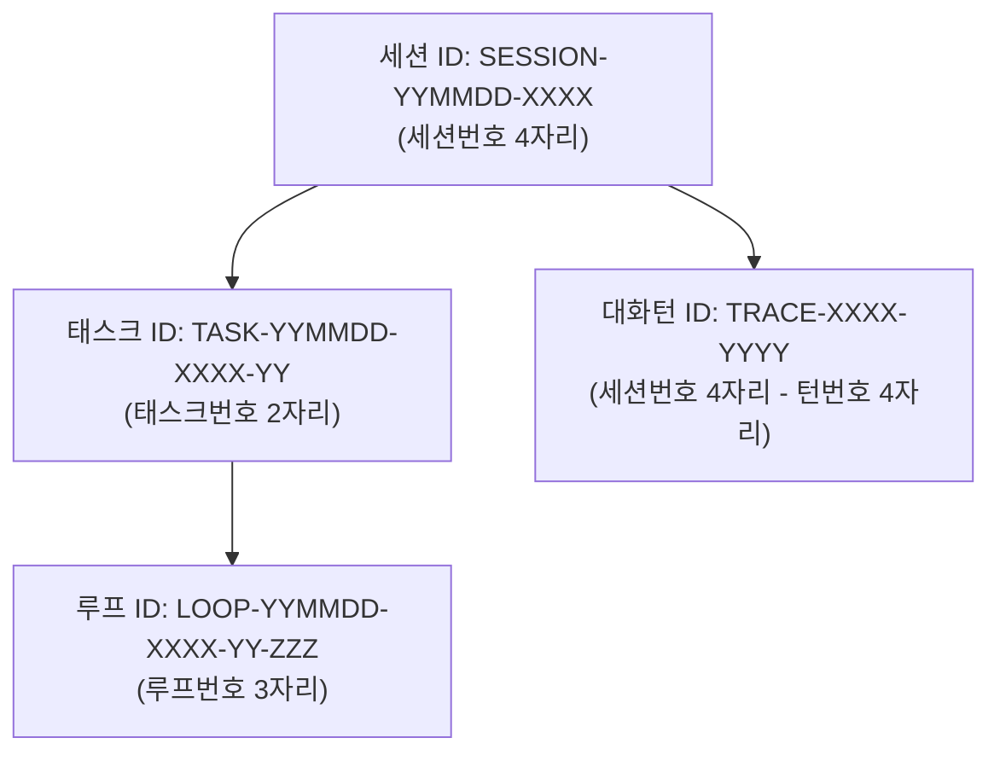

# 05-11. 거버넌스 4대 식별자 포맷 및 문서 다이어그램·편집이력 표준화 설계서

## 1. 개요 및 배경

본 문서는 purePDFrend 하네스 거버넌스 규정(AGENTS.md v2.1)의 식별자 체계 정밀화와 18대 기술문서 체계의 시각적 무결성 및 편집이력 거버넌스 표준을 정의합니다.

<div align="center">
  
  <p><em>[그림] 거버넌스 4대 식별자 계층 구조 및 채번 파이프라인</em></p>
</div>



---

## 2. 4대 식별자(ID) 표준 규격 명세

| 식별자 구분 | 표준 패턴 포맷 | 정규화 규칙 | 예시 |
| :--- | :--- | :--- | :--- |
| **세션 ID** | `SESSION-YYMMDD-XXXX` | 날짜 6자리 + 세션번호 4자리(`padStart(4, '0')`) | `SESSION-260924-0011` |
| **태스크 ID** | `TASK-YYMMDD-XXXX-YY` | 날짜 6자리 + 세션번호 4자리 + 태스크번호 2자리(`padStart(2, '0')`) | `TASK-260924-0011-01` |
| **루프 ID** | `LOOP-YYMMDD-XXXX-YY-ZZZ` | 날짜 6자리 + 세션번호 4자리 + 태스크번호 2자리 + 루프번호 3자리 | `LOOP-260924-0011-01-001` |
| **대화턴 ID** | `TRACE-XXXX-YYYY` | 세션번호 4자리 + 턴번호 4자리(`padStart(4, '0')`) | `TRACE-0011-0001` |

---

## 3. 도메인 엔진 구조 (`GovernanceIdGenerator.ts`)

```typescript
export class GovernanceIdGenerator {
  public static generateSessionId(sessionNum: number | string, date: Date = new Date()): string;
  public static generateTaskId(sessionNum: number | string, taskNum: number | string, date: Date = new Date()): string;
  public static generateLoopId(sessionNum: number | string, taskNum: number | string, loopNum: number | string, date: Date = new Date()): string;
  public static generateTraceId(sessionNum: number | string, turnNum: number | string): string;
  public static extractSessionNumber(sessionId: string | number): string;
}
```

---

## 4. 기술문서 2대 표준화 규칙

1. **Mermaid 다이어그램 시각화 래퍼 및 대체 텍스트 의무화**:
   - 모든 Mermaid 코드 블록 상단에 `<div align="center">...<p><em>[그림] ...</em></p></div>` 블록을 배치하여 다이어그램 미지원 렌더러에서도 대체 텍스트를 통해 내용을 완벽히 파악할 수 있도록 보장합니다.
2. **편집이력 테이블 문서 최하단 배치 및 타이틀 표준화**:
   - 가독성을 저해하는 문서 상단 편집이력을 모두 **문서 최하단**으로 이전합니다.
   - 타이틀은 반드시 `## 📋 편집 이력 (Revision History)`로 단일화하며 8대 표준 필드를 준수합니다.

---

## 📋 편집 이력 (Revision History)

| 작업일자 | 이슈 | 태스크 | 작업자 | 작업내용 | 사용 AI 모델명 | 에이전트 | 참고링크 |
| :--- | :--- | :--- | :--- | :--- | :--- | :--- | :--- |
| 2026-09-24 | #12 | TASK-0013 | gemini | [v1.0] 최초 제정: 거버넌스 4대 식별자 포맷 및 기술문서 Mermaid 이미지화/하단 편집이력 표준 수립 | Gemini 1.5 Pro | Google Antigravity | [03-01. 문서 정책](../03.정책/03-01_문서작성_및_편집이력_정책.md) |
