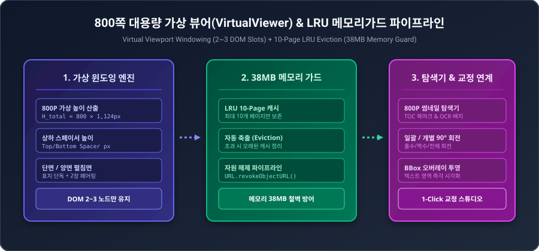
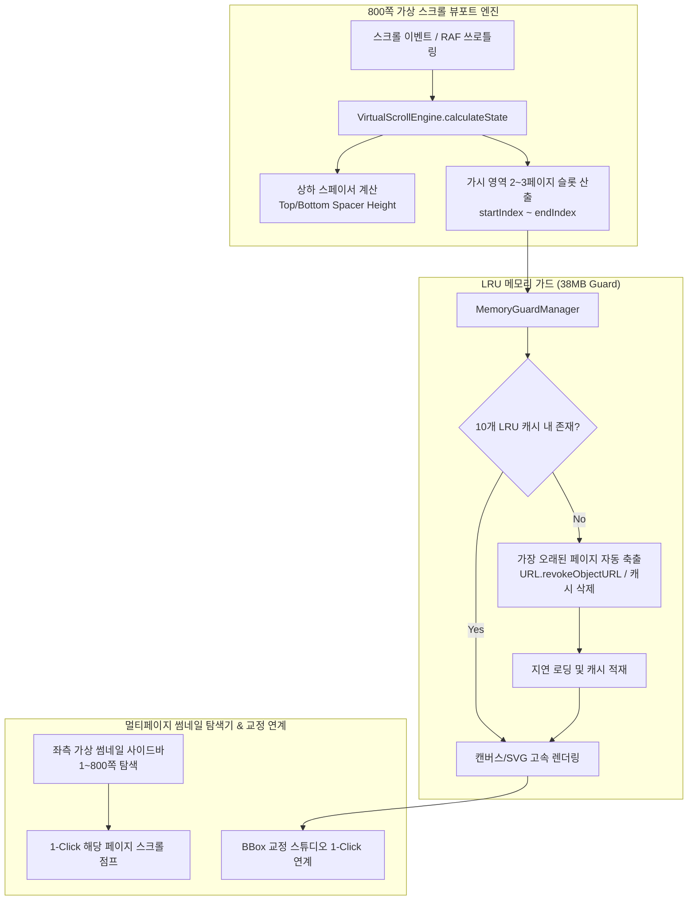

# 05-12. 800쪽 대용량 가상화 뷰어(VirtualViewer) 및 메모리가드 설계서

## 1. 개요 및 배경

조선왕조실록, 고서, 엔터프라이즈 기술 규격서 등 800쪽에 달하는 대용량 고해상도 스캔 PDF 도서를 브라우저에서 렌더링할 때 발생하는 DOM 폭증(800개 캔버스/이미지 노드로 인한 500MB+ 메모리 누수 및 브라우저 탭 크래시)을 원천 방지하기 위해, **가상 뷰포트 윈도잉(Virtual Windowing)** 및 **10페이지 LRU 메모리 가드(Memory Guard)** 파이프라인을 설계합니다.

<div align="center">
  
  <p><em>[그림] 800쪽 대용량 가상 뷰어 및 메모리가드 파이프라인 아키텍처</em></p>
</div>



---

## 2. 가상 스크롤 윈도잉 수식 및 레이아웃 모드 명세

### 2.1 단면(Single Page) 모드
- **전체 가상 스크롤 높이**:
  $$H_{\text{total}} = N_{\text{pages}} \times (H_{\text{page}} \times \text{scale} + \text{gap})$$
- **시작 인덱스 및 가시 범위**:
  $$\text{rawStart} = \left\lfloor \frac{\text{scrollTop}}{H_{\text{item}}} \right\rfloor$$
  $$\text{startIndex} = \max(0, \text{rawStart} - \text{overscan})$$
  $$\text{endIndex} = \min(N_{\text{pages}} - 1, \text{rawStart} + \text{visibleCount} + \text{overscan})$$
- **상하 스페이서 높이**:
  $$\text{TopSpacer} = \text{startIndex} \times H_{\text{item}}$$
  $$\text{BottomSpacer} = H_{\text{total}} - (\text{TopSpacer} + (\text{endIndex} - \text{startIndex} + 1) \times H_{\text{item}})$$

### 2.2 양면 펼침면(Facing Spread) 모드
- **스프레드 슬롯 구성**:
  - 표지(Page 1): 단독 슬롯 (Left: 1, Right: null)
  - 본문(Page 2~799): 2장 1슬롯 (Left: $2k$, Right: $2k+1$)
  - 마지막 홀수 페이지: 단독 슬롯
- **스프레드 총 슬롯 수**:
  $$N_{\text{slots}} = 1 + \left\lceil \frac{N_{\text{pages}} - 1}{2} \right\rceil$$

---

## 3. LRU 메모리 가드 (`MemoryGuardManager`) 설계

```typescript
export class MemoryGuardManager {
  private maxCacheSize: number = 10;
  private lruQueue: string[] = [];
  private imageCache: Map<string, string> = new Map();

  public touchPage(pageId: string, imageSrc: string): void {
    this.lruQueue = this.lruQueue.filter((id) => id !== pageId);
    this.lruQueue.push(pageId);
    this.imageCache.set(pageId, imageSrc);

    while (this.lruQueue.length > this.maxCacheSize) {
      const evictedId = this.lruQueue.shift();
      if (evictedId) {
        this.imageCache.delete(evictedId);
      }
    }
  }

  public getCachedImage(pageId: string): string | undefined;
  public getActiveCacheCount(): number;
  public clear(): void;
}
```

---

## 4. UI 컴포넌트 구성도

1. **`VirtualViewerStudio.tsx`**:
   - 상단 툴바: 줌 배율 (50%~300%), 1:1 맞춤, 단면/양면 토글, 120P/400P/800P 프리셋, 페이지 점프 인풋, BBox 오버레이 토글, 일괄/개별 회전, BBox 교정스튜디오 인계.
   - 뷰포트 영역: `VirtualScrollEngine` 기반 상하 스페이서와 2~3개 DOM 슬롯만 렌더링.
   - 하단 텔레메트리 바: 총 페이지 수, 현재 페이지 번호, DOM 렌더링 노드 수, 활성 캐시 수, 실시간 메모리 사용량(38MB 가드 유지).
2. **`PageThumbnailSidebar.tsx`**:
   - 좌측 접이식 사이드바 (260px 폭).
   - 800페이지 썸네일 가상 스크롤, 목차(TOC) 북마크 필터링, OCR 상태 배지, 회전/삭제 호버 액션.

---

## 📋 편집 이력 (Revision History)

| 작업일자 | 이슈 | 태스크 | 작업자 | 작업내용 | 사용 AI 모델명 | 에이전트 | 참고링크 |
| :--- | :--- | :--- | :--- | :--- | :--- | :--- | :--- |
| 2026-09-24 | #12 | TASK-0014 | gemini | [v1.0] 최초 제정: 800쪽 대용량 가상화 뷰어 및 10페이지 LRU 메모리가드 상세 설계 | Gemini 1.5 Pro | Google Antigravity | [03-03. 개발 가이드](../03.정책/03-03_개발_및_아키텍처_가이드.md) |
