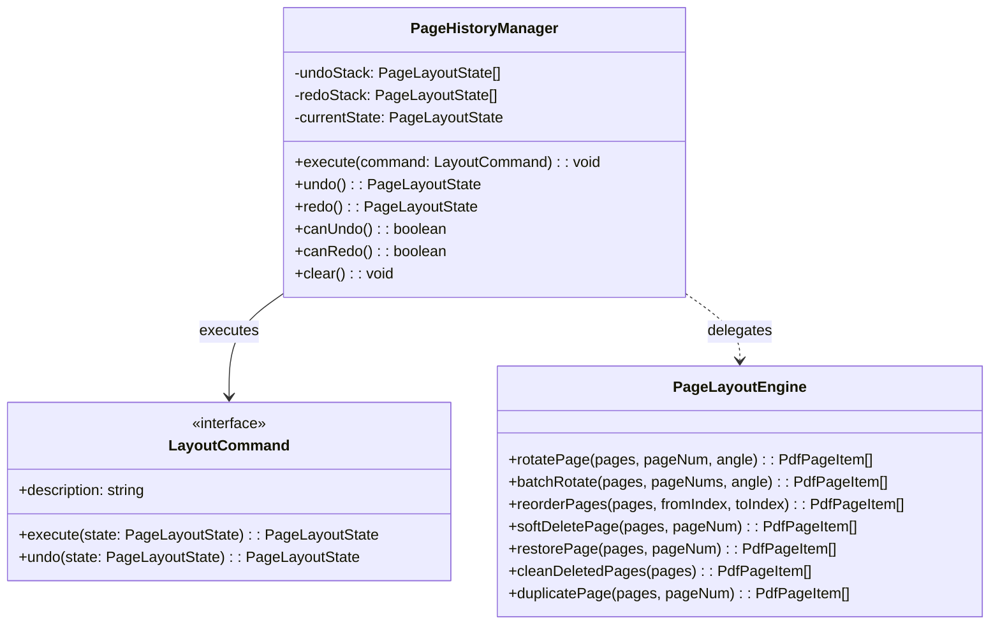

# 05-13. PDF 페이지 레이아웃 편집기 및 Undo/Redo 커맨드 엔진 설계

## 📌 문서 개요
- **문서 식별자**: `05-13`
- **작성 일자**: 2026-09-24
- **작성자**: Gemini (AI Agent) / jkoogit (Human Reviewer)
- **상위 세션**: `SESSION-260924-0012`
- **상위 태스크**: `TASK-260924-0012-01`
- **목적**: 대용량 스캔 PDF의 페이지 회전, 순서 변경(Drag & Drop), 소프트 삭제/복원, 그리고 무제한 실행 취소(Undo) / 다시 실행(Redo)을 지원하는 커맨드 패턴 기반 레이아웃 엔진의 아키텍처를 정의함.

---

## 🏗️ 1. 아키텍처 다이어그램

  
  
<em>[그림 05-13-1] 커맨드(Command) 및 메멘토(Memento) 패턴 기반 무제한 실행 취소/다시 실행 엔진 구조</em>

---

## ⚙️ 2. 핵심 설계 원칙

### 1) 커맨드(Command) 및 불변 메멘토(Memento) 패턴
- **무제한 Undo/Redo 보장**:
  - `PageHistoryManager`는 상태 변이 시 이전 상태 스냅샷을 Undo 스택에 Push하고 Redo 스택을 초기화합니다.
  - Undo 실행 시 현재 상태를 Redo 스택으로 이동하고 이전 상태를 복원합니다.
  - Redo 실행 시 Redo 스택의 상태를 Undo 스택으로 이동하고 복원합니다.
  - Undo/Redo 가능 여부(`canUndo`, `canRedo`)를 리액티브하게 계산하여 UI 버튼 활성/비활성을 제어합니다.
- **메모리 최적화**:
  - 대용량 PDF(800쪽+)에서도 무거운 이미지 픽셀 데이터는 `pageId` 기반 메모리 캐시로 공유하고, 가벼운 메타데이터(순서, 회전 각도, 삭제 여부)만 불변 객체로 관리하여 GC 부하를 최소화합니다.

### 2) 소프트 삭제(Soft Delete) 및 최종 클린징
- 사용자가 페이지 삭제 클릭 시 즉시 영구 삭제하지 않고 `isDeleted: true` 플래그로 마킹합니다.
- UI 상에서 흐리게(Opacity) 표시되며 [복원] 버튼을 통해 언제든 취소 가능합니다.
- 사용자가 [영구 반영 / 저장] 액션을 수행할 때만 `cleanDeletedPages()`를 통해 실제 배열에서 제거하고 `pageNum`을 1부터 N까지 연속적으로 재부여합니다.

### 3) 4방향 회전 순환 불변식
- 회전 각도는 항상 `(currentRotation + angle) % 360`으로 계산되어 `0°`, `90°`, `180°`, `270°` 정규화 상태를 유지합니다.

---

## 📋 편집 이력 (Revision History)

| 작업일자 | 이슈 | 태스크 | 작업자 | 작업내용 | 사용 AI 모델명 | 에이전트 | 참고링크 |
| :--- | :--- | :--- | :--- | :--- | :--- | :--- | :--- |
| 2026-09-24 | #15 | TASK-0015 | gemini | PDF 페이지 레이아웃 편집기 및 Undo/Redo 커맨드 엔진 설계서 제정 | Gemini 3.7 Flash | Google Antigravity | [03-01. 문서 정책](../03.정책/03-01_문서작성_및_편집이력_정책.md) |
