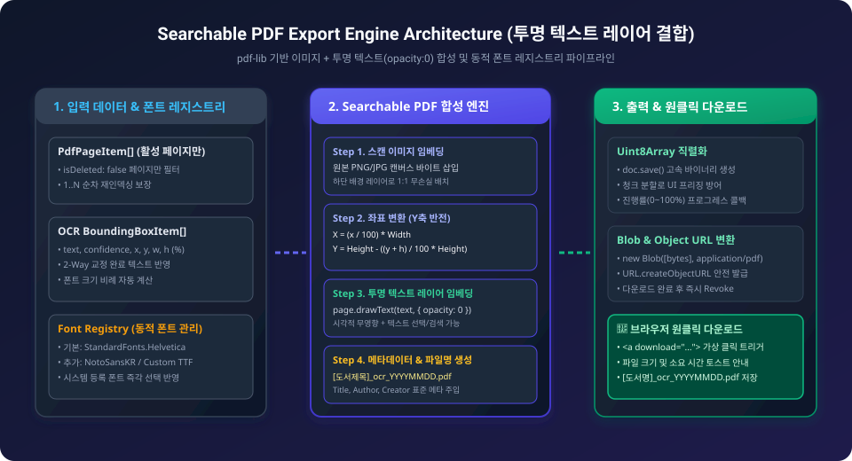
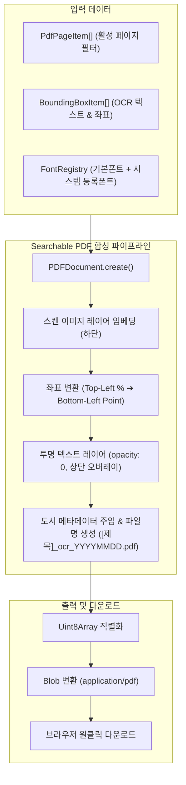

# 05-14. 투명 텍스트 레이어 결합 Searchable PDF 내보내기 엔진 설계

## 1. 시스템 개요 및 목적

본 문서는 purePDFrend의 핵심 기능인 **검색 가능한(Searchable) PDF 파일 생성 엔진**의 아키텍처 및 상세 설계를 정의합니다.  
스캔 도서의 고화질 원본 이미지 위에 OCR 교정이 완료된 바운딩 박스(BBox) 텍스트를 정확한 위치와 크기로 보이지 않는 투명 텍스트 레이어(`opacity: 0`)로 결합하여, 사용자가 PDF 뷰어에서 원본 스캔 화질을 그대로 감상하면서도 텍스트 검색(`Ctrl+F`), 마우스 드래그 선택 및 복사/붙여넣기를 완벽하게 수행할 수 있도록 지원합니다.

<div align="center">
  
  <p><em>[그림] Searchable PDF 내보내기 파이프라인 및 폰트 레지스트리 아키텍처</em></p>
</div>



---

## 2. 4대 핵심 설계 원칙

### 1. 좌표계 변환 및 정밀 오프셋 산출 (Coordinate System Transformation)
- **웹/이미지 좌표계**: 좌상단 $(0, 0)$, $x, y, w, h$는 $0 \sim 100\%$ 백분율.
- **PDF 표준 좌표계**: 좌하단 $(0, 0)$, 단위는 포인트(Point, $1\text{ pt} = \frac{1}{72}\text{ inch}$).
- **수학적 변환 공식**:
  $$X_{\text{pdf}} = \frac{x}{100} \times \text{PageWidth}$$
  $$Y_{\text{pdf}} = \text{PageHeight} - \left(\frac{y + h}{100} \times \text{PageHeight}\right)$$
  $$\text{FontSize} \approx \left(\frac{h}{100} \times \text{PageHeight}\right) \times 0.85$$

### 2. 폰트 레지스트리 및 동적 폰트 선택 (Dynamic Font Registry)
- **기본 폰트**: `StandardFonts.Helvetica` (경량, 내장 표준 폰트).
- **시스템 등록 폰트**: PDF 관리 시스템에 사용자가 등록한 커스텀 한글/다국어 폰트(TTF/OTF 바이너리 또는 웹 폰트)를 동적으로 로드 및 임베딩하여 다국어 검색 정확도를 극대화.

### 3. 투명 텍스트 레이어 임베딩 (Transparent Overlay)
- `pdf-lib`의 `page.drawText` 메서드에 `opacity: 0`을 설정하여 시각적으로는 원본 이미지만 보이도록 하고, PDF 리더 엔진의 텍스트 레이어에는 온전히 검색 가능한 글자가 매핑되도록 처리합니다.

### 4. 파일명 네이밍 거버넌스 및 메타데이터 주입
- **표준 파일명 포맷**: `[도서제목]_ocr_YYYYMMDD.pdf` (특수문자 정제 및 날짜 자동 채번).
- **PDF 메타데이터**: Title, Author, Subject, Creator (`purePDFrend Searchable Engine`), CreationDate를 표준 명세에 맞게 주입.

---

## 3. 인터페이스 정의

```typescript
export interface SearchablePdfExportOptions {
  bookTitle?: string;
  author?: string;
  fontName?: string; // 'Helvetica' | 'TimesRoman' | 'Courier' | 'CustomFont'
  customFontBytes?: Uint8Array;
  onProgress?: (current: number, total: number, message: string) => void;
}

export interface FontOptionItem {
  id: string;
  name: string;
  isCustom: boolean;
  fontBytes?: Uint8Array;
}
```

---

## 📋 편집 이력 (Revision History)

| 작업일자 | 이슈 | 태스크 | 작업자 | 작업내용 | 사용 AI 모델명 | 에이전트 | 참고링크 |
| :--- | :--- | :--- | :--- | :--- | :--- | :--- | :--- |
| 2026-09-24 | #16 | TASK-0016 | gemini | [v1.0] 최초 작성: 투명 텍스트 레이어 결합 Searchable PDF 내보내기 엔진 상세 설계 발행 | Gemini 1.5 Pro | Google Antigravity | [05-13. 페이지 레이아웃 설계](./05-13_PDF_페이지_레이아웃_편집기_및_Undo_Redo_커맨드_설계.md) |
