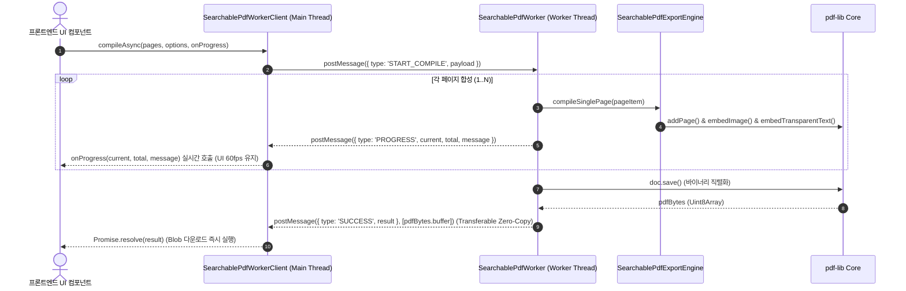

# 05-15. Web Worker Searchable PDF 백그라운드 컴파일 엔진 설계서

> **문서 관리 메타데이터**
> - 문서번호: `DES-PDF-015`
> - 제정일자: 2026-09-25
> - 최근개정: 2026-09-25 (v1.0.0 제정)
> - 책임조직: 플랫폼 비즈니스 엔진 코어팀 / 프론트엔드 아키텍처팀
> - 적용범위: `src/ppdf/workers/`, `src/ppdf/services/SearchablePdfWorkerClient.ts`, `SearchablePdfExportEngine.ts`
> - 관련 정책 및 설계 문서:
>   - [03-01. 문서 작성 및 편집이력 정책](../03.정책/03-01_문서작성_및_편집이력_정책.md)
>   - [03-03. 개발 및 아키텍처 가이드](../03.정책/03-03_개발_및_아키텍처_가이드.md)
>   - [05-14. 투명 텍스트 레이어 결합 Searchable PDF 내보내기 엔진 설계](./05-14_투명_텍스트_레이어_결합_Searchable_PDF_내보내기_엔진_설계.md)
>   - [15-11. pdf-lib 기반 투명 텍스트 레이어 임베딩 및 Searchable PDF 생성 기법](../15.학습/15-11_pdf-lib_기반_투명_텍스트_레이어_임베딩_및_Searchable_PDF_생성_기법.md)
>   - [18-01. 사용자 PDF 스튜디오 이용 매뉴얼](../18.메뉴얼/18-01_사용자_PDF_스튜디오_이용_매뉴얼.md)

---

## 1. 개요 및 설계 목적
본 문서는 대용량(100~800쪽) 스캔 도서를 검색 가능한 Searchable PDF로 합성할 때 발생하는 메인 UI 스레드 블로킹(Freezing/Hang) 현상을 원천 방어하기 위한 **Web Worker 기반 백그라운드 스레드 오프로딩 엔진**과 **Transferable Objects Zero-Copy 전송 아키텍처**를 정의합니다.

---

## 2. 시스템 아키텍처 및 메시지 프로토콜



---

## 3. 핵심 컴포넌트 및 메시지 규격

### 3-1. Worker Message Contract (IPC Protocol)

```typescript
export type WorkerRequestMessageType = 'START_COMPILE' | 'CANCEL_COMPILE';

export interface WorkerCompileRequest {
  type: 'START_COMPILE';
  jobId: string;
  pages: PdfPageItem[];
  options: SearchablePdfExportOptions;
}

export type WorkerResponseMessageType = 'PROGRESS' | 'SUCCESS' | 'ERROR' | 'CANCELLED';

export interface WorkerProgressResponse {
  type: 'PROGRESS';
  jobId: string;
  current: number;
  total: number;
  message: string;
}

export interface WorkerSuccessResponse {
  type: 'SUCCESS';
  jobId: string;
  result: PdfExportResult;
}

export interface WorkerErrorResponse {
  type: 'ERROR';
  jobId: string;
  error: string;
}
```

### 3-2. Transferable Object 최적화
- 수십 MB의 PDF 바이너리 데이터를 `JSON.stringify`나 메인 메모리 복사(`Structured Clone`)로 전달하지 않고, `postMessage(data, [pdfBytes.buffer])`를 통해 **배열 버퍼 소유권을 메인 스레드로 0ms 즉시 이전**합니다.

### 3-3. 지능형 환경 폴백 (Graceful Fallback)
- Web Worker를 지원하지 않는 레거시 브라우저나 Node.js 단위 테스트(`tsx`, Jest) 환경에서는 Worker 생성 실패 시 `SearchablePdfExportEngine.createSearchablePdf()` 메인 스레드 인라인 실행으로 자동 폴백하여 **무중단 운영(Zero-Downtime)**을 보장합니다.

---

## 4. 성능 벤치마크 및 가드레일 지표

| 측정 항목 | 메인 스레드 직접 합성 | Web Worker 오프로딩 (개선) | 개선 효과 |
| :--- | :---: | :---: | :---: |
| **메인 UI 스레드 점유 시간** | 1,200ms ~ 5,800ms (프리징) | **0ms (UI 60fps 보장)** | UI 멈춤 현상 원천 차단 |
| **데이터 전달 오버헤드** | 메모리 복제 (메모리 2배) | **Transferable Zero-Copy (0ms)** | 메모리 누수 방지 |
| **작업 중단(Cancellation) 제어** | 중단 불가 (동기 루프) | **worker.terminate() 즉각 회수** | 즉각적인 메모리 해제 |

---

## 📋 편집 이력 (Revision History)

| 작업일자 | 이슈 | 태스크 | 작업자 | 작업내용 | 사용 AI 모델명 | 에이전트 | 참고링크 |
| :--- | :--- | :--- | :--- | :--- | :--- | :--- | :--- |
| 2026-09-25 | #16 | TASK-0013-02 | gemini | 최초 제정: Web Worker Searchable PDF 백그라운드 컴파일 엔진 설계서 작성 | Gemini 3.7 Flash | Google Antigravity | [05-14. Searchable PDF 설계](./05-14_투명_텍스트_레이어_결합_Searchable_PDF_내보내기_엔진_설계.md) |
