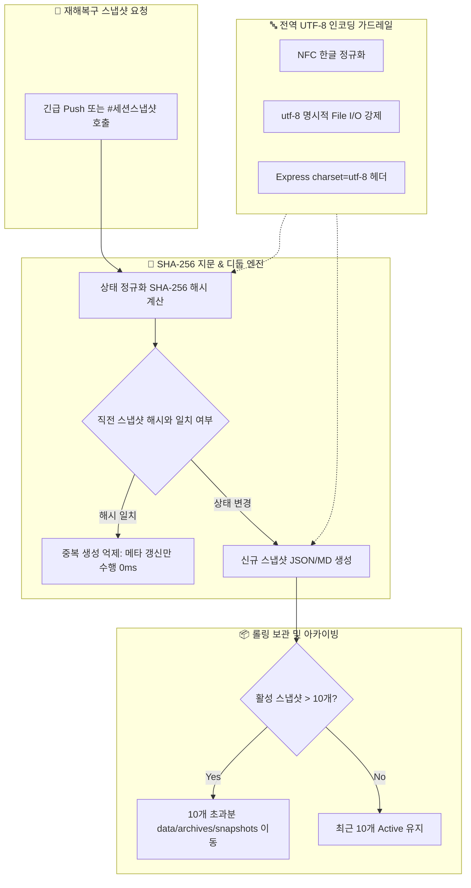

# 🛡️ 세션 DR 스냅샷 디둡·클린징 및 전역 UTF-8 가드레일 설계서 (05-17)

> **문서 식별자**: `DOC-05-17-SESSION-DR-DEDUP-AND-UTF8-GUARD`  
> **최초 작성일**: `2026-09-24`  
> **최종 수정일**: `2026-09-24`  
> **작성자**: AI Agent (Session-0012 / Task-0018)  
> **상태**: `APPROVED` (설계 승인 완료)

---

## 1. 개요 및 배경

세션 행(Hang) 및 토큰 소진 상황에서 시스템 안전성을 보장하기 위해 비-LLM 긴급 Push 및 세션 스냅샷 파일이 생성됩니다. 이때 다음 문제점이 발생할 수 있습니다:
1. **스냅샷 중복 생성 및 디스크 낭비**: 동일한 커밋 및 세션 상태에서 스냅샷이 반복 생성되면 디스크 I/O 낭비 및 복구 타임라인 목록이 혼잡해짐.
2. **무제한 스냅샷 누적으로 인한 성능 저하**: 수십 개의 스냅샷 파일이 정리되지 않고 쌓이면 탐색 속도 저하.
3. **Windows/Node.js/DB 환경 한글 인코딩 깨짐**: CP949/EUC-KR 간섭이나 NFD(자모분리)로 인해 한글 파일명 및 본문 손상 가능성.

본 설계서는 **SHA-256 지문 기반 스냅샷 디둡(Deduplication)**, **10개 롤링 보관 및 Cold 아카이빙**, **전역 UTF-8 인코딩 영구 방어 가드레일**을 정의합니다.

---

## 2. 시스템 아키텍처 및 상태 흐름도



---

## 3. 논리적 모순 및 충돌 방어 매트릭스 (Conflict Resolution)

| 충돌 시나리오 | 발생 가능한 결함 | 시스템 방어 로직 (Defense Logic) |
| :--- | :--- | :--- |
| **중복 억제 vs 타임라인 최신성** | 파일 생성을 막으면 최근에 검증되었다는 기록이 누락됨 | 신규 파일을 생성하지 않는 대신 기존 스냅샷의 `lastVerifiedAt`과 `verifyCount`를 갱신하여 최신성을 증명. |
| **롤링 아카이빙 vs 오래된 스냅샷 복구** | 10개 초과 파일을 삭제해버리면 `#세션복구:0005` 등 과거 복구 불가 | 물리적 영구 삭제 대신 `data/archives/snapshots/`로 Cold 이동하고, 복구 시 2계층(Active ➔ Archive Fallback) 탐색. |
| **NFC 정규화 vs 기존 NFD 파일 경로** | 자모 분리 파일 탐색 시 404 발생 | 파일 경로 탐색 시 `safeUtf8Path` 헬퍼를 통해 NFC/NFD 양방향 검사 수행. |

---

## 4. 스키마 및 인터페이스 정의

```typescript
export interface EnhancedSessionSnapshot {
  snapshotId: string;
  sessionNum: string;
  sessionTitle: string;
  latestCommitSha: string;
  branch: string;
  stateHash: string;                  // SHA-256 정규화 상태 지문
  verifyCount: number;                // 중복 호출 갱신 횟수
  status: 'PENDING_RECOVERY' | 'RESTORED' | 'ARCHIVED';
  createdAt: string;
  lastVerifiedAt: string;
  isDeduplicated?: boolean;
}
```

---

## 5. 편집 이력

| 버전 | 일자 | 변경 내용 | 작성자 |
| :--- | :--- | :--- | :--- |
| `v1.0.0` | `2026-09-24` | 세션 DR 스냅샷 디둡, 롤링 아카이빙 및 전역 UTF-8 가드레일 신규 설계 | AI Agent |
