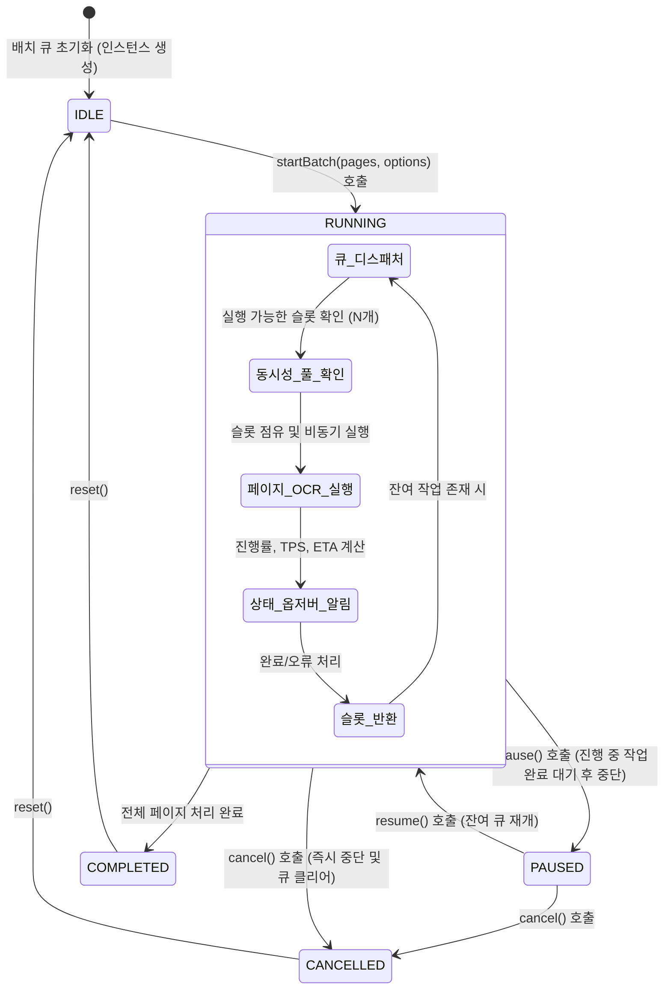

# 05-18. 다국어 OCR 병렬 배치 큐(Worker Pool) 및 프로그레스 엔진 설계

> **문서 관리 메타데이터**
> - 문서번호: `DES-05-18`
> - 제정일자: 2026-09-25
> - 최근개정: 2026-09-25 (v1.0.0 완료)
> - 책임조직: 플랫폼 아키텍처 거버넌스 위원회 / AI 연구소
> - 적용범위: `src/ppdf/services/ocr/`, `src/ppdf/components/OcrBatchProgressModal.tsx`, `tests/ocr_batch_queue.test.ts`
> - 관련 정책 및 설계 문서:
>   - [03-01. 문서 작성 및 편집이력 정책](../03.정책/03-01_문서작성_및_편집이력_정책.md)
>   - [03-03. 개발 및 아키텍처 가이드](../03.정책/03-03_개발_및_아키텍처_가이드.md)
>   - [05-10. PDF 이미지 전처리 및 3대 OCR 엔진 어댑터 설계](./05-10_PDF_이미지_전처리_및_3대_OCR_엔진_어댑터_설계.md)
>   - [05-15. Web Worker Searchable PDF 백그라운드 컴파일 엔진 설계](./05-15_Web_Worker_Searchable_PDF_백그라운드_컴파일_엔진_설계.md)
>   - [18-01. 사용자 PDF 스튜디오 이용 매뉴얼](../18.메뉴얼/18-01_사용자_PDF_스튜디오_이용_매뉴얼.md)

---

## 1. 개요 및 설계 목적

### 1-1. 배경
대용량 스캔 도서(100~800쪽)의 고품질 OCR 처리 시, 단일 스레드로 한 페이지씩 순차 실행할 경우 긴 대기 시간이 소요되고 메인 브라우저 UI 스레드의 이벤트 루프를 저해할 위험이 있습니다.

### 1-2. 목적
1. **Worker Pool 기반 동시성 제어 (Concurrency Limiter)**: 브라우저 CPU 자원(`navigator.hardwareConcurrency`)에 맞추어 2~4개 병렬 작업 풀을 가동하여 처리 시간을 최대 4배 단축.
2. **다국어 언어팩 및 엔진 어댑터 라우팅**: 한국어, 영어, 일본어, 중국어 등 선택된 언어 및 엔진(WASM / Docker / Cloud AI)에 맞춤형 배치 실행.
3. **상태 머신 및 제어 가드레일**: 일괄 실행 중 언제든 **일시정지(Pause) / 재개(Resume) / 취소(Cancel)** 및 오류 페이지 자동 재시도(Max 3회) 보장.
4. **실시간 텔레메트리 스트림**: 페이지별 진행 상태, 전체 진행률(%), TPS(Pages/sec), 남은 예상 시간(ETA)을 옵저버 패턴으로 UI에 실시간 브로드캐스팅.

---

## 2. 아키텍처 및 상태 전이 다이어그램



---

## 3. 세부 컴포넌트 설계

### 3-1. `OcrBatchQueueManager` 핵심 필드 및 메서드 규격

```typescript
export type BatchStatus = 'IDLE' | 'RUNNING' | 'PAUSED' | 'CANCELLED' | 'COMPLETED';
export type PageJobStatus = 'PENDING' | 'PROCESSING' | 'COMPLETED' | 'FAILED' | 'SKIPPED';

export interface PageOcrJob {
  pageNumber: number;
  imageBlobUrl: string;
  status: PageJobStatus;
  retryCount: number;
  result?: OcrResult;
  error?: string;
  startedAt?: number;
  completedAt?: number;
}

export interface OcrBatchProgressState {
  status: BatchStatus;
  totalPages: number;
  completedPages: number;
  failedPages: number;
  progressPercent: number;
  currentTps: number;        // Pages per second
  estimatedSecondsLeft: number; // ETA in seconds
  jobs: PageOcrJob[];
}

export type OcrBatchObserver = (state: OcrBatchProgressState) => void;
```

### 3-2. 동시성 제어 및 ETA 계산 알고리즘
- **EMA 기반 TPS 추정**:
  $$\text{Current TPS} = \frac{\Delta \text{Completed Pages}}{\Delta \text{Time (sec)}}$$
- **동적 ETA 계산**:
  $$\text{ETA (sec)} = \frac{\text{Remaining Pages}}{\max(\text{Current TPS}, 0.1)}$$
- **지수 백오프 재시도 (Exponential Backoff)**:
  페이지 실패 시 $t_{\text{wait}} = 2^{\text{retryCount}} \times 200\text{ms}$ 지연 후 최대 3회 재시도.

---

## 4. UI/UX 연동 설계 ([OcrBatchProgressModal.tsx](../../src/ppdf/components/OcrBatchProgressModal.tsx))

1. **상단 종합 대시보드**:
   - 상태 배지: `실행 중 (3/4 풀 가동)` / `일시정지` / `완료`
   - 메인 프로그레스 바 (0% ~ 100% 게이지 + 완료/전체 쪽수)
   - 실시간 처리 속도(예: `2.4 쪽/초`) & 남은 예상 시간(예: `약 14초 남음`)
2. **중앙 페이지 미니 그리드 (Visual Page Map)**:
   - 각 페이지 번호별 컬러 칩 (회색: 대기 / 파란색(애니메이션): 처리중 / 녹색: 완료 / 적색: 오류)
   - 칩 클릭 시 해당 페이지 에러 메시지 툴팁 표시
3. **하단 액션 툴바**:
   - **[일시정지] / [재개]** 버튼 (토글)
   - **[배치 취소]** 버튼 (즉시 중단)
   - **[완료 닫기]** 버튼 (완료 시 활성화)

---

## 📋 편집 이력 (Revision History)

| 작업일자 | 이슈 | 태스크 | 작업자 | 작업내용 | 사용 AI 모델명 | 에이전트 | 참고링크 |
| :--- | :--- | :--- | :--- | :--- | :--- | :--- | :--- |
| 2026-09-25 | #16 | TASK-0013-03 | gemini | 최초 제정: 다국어 OCR 병렬 배치 큐(Worker Pool) 및 프로그레스 엔진 설계 (v1.0) | Gemini 3.7 Flash | Google Antigravity | [README_설계.md](./README_설계.md) |
