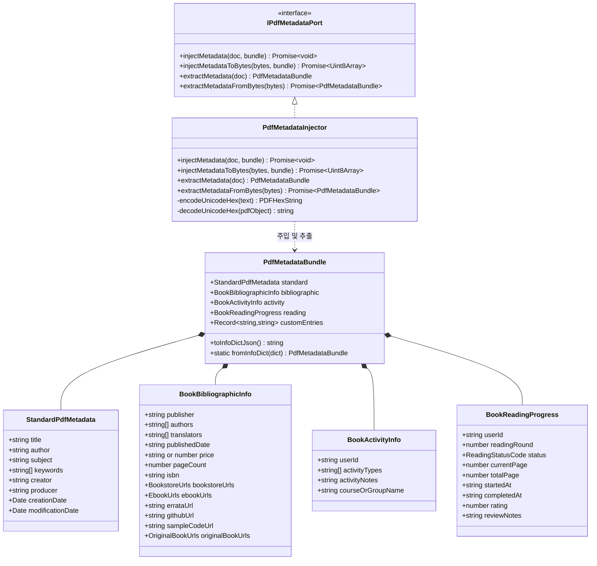

# [05-19] PDF 표준 및 커스텀 메타데이터 주입기 (PdfMetadataInjector) 상세 설계서

> **문서 번호**: `05-19`  
> **상태**: 승인됨 (APPROVED)  
> **작성일**: 2026-09-25  
> **관련 세션 / 태스크**: `SESSION-260925-0014` / `TASK-0014-01`  
> **적용 아키텍처**: 도메인 주도 설계(DDD), 헥사고날 아키텍처(Hexagonal Architecture), 불변 값 객체(Immutable VO)

---

## 1. 설계 배경 및 목적

### 1-1. 배경
스캔 도서 및 OCR 교정 스튜디오인 `purePDFrend`에서 생성되거나 가공된 PDF 문서는 표준 PDF 뷰어(Adobe Acrobat, Chrome PDF Viewer 등)에서 정확한 서지 정보가 노출되어야 할 뿐만 아니라, 애플리케이션 내에서 스캔 도서의 심층적인 출판 서지 정보, 사용자 학습 활동(스터디, 강의 연계), 회독 및 독서 진행 상황을 함께 영속화하여 관리할 수 있어야 합니다.

### 1-2. 목적
1. **ISO 32000-1 표준 준수**: Document Information Dictionary(`/Info`)의 표준 8대 메타데이터 필드(`Title`, `Author`, `Subject`, `Keywords`, `Creator`, `Producer`, `CreationDate`, `ModDate`)를 완벽히 지원합니다.
2. **풍부한 도서 속성 관리 (Book Bibliographic Domain)**:
   - 출판사, 저자/역자 다중 목록, 발행일, 정가, 총 페이지수, ISBN
   - 온라인 서점 링크 3사(알라딘, 교보문고, Yes24) 및 커스텀 서점 URL
   - 전자책(eBook) 링크 3사(리디북스, Yes24, 교보문고)
   - 정오표(Errata) 링크, GitHub 저장소, 예제 코드 다운로드 URL
   - 원서(Original Book) 링크 4사(아마존, 교보문고, 알라딘, Yes24)
3. **활동(Activity) 및 독서(Reading) 상태 분리 및 사용자별 확장성 보장**:
   - 활동 종류: `강의도서`, `뉴런데브`, `인프런강의`, `그룹독서` 등 사용자 맞춤형 활동 분류
   - 독서 진행: `회독(1독, 2독, 3독...)`, `진행상태(미독/독서중/완독/일시중단)`, 현재 읽은 쪽수, 별점 및 독서 메모
   - `userId` 필드를 내재화하여 향후 다중 사용자별 독서/활동 이력 관리로 매끄럽게 확장
4. **유니코드 및 다국어 무손실 인코딩**: 한글 및 특수문자가 포함된 메타데이터를 `PDFHexString (UTF-16BE)` 직렬화로 인코딩하여 인코딩 깨짐을 원천 방지합니다.

---

## 2. 도메인 모델 구조 및 클래스 다이어그램

---

## 3. PDF 바이너리 메타데이터 주입 규약

### 3-1. Document Information Dictionary (`/Info`) 키 매핑 규격
| 키 명칭 | 자료형 | 인코딩 방식 | 설명 |
| :--- | :--- | :--- | :--- |
| `/Title` | Text String | UTF-16BE / PDFDocEncoding | 책 제목 (`standard.title` 또는 `bibliographic` 기반 자동 보정) |
| `/Author` | Text String | UTF-16BE | 저자명 (`standard.author` 또는 `authors.join(', ')`) |
| `/Subject` | Text String | UTF-16BE | 주제 및 도서 개요 |
| `/Keywords` | Text String | UTF-16BE | 색인 키워드 (ISBN, 출판사, 활동태그, 회독태그 등 결합) |
| `/Creator` | ASCII String | PDFDocEncoding | 생성 애플리케이션 (`purePDFrend v1.0`) |
| `/Producer` | ASCII String | PDFDocEncoding | PDF 생성 엔진 (`purePDFrend Engine (pdf-lib)`) |
| `/CreationDate` | Date String | PDF Date Format | 생성일자 (`D:YYYYMMDDHHmmSSOHH'mm'`) |
| `/ModDate` | Date String | PDF Date Format | 최종 수정일자 |
| `/ISBN` | Text String | UTF-16BE | 도서 국제 표준 도서번호 (외부 PDF 리더 즉시 인식) |
| `/Publisher` | Text String | UTF-16BE | 출판사 명칭 |
| `/PpdfBookMeta` | Hex String | UTF-16BE JSON | 도서 상세 서지 정보 전체 직렬화 객체 (100% 무손실 보존) |
| `/PpdfActivityMeta` | Hex String | UTF-16BE JSON | 사용자 활동 정보 전체 직렬화 객체 |
| `/PpdfReadingMeta` | Hex String | UTF-16BE JSON | 사용자 독서 진행 상태 직렬화 객체 |
| `/PpdfUserMeta` | Hex String | UTF-16BE JSON | 사용자 식별 및 추가 확장 커스텀 속성 |

### 3-2. 유니코드 한글 무손실 보존 파이프라인
1. 일반 문자열 직렬화 시 `pdf-lib`의 `PDFString.of()`는 8비트 ASCII/WinAnsi 범위 초과 문자를 손상시킵니다.
2. 따라서 모든 한글 및 유니코드 JSON 페이로드는 `PDFHexString.fromText(jsonString)`을 사용하여 UTF-16BE 바이트 스트림으로 패킹합니다.
3. 역직렬화 시 `PDFHexString.decodeText()` 또는 버퍼 디코딩을 수행하여 다국어 및 특수문자 무손실 복원을 달성합니다.

---

## 4. 확장성 및 사용자별 관리 방안

1. **사용자 컨텍스트 분리 (`userId`)**:
   - `BookActivityInfo` 및 `BookReadingProgress`는 `userId` 속성을 보유합니다.
   - 단일 PDF 파일에 기본 독서 상태가 임베딩될 수도 있고, 서버/클라우드 환경에서는 동일한 도서 해시(ISBN/파일SHA-256)에 대해 사용자별로 다중 회독 및 활동 상태를 매핑할 수 있도록 설계되었습니다.
2. **점진적 서지 데이터 동기화**:
   - 온라인 서점 URL(알라딘, 교보, Yes24) 및 정오표, GitHub 링크 등은 웹 브라우저 뷰어에서 원클릭으로 이동할 수 있는 액션 트리거로 활용됩니다.

---

## 5. TDD 검증 계획 (단위 테스트 7종)

1. **TC-META-01**: 기본 표준 메타데이터 8종 주입 및 추출 일치 검증
2. **TC-META-02**: 도서 서지 정보(출판사, 저자/역자, ISBN, 가격, 온라인서점 3사 URL) 주입 및 역직렬화 무결성 검증
3. **TC-META-03**: 한글, 한자, 특수문자 깨짐 없는 UTF-16BE 무손실 인코딩/디코딩 검증
4. **TC-META-04**: 활동 정보(강의도서, 뉴런데브, 인프런강의, 그룹독서) 주입 및 복원 검증
5. **TC-META-05**: 독서 상태(회독, 진행상태, 현재페이지, 평점, 리뷰) 주입 및 복원 검증
6. **TC-META-06**: 기존 외부 PDF에 메타데이터 덮어쓰기 및 갱신 보존 검증
7. **TC-META-07**: 부분 데이터(일부 필드 누락) 시 기본값 폴백 및 안전 복구 검증
