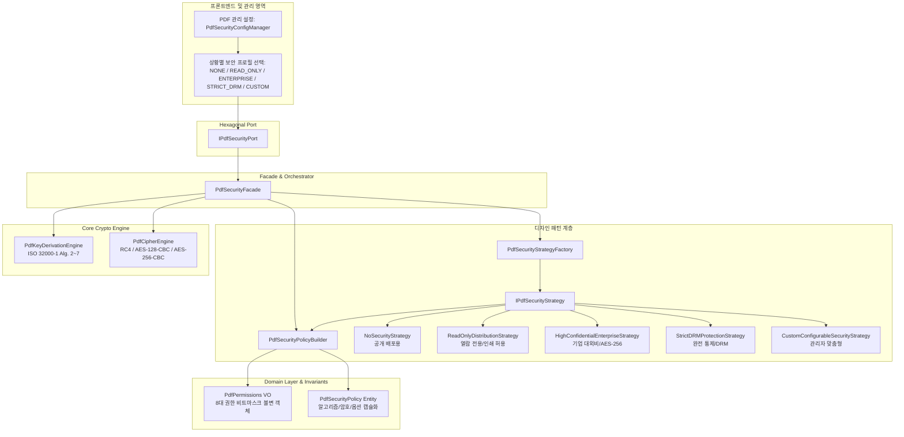

# [05-20] PDF 암호화 및 상황별 보안전략 엔진 상세설계서

> **문서 식별자**: `05-20`  
> **태스크 ID**: `TASK-0014-02`  
> **작성일자**: 2026-09-26  
> **표준 규격**: ISO 32000-1:2008 (PDF 1.7) Clause 7.6 (Encryption), ISO 32000-2:2020 (PDF 2.0)  
> **아키텍처 패턴**: 헥사고날 아키텍처(Hexagonal Architecture), 전략 패턴(Strategy Pattern), 팩토리 패턴(Factory Pattern), 빌더 패턴(Builder Pattern), 파사드 패턴(Facade Pattern)

---

## 1. 배경 및 설계 목적

### 1-1. 배경 및 사용자 요구사항
1. **상황별 보안 적용 요구 (Situational Security Configuration)**:
   - 보안 수준을 일괄 강제하지 않고, 문서의 배포 목적(공개 배포, 대외비 열람, 사내 기밀, DRM 보호, 맞춤형 통제)에 따라 PDF 관리 항목으로 선택 및 설정할 수 있어야 함.
2. **운영성 극대화를 위한 디자인 패턴 적용**:
   - 새로운 보안 알고리즘이나 기업별 보안 규정이 추가되더라도 기존 코드를 수정하지 않고 확장할 수 있도록 **전략 패턴(Strategy)**과 **팩토리 패턴(Factory)**을 적용.
   - 복잡한 8대 권한 플래그와 암호 유도 연산의 무결성을 보장하기 위해 **불변 Value Object**와 **빌더 패턴(Builder)**을 도입.
   - 외부 및 프론트엔드 연동을 단순화하기 위해 **파사드 패턴(Facade)**과 **헥사고날 포트(Hexagonal Port)**로 도메인을 캡슐화.

---

## 2. 전체 아키텍처 다이어그램



---

## 3. 상황별 보안 전략 (Strategy Pattern) 정의

| 전략 프로필명 | 암호화 알고리즘 | 사용자 암호 | 소유자 암호 | 인쇄 권한 | 복사/추출 권한 | 수정 권한 | 메타데이터 암호화 | 대표 활용 시나리오 |
| :--- | :---: | :---: | :---: | :---: | :---: | :---: | :---: | :--- |
| **NONE** (공개) | 없음 | 미설정 | 미설정 | 완전 허용 | 완전 허용 | 완전 허용 | N/A | 일반 공시, 논문, 오픈 라이브러리 |
| **READ_ONLY** (열람전용) | AES-128 / RC4 | 선택 | 필수 | 저해상도 허용 | 차단 | 차단 | 유지 | 강의자료, 보고서 공개 배포 |
| **ENTERPRISE** (기업대외비) | AES-256 | 필수 | 필수 | 고해상도 허용 | 차단 | 차단 | 암호화 | 사내 재무재표, 기획서, 회의록 |
| **STRICT_DRM** (완전통제) | AES-256 | 필수 | 필수 | 완전 차단 | 완전 차단 | 완전 차단 | 암호화 | 지식재산권(IP), 전자책 DRM |
| **CUSTOM** (맞춤형) | 가변 선택 | 설정값 준용 | 설정값 준용 | 비트별 설정 | 비트별 설정 | 비트별 설정 | 토글 | 관리자 개별 보안 정책 커스텀 |

---

## 4. 권한 비트마스크 사양 (ISO 32000-1 Clause 7.6.3.2)

PDF 표준의 `/P` 필드는 부호 있는 32비트 정수(Signed 32-bit Integer)로 표현되며, 상위 및 예약 비트는 `1`로 고정되어야 합니다.

```text
Bit Position (1-based):
Bit 3  : 인쇄 허용 (Print)
Bit 4  : 내용 수정 허용 (Modify Contents)
Bit 5  : 텍스트 및 그래픽 복사/추출 허용 (Copy / Extract)
Bit 6  : 텍스트 주석 및 대화형 양식 필드 추가/수정 (Add/Modify Annotations)
Bit 9  : 대화형 양식 필드 채우기 (Fill in Interactive Form Fields)
Bit 10 : 접근성을 위한 텍스트 및 그래픽 추출 (Accessibility Extract)
Bit 11 : 문서 조합(페이지 삽입, 회전, 삭제) 허용 (Assemble Document)
Bit 12 : 고해상도 인쇄 허용 (High Quality Print)
Bits 7~8, 13~32 : 예약 비트 (항상 1로 설정되어야 함)
```

---

## 5. 키 유도 및 암호화 절차 (ISO 32000-1)

1. **Algorithm 2 (파일 암호화 키 계산)**:
   - 사용자 암호 바이트(최대 32바이트 패딩) 준비.
   - 패딩된 암호 + `O`(소유자 해시 32바이트) + `P`(권한 4바이트 정수 Little-Endian) + `ID[0]`(문서 영구 식별자) 연결.
   - MD5 50회 해싱 반복(Revision 3/4) 또는 SHA-256 단방향 KDF(Revision 5/6).
   - 계산된 해시의 첫 $n$바이트를 파일 마스터 암호화 키(`File Encryption Key`)로 확정.
2. **Algorithm 7 (객체별 암호화 키 유도)**:
   - 객체 번호($num$) 3바이트 + 세대 번호($gen$) 2바이트를 마스터 키 뒤에 연결.
   - AES-CBC 모드의 경우 첫 16바이트에 암호학적 난수 초기화 벡터(IV)를 배치하고 암호문 블록 뒤에 연결.

---

## 6. 운영성 및 확장성 보장 (Extensibility)

1. **동적 전략 등록 (Dynamic Strategy Registry)**:
   - `PdfSecurityStrategyFactory.registerStrategy('CUSTOM_GOV', new GovStrategy())`와 같이 런타임에 손쉽게 새로운 전략 추가 가능.
2. **무중단 로컬 폴백**:
   - DB 연결이 지연되더라도 로컬 메모리 및 스토어에 기정의된 5대 프리셋 전략이 항상 100% 즉시 활성화됨.
3. **타 도메인과의 결합도 최소화**:
   - `TASK-0014-01`의 `PdfMetadataBundle`을 주입받아 메타데이터의 `/EncryptMetadata` 플래그와 유연하게 결합.
