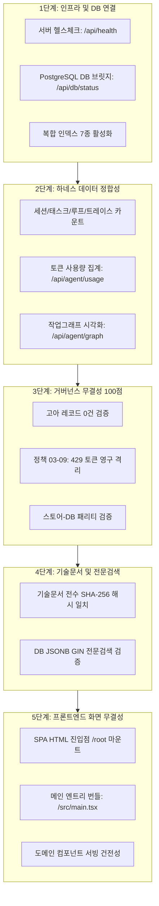
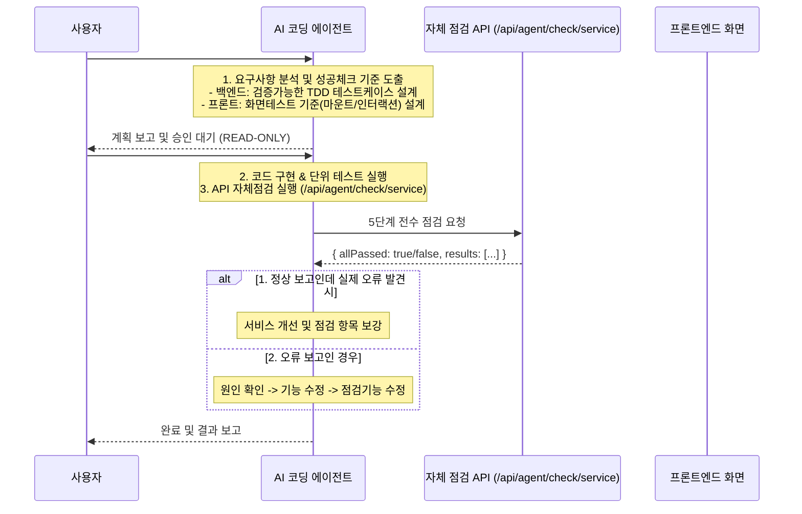

# [05-21] 서비스 자가진단 및 화면·기능 검증 자동화 거버넌스 설계서

> **문서 식별자**: `05-21`  
> **태스크 ID**: `TASK-0014-03` (또는 거버넌스 보완 프로세스)  
> **작성일자**: 2026-09-26  
> **관련 정책**: AGENTS.md [규칙 2.1], [규칙 2.2], [규칙 2.3] 및 흰 화면 방어 원칙  
> **핵심 주제**: 5단계 서비스 전수진단, 백엔드/프론트엔드 사전 테스트케이스 및 화면테스트 기준 수립 의무화, 토큰 절약형 API 자체 점검 보고

---

## 1. 배경 및 문제의식

### 1-1. 화면 흰 화면(White Screen) 및 런타임 오류 방어
- 클라이언트 컴포넌트 내에 Node.js 전용 모듈(`crypto`, `Buffer` 등) 참조가 발생할 경우 Vite의 HMR/번들링 환경에서 화면이 먹통이 되거나 빈 화면이 노출될 수 있음.
- 이를 사전에 차단하기 위해 **SPA 렌더링 무결성, 엔트리 번들 서빙, 도메인 컴포넌트 건전성**을 자동으로 진단하는 프로세스가 필수적임.

### 1-2. LLM 토큰 낭비 방지 원칙 (Token-Efficient Self-Inspection)
- 매 작업마다 수만 토큰에 달하는 전체 코드나 화면 덤프를 LLM에게 질의하면 일일 호출 쿼터(RPD)가 급격히 소진됨.
- 따라서 **백엔드/프론트엔드 자체 API 점검 엔진(`scripts/service_health_check.ts`, `GET /api/agent/check/service`)**이 자체적으로 1차 점검을 완결하고, 요약된 정량 결과(`allPassed: true/false`, 단계별 점검결과)만을 보고받아 효율적으로 판단하도록 규정함.

---

## 2. 5단계 서비스 전수 점검 파이프라인 구조

---

## 3. 기능 개선 시 백엔드/프론트엔드 테스트 기준 설계 절차

태스크 착수 시 다음과 같은 기준을 사전 수립하고 점검을 진행합니다.

### 3-1. 백엔드 작업 시 검증 기준
- 비즈니스 로직 및 도메인 모델 불변식 검증 단위 테스트 작성 (`tests/*.test.ts`)
- 독립적인 실행 스크립트로 100% 무손실 복원/계산 검증

### 3-2. 프론트엔드 작업 시 화면테스트 기준
1. **브라우저 호환성 검증**: Node.js 전용 라이브러리(`crypto`, `fs`, `path`) 정적/동적 의존성 배제
2. **HTML 루트 마운트 무결성**: `/index.html` 내 `

`와 번들 스크립트 연결 확인
3. **에러 바운더리 보호**: 모든 메인 뷰 컴포넌트는 `ErrorBoundary`로 감싸져 개별 오류가 전체 화면 흰 화면으로 전파되지 않도록 차단
4. **포털(Portal) 가드레일**: 모달 및 드로어는 `document.body` 마운트 전 `typeof document !== 'undefined'` 체크 필수

---

## 4. 이상 징후 발생 시 2대 대응 정책

1. **[정책 1] 정상 보고인데 실제 화면 오류로 판명된 경우**:
   - 원인: 자체 점검 API가 감지하지 못하는 브라우저 런타임 특유의 예외(예: Web API 미지원, 미선언 변수 등) 존재
   - 조치: 해당 오류 패턴을 `service_health_check.ts` 5단계 화면 점검 항목에 새로운 서브 테스트로 즉시 추가하여 점검 체계를 개선함.
2. **[정책 2] 오류 보고인 경우**:
   - 원인: DB 정합성, 문서 해시 불일치, 컴포넌트 렌더링 실패 발생
   - 조치: 보고서의 구체적 실패 항목(단계, 메시지)을 추적하여 기능 코드를 선제 수정하고, 점검 로직에 오판이 있었다면 점검 기능도 함께 보정함.
