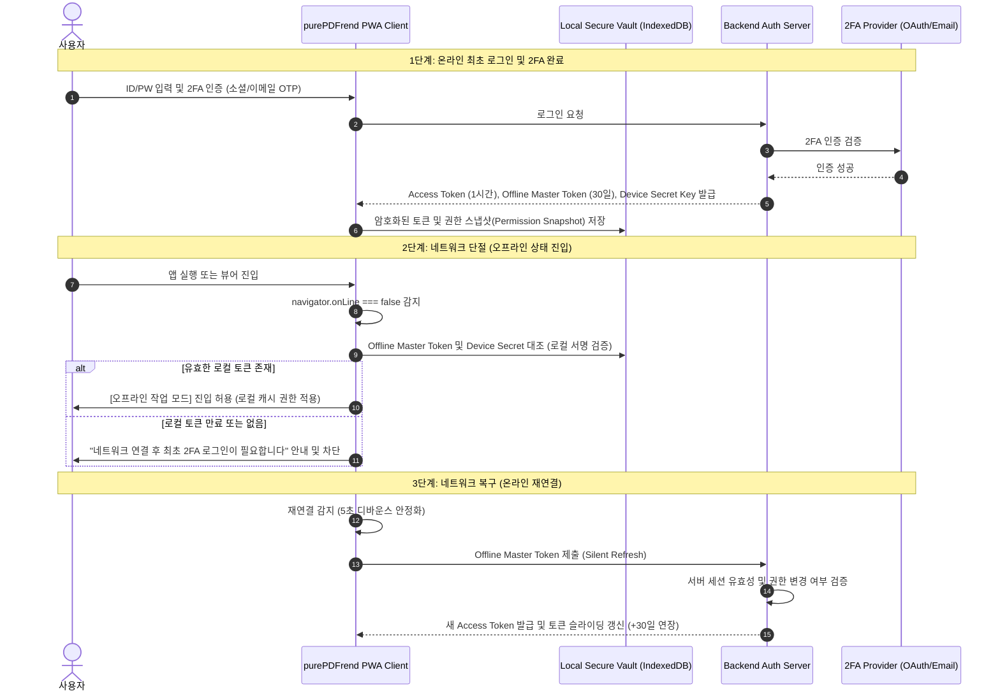

# 오프라인 인증 토큰·문서 해시 검증 및 커스텀 툴바 상세 설계서

> **문서 식별자**: `05-21`  
> **상태**: 승인 및 적용 (Approved)  
> **관련 기획**: `docs/17.참고/260927_01_화면UI기획-초안.md` (ERR-01, ERR-02, ERR-04, ERR-05 기술 보완)  
> **적용 도메인**: purePDFrend 오프라인 인증 아키텍처, 문서 무결성 검증, 뷰어 툴바 커스터마이징

---

## 1. 개요 및 설계 목적

본 문서는 purePDFrend 서비스가 네트워크 단절(오프라인) 상태에서도 연속적인 사용자 경험(Seamless UX)을 제공하기 위한 **하이브리드 인증 토큰 수명주기, 로컬 뷰어 권한 모델, 문서 SHA-256 무결성 락(Lock) 체계, 그리고 사용자 개인화 커스텀 툴바 아키텍처**를 상세히 정의한다.

---

## 2. 오프라인 2FA 로그인 체크 구조 및 인증 토큰 수명주기 (ERR-01 보완)

### 2.1 상시 로그인 유지 앱의 원리와 2FA 설계 개념
일반적인 상용 네이티브/PWA 앱(Slack, Notion, Notion, 카카오톡 등)이 네트워크가 끊겨도 로그인이 유지되는 핵심 원리는 **'2단계 분리형 세션-토큰 아키텍처(Sliding Session & Offline Cryptographic Vault)'**에 있다.



### 2.2 오프라인 토큰 가용 시간 및 지속 사용 보완 정책
1. **토큰 3계층 수명주기**:
   - **Access Token (온라인 전용)**: 1시간 유효. API 호출 시 Bearer 헤더로 전달.
   - **Offline Refresh Token (슬라이딩 토큰)**: **시스템 속성(`SYSTEM_CONFIG: OFFLINE_REFRESH_TOKEN_DAYS`, 기본값 30일, 설정 가능 범위 1일 ~ 180일)**으로 관리자(`PG-ADM-01` 보안관리 및 `PG-ADM-11` 설정항목관리)가 동적 변경 가능. 온라인에 접속할 때마다 해당 설정 일수만큼 자동으로 연장(Sliding Expiry).
   - **Emergency Offline Pass (장기 오프라인 연장)**: 사용자가 사전에 `[오프라인 작업 보존 모드]`를 활성화한 경우, 로컬 디바이스 지문(Fingerprint)과 비대칭 키(Web Crypto API)를 결합하여 **설정값의 최대 3배(기본 90일, 최대 180일)까지 오프라인 작업 권한 보장**.
2. **토큰 만료 시 오프라인 비상 구제책**:
   - 30일 이상 완전 오프라인으로 토큰이 만료되었더라도, **사용자가 작업 중이던 미저장 로컬 주석 및 이벤트 데이터는 절대 삭제하지 않고 격리 보존(Draft Quarantine)**.
   - 네트워크 연결 후 재로그인을 완료하면 보존된 오프라인 작업 내역을 즉시 안전하게 병합 복구.

### 2.3 로컬 뷰어 권한 분리: 읽기 모드 vs 주석 편집 모드
- **미인증 / 비회원 / 오프라인 토큰 만료 시**:
  - `순수 로컬 파일 읽기 모드 (Read-Only)`만 허용.
  - 파일 열람, 페이지 넘김, 텍스트 검색은 가능하나, 서버 저장, 주석 추가, 버전 관리는 비활성화.
- **오프라인 유효 토큰 보유 시**:
  - `오프라인 편집 모드 (Offline Event-Sourcing Edit)` 활성화.
  - 주석 작성, 북마크 편집을 로컬 이벤트 큐(`IndexedDB`)에 저장하며 작업 유지.

---

## 3. 원본 문서 해시(SHA-256) 검증 및 주석 락 체계 (ERR-02 보완)

### 3.1 기술적 배경 및 필요성
PDF 문서의 주석(Annotations)은 본문 텍스트의 고유 좌표(Bounding Box: `[x, y, w, h]`) 및 페이지 인덱스를 기반으로 렌더링된다. 주석 파일만 별도로 내려받아 보관하다가 서버의 PDF 파일이 교체된 상태에서 재업로드하면 주석 위치가 완전히 틀어지거나 본문과 무관한 위치에 표시되는 **'좌표 고아화(Orphaned Coordinates)'** 결함이 발생한다.

### 3.2 문서 무결성 SHA-256 핑거프린트 구조
모든 내보내기/불러오기 주석 메타데이터 파일(`.xfdf` 또는 `.json`)은 헤더에 다음 4대 무결성 메타를 필수로 포함한다.

```json
{
  "manifest": {
    "schema_version": "purepdfrend-annot-v2",
    "document_id": "DOC-20260927-0091",
    "target_doc_hash": "e3b0c44298fc1c149afbf4c8996fb92427ae41e4649b934ca495991b7852b855",
    "hash_algorithm": "SHA-256",
    "total_pages": 482,
    "exported_at": "2026-09-27T04:15:00.000Z",
    "exported_by": "jkok2j2m"
  },
  "annotations": [
    {
      "annot_id": "AN-001",
      "page_index": 14,
      "type": "HIGHLIGHT",
      "bbox": [102.5, 340.2, 210.0, 18.5],
      "text_content": "하이브리드 아키텍처 설계 원칙",
      "text_hash": "a1b2c3d4e5f6..."
    }
  ]
}
```

### 3.3 검증 및 복구 파이프라인
1. **해시 일치 시**: 즉시 100% 무결성 로드 완료.
2. **해시 불일치 감지 시 (Mismatch Handling)**:
   - 즉시 덮어쓰지 않고 `[주석 정합성 불일치 경고 모달]` 노출.
   - **옵션 A (강제 로드)**: 페이지 번호 기준으로 일단 배치.
   - **옵션 B (OCR 텍스트 기반 스마트 리로케이션)**: 주석의 `text_content` 및 `text_hash`를 현재 문서의 OCR 텍스트 레이어와 비교하여 달라진 좌표로 자동 보정(Auto-Anchor).
   - **옵션 C (새 버전으로 분기)**: 원본을 유지하고 별도 문서 복사본에 주석 결합.

---

## 4. 커스텀 툴바 그룹핑 및 사용자 개인화 아키텍처 (ERR-04 보완)

### 4.1 툴바 디스플레이 정책: 텍스트 생략 및 가로 슬라이더
- **아이콘 전용(Icon-Only) 원칙**: 모바일/태블릿/데스크톱 툴바의 모든 액션 버튼은 텍스트를 제거하고 고해상도 SVG 벡터 아이콘으로만 표기하여 가로 공간을 극대화한다.
- **수평 스크롤 스냅 슬라이더**: 화면 너비가 툴바 아이콘 전체를 수용하지 못할 경우, 영역을 벗어나는 아이콘은 줄바꿈되지 않고 **터치/휠로 부드럽게 넘겨지는 가로 슬라이더(`ScrollSnapCarousel`)**로 처리된다.

```mermaid
graph LR
    subgraph ToolbarHeader [단일줄 상단 툴바]
        Home[홈/뒤로]
        DocTitle[문서명 축약]
        Slider[가로 슬냅 슬라이더: 펜 | 형광펜 | 밑줄 | ...]
        CfgBtn[⚙ 툴바 순서/구성 설정 버튼]
        MoreBtn[더보기 ...]
    end
```

### 4.2 툴바 순서 설정 팝업 및 아이콘 이름 확인 보조기능
1. **툴바 그룹 설정 팝업 (`ToolbarConfigModal`)**:
   - 툴바 우측의 `⚙ (툴바 설정)` 아이콘 클릭 시 전용 설정 팝업 노출.
   - 팝업 내에서 **아이콘의 공식 명칭, 단축키, 상세 설명 툴팁**을 명확히 확인 가능.
2. **사용자 개인화 툴바 관리 (User Customization)**:
   - **등록 / 삭제**: 자주 쓰지 않는 도구(예: 변환, 양식)는 툴바에서 숨기고, 즐겨 쓰는 도구(펜, 형광펜, 번역)만 전면에 등록.
   - **드래그 앤 드롭 순서 변경 (Reorder)**: 모바일 한 손 조작 편의성에 맞추어 좌/우 순서를 자유롭게 재배치.
   - **로컬 영속화**: 변경된 툴바 순서는 사용자 프로필 및 로컬 스토리지(`user_toolbar_preset`)에 자동 저장되어 기기별로 유지.

---

## 5. 네트워크 복구 디바운스 및 수동 즉시 재연결 (ERR-05 보완)

1. **자동 안정화 디바운스 (5초 감시)**:
   - `window.addEventListener('online')` 이벤트 수신 후, 즉시 동기화하지 않고 백그라운드에서 서버 헬스체크 핑(`/api/health`)을 1초 간격으로 3회 연속 성공해야 정상 연결로 최종 확정.
2. **수동 즉시 재연결 버튼 (Manual Reconnect Bypass)**:
   - 하단 상태 바에 `[네트워크 오프라인 상태 | 🔄 지금 다시 연결]` 버튼 상시 노출.
   - 사용자가 명시적으로 재연결 버튼을 클릭하면 5초 디바운스를 건너뛰고 즉시 강제 핑 및 동기화 파이프라인 수행.
