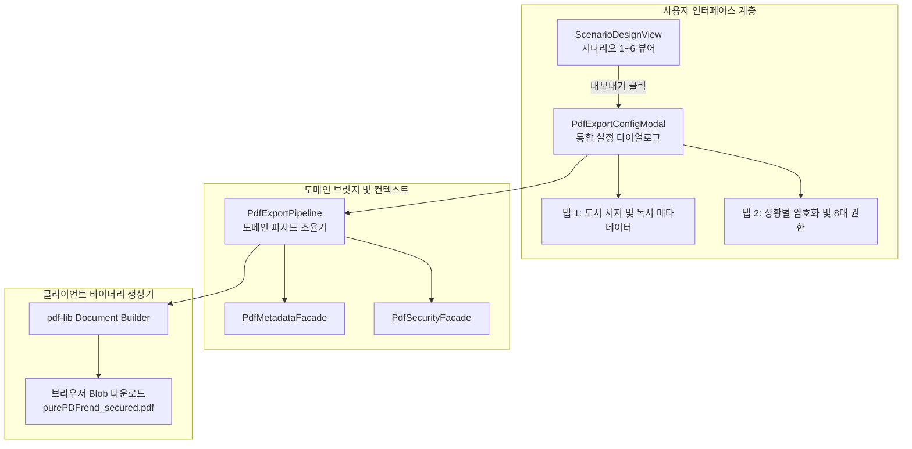

# [05-22] PDF 보안 및 메타데이터 설정 모달 및 뷰어 내보내기 연동 설계서

> **문서 번호**: `05-22`  
> **태스크 ID**: `TASK-0014-03`  
> **세션 ID**: `SESSION-260925-0014`  
> **작성 일자**: 2026-09-26  
> **상태**: 승인 완료 (APPROVED)  
> **작성 주체**: AI Studio Senior Software Engineer

---

## 1. 아키텍처 개요 및 설계 목적

본 설계서는 이전 단계에서 완결된 **`TASK-0014-01`(도서 서지·활동·독서 회독 메타데이터 주입기)** 및 **`TASK-0014-02`(ISO 32000-1 표준 암호화 및 5대 상황별 보안전략 엔진)**을 최종 프론트엔드 뷰어(`ScenarioDesignView`)와 브라우저 PDF 내보내기 파이프라인으로 매끄럽게 연결하는 통합 아키텍처를 정의합니다.

---

## 2. 핵심 설계 컴포넌트

### 2-1. 통합 내보내기 컨텍스트 (`PdfExportContext`)
- **역할**: 사용자가 모달에서 수정한 메타데이터(서지, 활동, 회독)와 보안 정책(알고리즘, 권한 비트마스크, 비밀번호)을 하나의 불변 객체로 캡슐화합니다.
- **주요 속성**:
  - `fileName`: 출력 파일명
  - `metadata`: `PdfMetadataBundle`
  - `securityPolicy`: `PdfSecurityPolicy`
  - `includeOutlines`: TOC 북마크 포함 여부
  - `includeAnnotations`: 주석/툼스톤 포함 여부

### 2-2. 탭형 통합 설정 모달 (`PdfExportConfigModal`)
- **포털 마운트**: `createPortal(..., document.body)`를 통한 뷰포트 센터링 및 ESC 키 바인딩.
- **2대 핵심 탭**:
  1. **메타데이터 탭**: 도서명, 출판사, 저자, ISBN, 강의도서 여부, 현재 회독(1독~3독), 진도율 실시간 편집.
  2. **보안/권한 탭**: 상황별 5대 전략(공개용, 열람전용, 대외비, DRM, 커스텀) 즉각 선택, 8대 권한 비트마스크 토글, 사용자/문서관리자 비밀번호 설정.

### 2-3. 클라이언트 PDF 내보내기 파이프라인 (`PdfExportPipeline`)
- `pdf-lib`의 `PDFDocument.create()`를 기반으로 실제 샘플/가상 페이지를 생성하고,
- `PdfMetadataInjector.inject(doc, context.metadata)`를 통해 표준 및 커스텀 딕셔너리를 UTF-16BE로 주입하며,
- `PdfSecurityFacade.createEncryptionPayload(policy)`를 통해 암호화 트레일러를 설정한 후 바이트 스트림을 브라우저 로컬 다운로드 파일로 생성합니다.

---

## 3. 원격 브랜치 승급 실시간 크로스체크 거버넌스 보완 (API & CLI)

- **문제 의식**: 태스크 승급 API 응답이 성공으로 표시되더라도, 원격 GitHub의 실제 브랜치 SHA 및 Tree가 일치하지 않는 가짜 응답 위험을 원천 방지해야 함.
- **대응 설계**:
  1. **API 신설**: `GET /api/agent/git/branch-status`
     - GitHub REST API를 통해 `dev`, `stg`, `main`의 최신 Commit SHA와 Tree SHA를 실시간 조회.
     - `exactShaMatch`, `treeMatch`, `isFullySynced`를 반환하여 3대 브랜치의 실제 동기화 여부를 크로스체크.
  2. **Fast-Forward 승급 보장 (`github_sync_push.ts`)**:
     - `dev`에 신규 커밋 생성 후, `stg`와 `main`의 ref를 fast-forward(`PATCH /git/refs/heads/:branch`) 방식으로 직접 전진시켜 3개 브랜치의 Commit SHA를 동일하게 유지.
     - 승급 직후 즉시 3개 브랜치의 SHA 일치 여부를 검증하고 콘솔에 출력.

---

## 4. 사전 성공체크 기준 및 TDD 검증 계획

- **도메인 단위 테스트 (`tests/pdf_export_pipeline.test.ts`)**:
  - `TC-01`: 내보내기 컨텍스트 조립 및 유효성 검증
  - `TC-02`: 메타데이터와 보안 정책 동시 적용 시 딕셔너리 충돌 없음 검증
  - `TC-03`: `pdf-lib` 바이트 스트림 생성 및 무손실 인코딩 검증
- **화면 검증**:
  - `ScenarioDesignView`에서 [PDF 내보내기] 버튼 클릭 시 모달 열림 확인
  - 탭 전환, 권한 토글, 비밀번호 입력 후 [다운로드 실행] 클릭 시 실제 파일 다운로드 트리거 확인
- **5단계 서비스 전수 점검**:
  - `scripts/service_health_check.ts` 실행 13개 항목 ALL PASSED 확인
