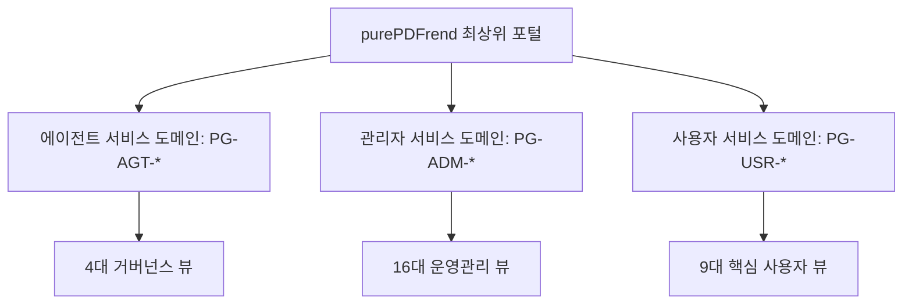
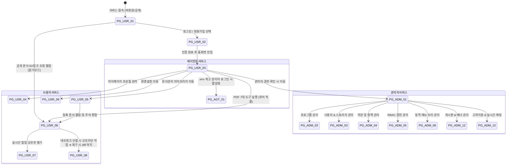

# 화면 프로그램 ID 체계표 및 계층적 정보구조(IA) 상세설계서

> **문서 식별자**: `05-22`  
> **상태**: 승인 및 적용 (Approved)  
> **관련 기획**: `docs/17.참고/260927_01_화면UI기획-초안.md`, `docs/05.설계/05-21_오프라인_인증토큰_문서검증_및_커스텀툴바_상세설계서.md`  
> **적용 범위**: purePDFrend 3대 도메인 전체 프로그램 식별자, 메뉴 트리, 반응형 화면 라우팅

---

## 1. 개요 및 설계 철학

purePDFrend의 모든 화면은 독립된 모듈 단위인 **'프로그램(Program ID)'**으로 식별 및 등록되며, 관리자 서비스의 프로그램 관리(`PG-ADM-02`) 및 메뉴 관리(`PG-ADM-06`)와 데이터베이스 레벨에서 연동된다.

---

## 2. 관리자 서비스 16대 서브화면 프로그램 ID 체계표

| 프로그램 ID | 프로그램 명칭 | 부모 프로그램 ID | 기본 라우트 / 모달 | 권한 요건 | 주요 기능 및 화면 레이아웃 구성 |
| :--- | :--- | :--- | :--- | :---: | :--- |
| `PG-ADM-01` | **보안관리** | `PG-ADM-ROOT` | `/admin/security` | `ROLE_ADMIN` | 해외 IP 차단, 2FA(소셜/이메일) 정책 강제화, Provider 인증키 관리, 세션 만료 시간 설정 |
| `PG-ADM-02` | **프로그램관리** | `PG-ADM-ROOT` | `/admin/programs` | `ROLE_ADMIN` | 프로그램 등록/수정/삭제, 부모-자식 트리 구성, DAG 순환참조 방지 검증, 버전별 화면 교체 |
| `PG-ADM-03` | **사용자관리** | `PG-ADM-ROOT` | `/admin/users` | `ROLE_ADMIN` | 회원 상태/비밀번호 초기화/오프라인 허용 관리, 개인정보 수정 불가 원칙, NAS/FTP 스토리지 연동 |
| `PG-ADM-04` | **약관·동의·정책** | `PG-ADM-ROOT` | `/admin/terms` | `ROLE_ADMIN` | 웹 문서 기반 8대 약관 관리, 문서그룹ID 기반 버전 배포, 사용자별 동의 시점 증빙 이력 원장 |
| `PG-ADM-05` | **사용자 권한관리** | `PG-ADM-ROOT` | `/admin/roles` | `ROLE_ADMIN` | 권한그룹 정의 및 우선순위 부여, 개별 프로그램 권한 부여(최우선 오버라이드), 필수동의 교차검증 |
| `PG-ADM-06` | **메뉴관리** | `PG-ADM-ROOT` | `/admin/menus` | `ROLE_ADMIN` | 프로그램 ID 기반 네비게이션 메뉴 트리 구성, 도메인별(관리자/사용자) 분리, 노출/숨김 순서 제어 |
| `PG-ADM-07` | **로그관리** | `PG-ADM-ROOT` | `/admin/logs` | `ROLE_ADMIN` | 사용자 감사 로그 검색(IP, 작업유형, 시간, 프로그램ID), PDF 다운로드 및 주석 변경 추적 |
| `PG-ADM-08` | **알림관리** | `PG-ADM-ROOT` | `/admin/notifications` | `ROLE_ADMIN` | 이메일/푸시/인앱 알림 발송, 긴급/일반 공지 모달 노출, 예약 발송 및 수신확인 이력 집계 |
| `PG-ADM-09` | **서비스 API관리** | `PG-ADM-ROOT` | `/admin/service-api` | `ROLE_ADMIN` | 백엔드 PDF 변환, OCR 엔진, 보안 암호화, 가상 뷰어 엔드포인트 모니터링 및 상태 검증 |
| `PG-ADM-10` | **외부 API관리** | `PG-ADM-ROOT` | `/admin/external-api`| `ROLE_ADMIN` | 카카오/네이버/구글 OAuth, 외부 번역, 외부 클라우드 드라이브 연동 상태 및 토큰 점검 |
| `PG-ADM-11` | **사용자설정 항목관리** | `PG-ADM-ROOT` | `/admin/user-settings`| `ROLE_ADMIN` | 사용자에게 제공할 설정 옵션 메타데이터 관리(토글형/목록선택형), 설명 및 기본값 배포 |
| `PG-ADM-12` | **게시판·배너관리** | `PG-ADM-ROOT` | `/admin/boards` | `ROLE_ADMIN` | 공지사항(일반/긴급/이벤트) 등록, 첫화면/홈화면 롤링 배너 등록(HTML/이미지/URL) 및 통계 |
| `PG-ADM-13` | **고객지원관리** | `PG-ADM-ROOT` | `/admin/support` | `ROLE_ADMIN` | 운영시간 안내 관리, 1:1 상담 예약 접수, 사용자 후기/리뷰 승인, 실시간 채팅 및 파일 공유 |
| `PG-ADM-14` | **무료글꼴관리** | `PG-ADM-ROOT` | `/admin/fonts` | `ROLE_ADMIN` | 전자책 및 텍스트 주석용 웹폰트(WOFF2/TTF) 등록, 별명(Alias) 지정 및 프리뷰 제공 |
| `PG-ADM-15` | **단축키 및 도구아이콘 관리** | `PG-ADM-ROOT` | `/admin/shortcuts` | `ROLE_ADMIN` | 뷰어 기능별 기본 단축키(PC/태블릿) 정책 정의, 도구별 디자인 리소스 아이콘 지정, 시스템 기본값 배포 |
| `PG-ADM-16` | **도구그룹관리** | `PG-ADM-ROOT` | `/admin/tool-groups` | `ROLE_ADMIN` | 8대 뷰어모드별 기본도구 편성, 그룹간 중복허용 정책 제어, 도구그룹 기본값 배포 |

---

## 3. 사용자 서비스 9대 핵심화면 프로그램 ID 체계표

| 프로그램 ID | 프로그램 명칭 | 부모 프로그램 ID | 기본 라우트 / 뷰 | 주요 기능 및 와이어프레임 레이아웃 |
| :--- | :--- | :--- | :--- | :--- |
| `PG-USR-01` | **첫화면 (랜딩)** | `PG-USR-ROOT` | `/` | 상단 로그인/회원가입 버튼, 공개 열람 문서 조회 바, 롤링 배너, 공지/리뷰/가이드 3대 탭, 푸터 |
| `PG-USR-02` | **로그인 / 회원가입** | `PG-USR-ROOT` | `/auth` | ID/PW 1차 인증 + 소셜/이메일 2FA 탭 전환, 회원가입 프로필 및 약관 동의 모달 |
| `PG-USR-03` | **홈화면 (대시보드)** | `PG-USR-ROOT` | `/home` | 시스템/관리자 이동 아이콘, 프로필 요약 카드, **7대 PDF 핵심 도구 퀵 액션 그리드** |
| `PG-USR-04` | **마이페이지 > 사용자관리**| `PG-USR-ROOT` | `/mypage` | 비밀번호 변경, 2차 인증(소셜/이메일) 탭 설정, 프로필 사진/닉네임/연락처 수정 |
| `PG-USR-05` | **문서관리 (라이브러리)**| `PG-USR-ROOT` | `/documents` | 8대 상세 필터 바, 카드/테이블 뷰, 문서등록(PDF/이미지), 4종 다운로드, 주석 내보내기/불러오기 |
| `PG-USR-06` | **문서뷰어 & 주석스튜디오**| `PG-USR-ROOT` | `/viewer/:id` | **단일줄 상단 툴바 + 가로 슬라이더**, 좌측 네비(북마크/목차/주석), 8대 모드 팔레트, 3단계 인터랙션 |
| `PG-USR-07` | **문서공유 및 협업작업뷰**| `PG-USR-06` | `/viewer/:id/share` | 공유 권한(읽기/열람자쓰기/관리자) 설정, 유효기간, 우측 협업 사이드바(동시접속자/이벤트 피드) |
| `PG-USR-08` | **오프라인 모드 & 충돌머지**| `PG-USR-ROOT` | 오프라인 팝업/뷰어 | 오프라인 감지 배너, 로컬 이벤트 소싱 큐, 온라인 복구 시 **Last-Write-Wins 및 diff 수동 머지** |
| `PG-USR-09` | **정밀 사용자 환경설정**| `PG-USR-ROOT` | `/settings` | 검색창, 디자인 테마, 첫화면 지정, 뷰어/일반/보기/주석/글꼴/협업 상세 옵션 탭 |

---

## 4. 에이전트 서비스 도메인 프로그램 ID 체계표 (시스템관리자 전용)

| 프로그램 ID | 프로그램 명칭 | 기본 라우트 | 접근 조건 | 담당 역할 |
| :--- | :--- | :--- | :---: | :--- |
| `PG-AGT-01` | **하네스 관제 대시보드** | `/agent/harness` | `.env` 시스템관리자 | 세션·태스크·루프 3계층 생명주기 제어 및 작업 그래프 시각화 |
| `PG-AGT-02` | **대화턴 트레이스 뷰어** | `/agent/traces` | `.env` 시스템관리자 | LLM 대화턴 전문 조회, 토큰 사용량 집계, 429 토큰 필터링 감사 |
| `PG-AGT-03` | **시스템 무결성 감사관** | `/agent/audit` | `.env` 시스템관리자 | 5단계 가드레일, DB-로컬 패리티, 기술문서 142종 SHA-256 해시 감사 |
| `PG-AGT-04` | **재해복구(DR) 관제실** | `/agent/dr` | `.env` 시스템관리자 | 스냅샷 복구, 비-LLM 긴급 GitHub Push, 행(Hang) 리셋 제어 |

---

## 5. 계층적 정보 아키텍처(IA) 및 화면 전환 흐름도

---

## 6. 반응형 UI/UX 배치 규격 및 모바일 최적화

1. **데스크톱 (≥ 1280px)**:
   - 상단 글로벌 네비게이션 바(GNB) 고정.
   - 좌측 네비게이션 드로어(280px), 중앙 뷰어 캔버스(가변), 우측 인스펙터 패널(320px).
2. **태블릿 (768px ~ 1279px)**:
   - 좌우 패널은 접이식 오버레이(Off-canvas Drawer)로 전환.
   - 툴바는 수평 스냅 슬라이더(`ScrollSnapCarousel`) 적용.
3. **모바일 (≤ 767px)**:
   - GNB는 햄버거 메뉴 및 단일 줄 툴바로 단순화.
   - 툴바 텍스트 완전 제거, 아이콘 전용 + 터치 타겟 최소 44px 보장.
   - 복잡한 툴바 순서 설정은 `ToolbarConfigModal` 팝업을 통해 직관적으로 제공.
