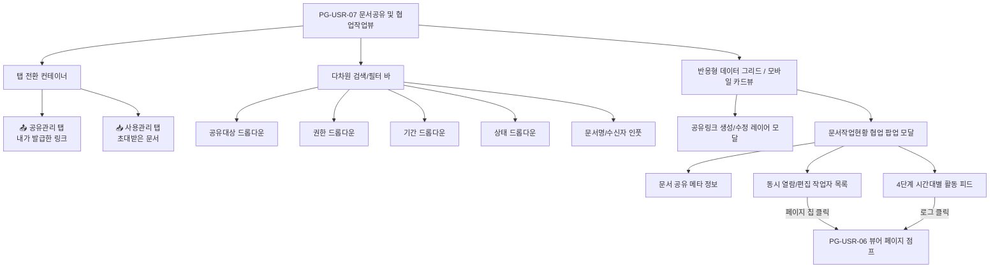

# PG-USR-07 문서공유 및 협업작업뷰 상세설계서

> **문서 ID**: `DOC-DES-USR-07`  
> **프로그램 ID**: `PG-USR-07`  
> **버전**: v1.0.0 (2026-10-03)  
> **관련 정책**: 정책 03-13 (UI/UX 통일 디자인시스템), 정책 03-14 (모바일 가로스크롤 방지)

---

## 1. 정보 구조(IA) 및 컴포넌트 아키텍처



---

## 2. 도메인 모델 및 상태 인터페이스

```typescript
export type ShareTargetKind = 'file' | 'category' | 'version';
export type SharePermissionLevel = 'viewer' | 'reviewer' | 'editor';
export type SharePeriodKind = 'unlimited' | '1d' | '7d' | '30d' | 'custom';
export type UserCollabStatus = 'active' | 'idle' | 'offline';

export interface DocumentShareLinkItem {
  id: string;
  targetKind: ShareTargetKind;
  targetName: string;
  docId: string;
  docVersion: string;
  totalPages: number;
  ownerName: string;
  ownerAvatar?: string;
  permission: SharePermissionLevel;
  periodKind: SharePeriodKind;
  expireDateText: string;
  isExpired: boolean;
  isRevoked: boolean;
  isPublicRead: boolean;
  hasPassword: boolean;
  shareUrl: string;
  createdAt: string;
  updatedAt: string;
  activeCollaboratorCount: number;
  recentActivityText: string;
  myRole?: 'owner' | 'invited';
}

export interface DocumentCollaborator {
  userId: string;
  name: string;
  roleTitle: string;
  status: UserCollabStatus;
  currentPage: number;
  currentActionText: string;
  colorBorder: string;
  avatarSeed: string;
}

export interface CollaborationActivityLog {
  id: string;
  timeCategory: 'just_now' | '10m_ago' | '7d_ago' | 'long_ago';
  timeText: string;
  authorName: string;
  actionText: string;
  targetPage?: number;
  annotationId?: string;
}
```

---

## 3. 핵심 인터랙션 시퀀스

1. **링크 복사 (네이티브 클립보드 & 비차단 토스트)**:
   - `navigator.clipboard.writeText(url)` 호출 후 `showToast('공유 링크가 클립보드에 복사되었습니다.', 'success')`
2. **동시 작업자 ➔ 뷰어 점프 (Live Follow Jump)**:
   - 작업자 행의 `[p.14 형광펜 ➔]` 클릭 ➔ `setViewerCurrentPage(14)`, `setSelectedProg('PG-USR-06')`, 협업 모달 닫기
3. **활동 피드 로그 ➔ 주석 펄스 점프**:
   - 피드 항목 클릭 ➔ 해당 페이지로 이동 + `setPulseAnnotationId(annotationId)` 발동 (1.8초간 펄스 애니메이션)
4. **소유자의 공유 회수 (Revoke Action)**:
   - `[🚫 공유 회수]` 클릭 시 `isRevoked: true` 설정, 상태 뱃지 '회수완료' 전환, 참여자 접근 즉시 차단
5. **뷰어 내 주석 작성자 라벨 토글**:
   - `showAuthorLabels` 상태가 true일 경우 캔버스 주석 바운딩 박스 우상단에 작성자 닉네임 라벨 상시 렌더링.
