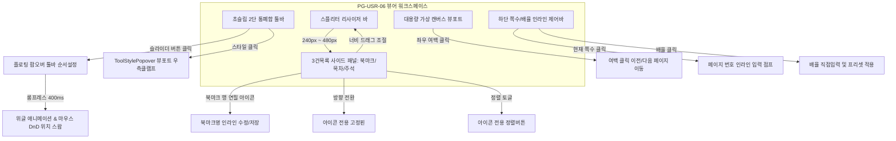

# 05-23. 가상뷰어 3건목록 리사이저·북마크명 수정·스타일팝오버 및 툴바 롱프레스 드래그 상세설계서

> **문서 ID**: `05-23`  
> **프로그램 ID**: `PG-USR-06` (문서뷰어 & 주석스튜디오)  
> **작성 일자**: 2026-10-02  
> **관련 세션 / 태스크**: `SESSION-0021` / `TASK-0021-01`  
> **참조 정책**: `docs/03.정책/03-13_UIUX_통일성_및_모바일반응형_디자인시스템_운영정책.md`, `docs/03.정책/03-14_모바일반응형_카드전환_및_가로스크롤_원천방지_디자인가이드.md`

---

## 1. 배경 및 목적

본 문서는 `purePDFrend`의 핵심 뷰어인 `PG-USR-06 고성능 가상 뷰어(VirtualViewerStudio)`의 9대 핵심 사용자 인터랙션 결함을 해소하고, Xodo 수준의 직관적이고 끊김 없는 사용성을 달성하기 위한 프론트엔드 아키텍처 및 인터랙션 상세 설계를 정의한다.

---

## 2. 9대 핵심 기능 상세 설계

### 2.1 [기능 1] 3건목록 세로 패널 너비(Width) 드래그 조절
- **구조**: 좌측 사이드 패널(`bg-slate-950`)과 중앙 가상 캔버스 사이에 12px 터치/마우스 히트 영역을 갖는 슬림 스플리터 핸들러(`w-3 cursor-col-resize`) 배치.
- **동작**:
  - `onMouseDown` 시 전역 포인터 캡처 및 `window.addEventListener('mousemove')` 등록.
  - 마우스 `clientX` 변화량을 계산하여 `viewerSidebarWidth`를 240px(최소) ~ 480px(최대) 범위로 실시간 클램프.
  - 마우스 릴리즈 시 리스너 안전 해제 및 최종 너비 영속화.

### 2.2 [기능 2] 3건목록 북마크 항목 수정기능 (북마크명 인라인 편집)
- **데이터 모델**:
  - `bookmarkCustomTitles: Record<number, string>` 매핑 테이블 관리.
  - 기본값: `제 {page} 페이지 북마크`.
- **인터랙션**:
  - 북마크 행 우측에 연필(✏️) 수정 버튼 배치.
  - 클릭 시 `editingBookmarkPage === page` 상태로 전환되어 `<input>` 필드로 즉시 치환.
  - Enter 키 입력 또는 확인(✓) 버튼 클릭 시 `bookmarkCustomTitles[page]` 갱신 후 토스트 안내. ESC 또는 취소(✕) 클릭 시 롤백.

### 2.3 [기능 3] 가로/세로 설정핀 아이콘화 (텍스트 제거)
- 패널 상단 고정핀 버튼에 존재하던 한글 텍스트(`가로(해제됨)` 등)를 전면 제거하고 직관적인 `Pin` / `PinOff` 아이콘만 단독 노출.
- 툴팁(`title="고정핀: 세로(좌측 패널) / 가로(상단 패널) 전환"`)으로 접근성 보장.

### 2.4 [기능 4] 정렬 기능 아이콘화 (텍스트 제거)
- 북마크 및 주석 패널의 `오름차순` / `내림차순` 텍스트를 제거하고, 상하 화살표 정렬 아이콘(`⬇️` / `⬆️`)만 컴팩트하게 노출.

### 2.5 [기능 5] 주석 도구 [스타일] 팝업레이어 우측 잘림 방지
- `ToolStylePopover` 컨테이너의 위치 지정을 `right-0 sm:right-auto sm:left-0` 및 `max-w-[calc(100vw-24px)]`로 변경.
- 부모 기준 상대 위치에서 뷰포트 우측 경계를 절대 벗어나지 않도록 강제 클램프.

### 2.6 [기능 6] 뷰어 툴바 순서 및 사용자 설정 모달 ➔ 플로팅 팝오버 전환
- 전체 화면을 가리던 `fixed inset-0` 모달을 제거하고, 툴바의 순서설정(Sliders) 버튼 하단에 직접 마운트되는 `absolute right-0 top-10 z-50` 플로팅 카드 팝오버로 변경.
- 뷰어 캔버스를 가리지 않고 직관적인 실시간 커스텀 가능.

### 2.7 [기능 7] 툴바 카드 롱프레스(400ms) 위글 모드 & 마우스 드래그 순서 변경
- 팝오버 내 도구 카드 항목에 400ms 롱프레스 타이머(`onMouseDown` / `onTouchStart`) 적용.
- 롱프레스 감지 시 `isReorderDragMode = true` 활성화.
- 선택된 카드에 CSS 위글 애니메이션(`animate-[wiggle_0.2s_ease-in-out_infinite]`) 부여.
- HTML5 DnD (`draggable`, `onDragStart`, `onDragOver`, `onDrop`)를 통해 카드를 드래그하여 목표 위치 카드와 순서를 즉시 스왑(`handleMoveTool`).

### 2.8 [기능 8] 문서영역 좌/우 여백 클릭 페이지 이동 (설정 토글)
- 캔버스 뷰포트의 좌/우 여백 영역에 클릭 감지 분기:
  - 캔버스 중심 기준 좌측 30% 영역 클릭 ➔ 이전 페이지(`prevPage`)
  - 캔버스 중심 기준 우측 30% 영역 클릭 ➔ 다음 페이지(`nextPage`)
- 뷰어 하단 컨트롤 바에 '여백 클릭 페이지 이동: ON/OFF' 토글 스위치 제공.

### 2.9 [기능 9] 하단 배율 직접 입력 및 현재 페이지 번호 인라인 입력 점프
- **현재 페이지 점프**:
  - `열람 쪽수: [ 157 ] / 800`의 숫자 부분을 클릭하면 즉시 `<input type="number">`로 전환.
  - 숫자를 입력하고 Enter를 누르면 해당 페이지로 즉시 뷰포트 점프.
- **배율 직접 제어**:
  - `배율: [ 100% ]` 칩을 클릭 시 인라인 입력창 및 배율 프리셋(50%, 75%, 100%, 125%, 150%, 200%) 빠른 선택 지원.
