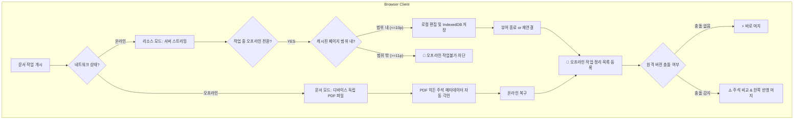

# 05-24. 오프라인 작업 정리 및 리소스·문서모드 충돌머지 엔진 설계서

## 📋 문서 정보 및 편집 이력 (Revision History)

| 작업일자 | 이슈 | 태스크 | 작업자 | 작업내용 | 사용 AI 모델명 | 에이전트 | 참고링크 |
| :--- | :--- | :--- | :--- | :--- | :--- | :--- | :--- |
| 2026-10-05 | #66 | TASK-0024-01 | gemini | [v1.1] 오프라인 작업 정리(PG-USR-08) 메뉴명 개편, 리소스모드 vs 문서모드 듀얼 아키텍처 수립, 리소스모드 캐시 한계(10p 등) 범위 가드레일 설계, 문서모드 PDF 히든 주석(Hidden Annotation Metadata) 각인 엔진 설계, 작업 단위(문서 단위) 관리 스키마 및 주석 비교/한쪽 반영(Local/Remote) 인터랙션 설계 | Gemini 3.8 Flash | Google AI Studio | [UserWireframes.tsx](../../src/ppdf/views/wireframes/UserWireframes.tsx) |
| 2026-10-05 | #66 | TASK-0024-01 | gemini | [v1.0] 최초 설계: PG-USR-08 오프라인 모드 화면 아키텍처 및 3-Way Diff Engine 인터페이스 수립 | Gemini 3.8 Flash | Google AI Studio | [UserWireframes.tsx](../../src/ppdf/views/wireframes/UserWireframes.tsx) |

---

## 1. 시스템 아키텍처 개요 (System Overview)

오프라인 작업 정리(PG-USR-08) 엔진은 사용자의 네트워크 상태와 작업 시작 지점에 따라 **리소스 모드(Resource Mode)**와 **문서 모드(Document Mode)**로 분기되어 동작합니다.



---

## 2. 뷰어 아키텍처 검토: 통합 뷰어 vs 별도 뷰어

### 2.1 아키텍처 대안 비교

| 비교 항목 | 대안 A: 뷰어 컴포넌트 물리적 분리 | 대안 B: 단일 가상 뷰어 코어 + 듀얼 데이터 어댑터 (선정) |
| :--- | :--- | :--- |
| **구조** | `ResourceViewerStudio`와 `DocumentModeViewerStudio` 별도 개발 | `VirtualViewerStudio` 단일 코어에 `IDataProvider` 전략 패턴 적용 |
| **코드 중복도** | 높음 (가상 윈도잉 캔버스, 툴바, 줌/회전 로직 중복) | **전무 (0%)** (렌더링 및 UI 로직 완벽 재사용) |
| **유지보수성** | 도구 추가 및 UI 개선 시 두 뷰어 동시 수정 필요 | **단일 뷰어 수정으로 양대 모드 자동 반영** |
| **모드 전환성** | 온라인 재연결 시 뷰어 언마운트/리마운트 깜빡임 발생 | **어댑터 교체만으로 매끄러운 인라인 전환(Zero-Flicker)** |

### 2.2 권장 아키텍처: 어댑터/전략 패턴 (Strategy Pattern)
단일 `VirtualViewerStudio` 내에서 데이터 공급 계층만 인터페이스로 분리합니다:
- `ResourceStreamingProvider`: 온라인 시 타일 청크 및 서버 REST API 연동
- `LocalPdfFileProvider`: 오프라인 시 브라우저 `ArrayBuffer` 로컬 파일 파싱 + 히든 주석 인젝터 연동

---

## 3. PDF 히든 주석(Hidden Annotation Metadata) 규격

문서 모드에서 독립 PDF 파일에 각인되는 메타데이터는 표준 PDF 파서와 호환되면서도 뷰어 화면에는 표시되지 않는 **비표시 TrapNet Annotation Layer** 및 **XMP 메타데이터**에 영속화됩니다:

```typescript
export interface HiddenAnnotationPayload {
  startTime: string;      // ISO-8601 최초 수정 시각
  updateTime: string;     // ISO-8601 최종 수정 시각
  modifier: string;       // 작업자 계정 이메일
  docNo: string;          // 문서 번호 (DOC-XXXX)
  docTitle: string;       // 문서 제목
  docVersion: string;     // 문서 버전
  endTime: string;        // 로컬 저장 완료 시각
  annotationCount: number;// 작성된 주석 수
  targetSystem: string;   // 'purePDFrend Production'
}
```

---

## 4. 오프라인 작업 정리 문서 목록 데이터 모델

```typescript
export interface OfflineWorkDocument {
  docId: string;             // 문서 ID (예: DOC-0091)
  docName: string;           // 문서명
  docVersion: string;        // 문서 버전 (v2.1)
  workMode: '리소스모드' | '문서모드';
  offlineTime: string;       // 오프라인 전환 시각
  startTime: string;         // 작업 시작 시각 (최초 주석 수정)
  endTime: string;           // 작업 종료 시각 (저장)
  author: string;            // 작업자 이메일
  cachedPages?: number;      // 캐시된 페이지 (리소스모드: 10p)
  totalPages?: number;       // 전체 페이지
  status: '충돌감지' | '바로머지가능' | '머지완료' | '온라인등록대기';
  hasConflict: boolean;
  offlineChangeDesc: string; // 오프라인 수정 요약
  externalChangeDesc?: string;// 외부 동시 수정 요약
  hiddenMetadata?: HiddenAnnotationPayload | null;
}
```

---

## 5. 주석 비교 및 한쪽 반영(One-Sided Apply) 알고리즘

```typescript
export type MergeDecision = 'LOCAL_WINS' | 'REMOTE_WINS' | 'SMART_MERGE';

export function resolveOfflineDocumentMerge(
  doc: OfflineWorkDocument, 
  decision: MergeDecision
): { success: boolean; resultStatus: '머지완료'; log: string } {
  switch (decision) {
    case 'LOCAL_WINS':
      // 내 로컬 오프라인 작업본 100% 반영: 원격 서버에 강제 푸시
      return {
        success: true,
        resultStatus: '머지완료',
        log: `[Local-Wins] ${doc.docId} 로컬 작업내용이 서버에 우선 반영되었습니다.`
      };
    case 'REMOTE_WINS':
      // 외부 원격 작업본 100% 반영: 내 작업본은 Draft Quarantine에 안전 아카이빙
      return {
        success: true,
        resultStatus: '머지완료',
        log: `[Remote-Wins] ${doc.docId} 외부 원격본이 채택되고 내 작업본은 로컬 격리 보관소에 안전 보존되었습니다.`
      };
    case 'SMART_MERGE':
    default:
      // 양방향 스마트 병합: 주석 속성 및 텍스트 레이어 결합
      return {
        success: true,
        resultStatus: '머지완료',
        log: `[Smart-Merge] ${doc.docId} 로컬 주석과 원격 수정사항이 통합되었습니다.`
      };
  }
}
```
