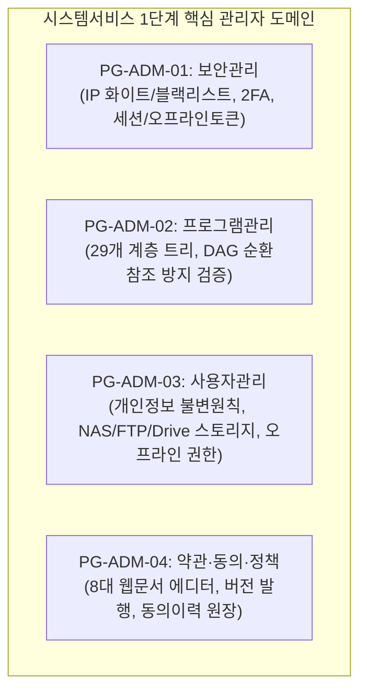

# PG-ADM-01~04 시스템서비스 1단계 와이어프레임 및 DAG 트리 상세설계서

> **문서 식별자**: `05-25`  
> **상태**: 승인 및 구현 (Approved & Implemented)  
> **관련 문서**: `docs/05.설계/05-22_화면프로그램ID체계표_및_정보구조_IA_설계서.md`, `docs/05.설계/05-21_오프라인_인증토큰_문서검증_및_커스텀툴바_상세설계서.md`, `docs/03.정책/03-14_모바일반응형_카드전환_및_가로스크롤_원천방지_디자인가이드.md`  
> **적용 범위**: 관리자 16대 화면 중 1단계 핵심 4대 화면(`PG-ADM-01` ~ `PG-ADM-04`) UI/UX 및 도메인 인터랙션

---

## 1. 개요 및 설계 목표

purePDFrend 시스템서비스의 1단계 고도화는 엔터프라이즈급 관리 환경을 구축하기 위해 필수적인 보안 통제, 모듈형 프로그램 계층 트리, 사용자 및 스토리지 거버넌스, 웹문서 기반 약관 라이프사이클을 체계화합니다.

---

## 2. 화면별 상세 아키텍처 및 요구 명세

### 2.1 PG-ADM-01 (보안관리)
1. **IP 접근 제어 (Access Control)**:
   - 화이트리스트 CIDR: 사내망 및 VPN IP 대역 등록/삭제
   - 블랙리스트 CIDR: 이상 트래픽 및 무차별 대입 공격 의심 IP 즉시 차단
   - Geo-Blocking: 국내 외 IP 접근 원천 차단 토글 및 예외 국가 설정
2. **2FA 강제화 정책**:
   - 관리자 역할(`ROLE_ADMIN`)에 대한 2단계 인증 강제 적용 스위치
   - 일반 회원에 대한 선택/권장/필수 정책 토글
   - 비상 복구 일회용 코드 발급 수량 및 만료 정책
3. **세션 및 오프라인 토큰 수명주기**:
   - 온라인 유휴 세션 만료 시간 (15분, 30분, 60분, 120분)
   - `OFFLINE_REFRESH_TOKEN_DAYS` 속성: 오프라인 모드 유지 기간(1~180일, 기본 30일) 슬라이더

### 2.2 PG-ADM-02 (프로그램관리 & DAG 순환참조 방지)
1. **29대 프로그램 계층 트리 시각화**:
   - 도메인별 루트: `PG-USR-ROOT`, `PG-ADM-ROOT`, `PG-AGT-ROOT`
   - 각 하위 화면 프로그램의 부모-자식 관계를 트리 형태로 렌더링
2. **DAG (Directed Acyclic Graph) 순환참조 검출 알고리즘**:
   - 부모 프로그램 재지정 시, 대상 부모가 자기 자신(`id === parentId`)이거나 자신의 직계/방계 자식 노드(`isDescendant(target, parent)`)인지 실시간 검증
   - 순환 종속성 발견 시 즉시 `DAG_CYCLE_DETECTED` 에러 뱃지 출력 및 저장 차단
3. **프로그램 메타데이터 관리**:
   - 프로그램 ID, 명칭, 부모 프로그램, 라우트 URL, 필요 권한, 활성 상태

### 2.3 PG-ADM-03 (사용자관리 & 스토리지 거버넌스)
1. **개인정보 불변원칙 (헌장 준수)**:
   - 관리자는 사용자의 평문 비밀번호, 주민번호, 개인 연락처를 임의 수정할 수 없음
   - 비밀번호 분실 시 "초기화 인증 메일 발송" 기능만 제공
2. **오프라인 사용 권한 제어**:
   - 사용자별 오프라인 작업 권한 토글 스위치
   - 잔여 유효일수 표기 및 원클릭 +30일 연장 인터랙션
3. **스토리지 연동 현황**:
   - Local NAS (Synology, QNAP), FTP/SFTP, Google Drive, WebDAV 마운트 경로 및 사용량 모니터링
4. **반응형 카드 전환 (정책 03-14)**:
   - 데스크톱: 데이터 테이블 / 모바일(≤ 767px): 카드형 리스트 뷰 자동 전환 (가로 스크롤 0px)

### 2.4 PG-ADM-04 (약관·동의·정책)
1. **8대 표준 약관 체계**:
   - `DOC_GRP_01` (이용약관), `DOC_GRP_02` (개인정보 수집·이용), `DOC_GRP_03` (마케팅 수신동의), `DOC_GRP_04` (저작권 안내), `DOC_GRP_05` (면책조항), `DOC_GRP_06` (쿠키 정책), `DOC_GRP_07` (청소년 보호정책), `DOC_GRP_08` (오프라인 동기화 정책)
2. **실시간 웹문서 에디터 & 버전 발행**:
   - 버전 업그레이드(v1.0 -> v2.0), 효력 발생일자 지정, 주요 개정 사유 입력
3. **사용자 동의 이력 원장 (Consent Ledger)**:
   - 사용자 ID, 약관그룹ID, 동의 버전, 동의 시각(KST), IP, 철회 상태 추적

### 2.5 13대 시스템 설정 와이어프레임 고도화 규격 (전체 16대 화면 연계)
1. **보안관리 (PG-ADM-01)**: 화이트리스트 CIDR 및 실시간 블랙리스트(차단 사유 기록, 즉시 차단/해제) 동시 관리, 2FA 강제화, 세션 만료, 오프라인 토큰 기간 연동.
2. **프로그램 등록/수정/삭제 (PG-ADM-02)**: 신규 프로그램 등록 폼, 수정/삭제 UI, DAG 순환참조 방지 실시간 검증기 탑재.
3. **화면관리 (PG-ADM-02 연계)**: 화면 등록/수정/삭제, 프로그램 설정, 다중 권한(`ROLE_*` 복수 체크) 부여 지원.
4. **사용자관리 (PG-ADM-03)**: 목록에 아바타 프로필 사진 표시, 상세화면 조회 모달, 다중 권한(여러 권한) 부여, 스토리지/오프라인 관리.
5. **메뉴관리 (PG-ADM-06)**: 메뉴 등록/수정/삭제, 위치 관리(위/아래 순서 이동), 대상 화면 프로그램 매핑.
6. **사용자 권한관리 (PG-ADM-05)**: 3대 서브탭 분리:
   - 권한관리: 역할 그룹 정의, 등록/수정/삭제
   - 프로그램권한관리: 권한별 프로그램 다중 매핑
   - 사용자권한관리: 권한별 사용자 다중 배정
7. **약관관리 (PG-ADM-04)**: 약관 검색, 적용버전 체크(최신 활성본만 조회 필터), 이전 약관 수정 후 새 파일 등록 및 버전 설정(v1.0 개정 / v1.1 수정).
8. **알림관리 (PG-ADM-08)**: 공지(점검안내), OCR 완료안내, 개인알림 대상여부(전체 vs 개인) 설정.
9. **API 관리 (PG-ADM-09 & 10)**: 내부 API(OCR, Core, Merge) 및 외부 API(OAuth, Drive, Vision) 탭 화면 분리.
10. **게시판·배너관리 (PG-ADM-12)**:
    - 공지: 예약공지, 다시열지않기(하루, 7일, 30일, 영구) 팝업 옵션
    - 배너: 텍스트/이미지 배너 등록, 노출 순서 설정
11. **고객관리 (PG-ADM-13)**: 3대 탭: FAQ 그룹관리, 공개 Q&A(관리자/등록자 알림), 1:1 비공개 상담.
12. **무료글꼴관리 (PG-ADM-14)**: 글꼴 등록/수정/삭제, 웹폰트 포맷(WOFF2/TTF), 적용여부 토글, 실시간 텍스트 프리뷰.
13. **단축키 및 도구아이콘/그룹관리 (PG-ADM-15, 16)**:
    - 단축키: 시스템 기본 vs 사용자 커스텀 우선순위 정책
    - 도구아이콘: 도구별 디자인 리소스 아이콘 변경
    - 도구그룹: 모드별 도구 편성 및 변경 시 영향도 검토(Impact Analysis) 패널.

---

## 3. 화면 메뉴 접근 경로 (Information Architecture)
1. 상단 글로벌 네비게이션: `[PDF 스튜디오]` ➔ `[와이어프레임]` ➔ `[🛠 관리자 서비스 (16개 화면)]`
2. 관리자 와이어프레임 상단: 16대 프로그램 가로 슬라이드 칩 바 및 실시간 검색 필터
3. 메뉴관리(PG-ADM-06) 및 화면관리(PG-ADM-02) 매핑을 통한 실제 런타임 라우팅 연계

---

## 4. 모바일 반응형 0px 가로스크롤 가드레일 (정책 03-14) 준수
- 모든 테이블 컴포넌트는 `hidden md:table` 및 모바일 전용 `block md:hidden` 분기 처리
- 폭 초과 방지: `break-all`, `truncate`, 플렉스 랩핑 및 터치 타깃 44px 이상 확보
