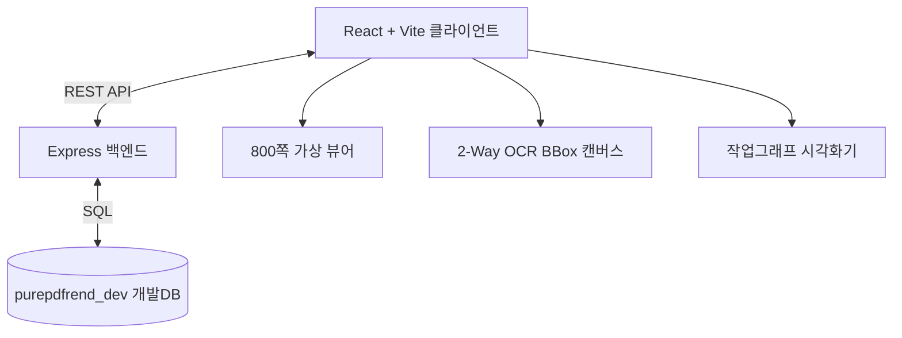

# 05. 설계 (Architecture & Design Specs) 요약 가이드

## 📋 폴더 개요
시스템 전체 아키텍처, 800쪽 대용량 가상화, 데이터베이스 스키마, 작업그래프 뷰어 및 UI 컴포넌트 설계 명세서를 보관합니다.

## 📑 하위 문서 목록
| 문서번호 | 파일명 | 문서 제목 | 주요 내용 요약 |
| :--- | :--- | :--- | :--- |
| `05-01` | `05-01_전체_아키텍처_및_가상화_설계.md` | 전체 아키텍처 및 800쪽 가상화 | 가상화 뷰어, 2-Way BBox, TOC 트리, 주석 툼스톤 동기화 설계 |
| `05-02` | `05-02_데이터베이스_아키텍처_설계.md` | 개발DB 아키텍처 및 스키마 | purepdfrend_dev 개발DB 및 aiagent 6대 핵심 테이블 구조 |
| `05-03` | `05-03_작업그래프_관리_및_시각화_설계.md` | 작업그래프 관리 및 시각화 거버넌스 | 다중 계층 동시선택 뷰모드, 완료/진행/대기 필터 및 카드 간격 설정 |
| `05-04` | `05-04_세션스토어격리_및_동적DB영속화_설계.md` | 세션 스토어 격리 및 동적 DB 영속화 | 세션단위 스토어 격리 생명주기 및 3계층 하네스 동적 교차검증 파이프라인 |
| `05-05` | `05-05_DB인덱스_및_체크포인트_대화턴_영속화_설계.md` | DB 인덱스 최적화 및 체크포인트 영속화 | 복합 인덱스 가속화, 감사컬럼 기본값 설정 및 생명주기 체크포인트 턴 영속화 파이프라인 |
| `05-06` | `05-06_모바일반응형UX_및_3대도메인_IA그룹화_설계.md` | 모바일 반응형 UX 및 3대 도메인 IA 설계 | 3대 도메인 8대 뷰 아키텍처, Navbar 인터랙션 컴포넌트, 모바일 터치 가드레일 |
| `05-07` | `05-07_실시간_토큰텔레메트리_및_자가적응형_도메인설계.md` | 실시간 토큰 텔레메트리 및 자가적응형 도메인 설계 | 4계층 텔레메트리(v, B, LSM, BRI), EMA 피드백 루프, Git 3대 기준점 도메인 모델 |
| `05-19` | `05-19_PDF_표준_및_커스텀_메타데이터_주입기_설계서.md` | PDF 표준 및 커스텀 메타데이터 주입기 상세 설계서 | 표준 8대 필드, 도서 서지정보, 활동(강의/스터디) 및 독서(회독/진도) 상태 유니코드 무손실 주입 |

