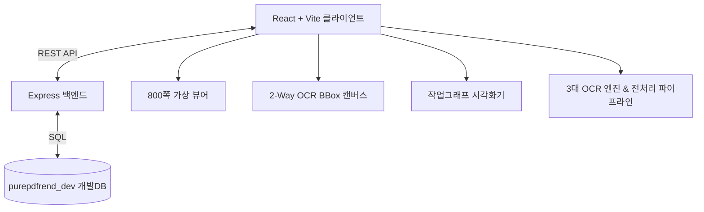

# 05. 설계 (Architecture & Design Specs) 요약 가이드

## 📋 폴더 개요
시스템 전체 아키텍처, 800쪽 대용량 가상화, 데이터베이스 스키마, 작업그래프 뷰어 및 UI 컴포넌트 설계 명세서를 보관합니다.

## 📑 하위 문서 목록
| 문서번호 | 파일명 | 문서 제목 | 주요 내용 요약 |
| :--- | :--- | :--- | :--- |
| `05-01` | `05-01_전체_아키텍처_및_가상화_설계.md` | 전체 아키텍처 및 800쪽 가상화 | 가상화 뷰어, 2-Way BBox, TOC 트리, 주석 툼스톤 동기화 설계 |
| `05-02` | `05-02_데이터베이스_아키텍처_설계.md` | 개발DB 아키텍처 및 스키마 | purepdfrend_dev 개발DB 및 aiagent 6대 핵심 테이블 구조 |
| `05-03` | `05-03_작업그래프_관리_및_시각화_설계.md` | 작업그래프 관리 및 시각화 거버넌스 | 다중 계층 동시선택 뷰모드, 완료/진행/대기 필터 및 카드 간격 설정 |
| `05-04` | `05-04_세션스토어격리_및_동적DB영속화_설계.md` | 세션 스토어 격리 및 동적 DB 영속화 | 세션단위 스토어 격리 생명주기 및 3계층 하네스 동적 교차검증 파이프라인 |
| `05-05` | `05-05_DB인덱스_및_체크포인트_대화턴_영속화_설계.md` | DB 인덱스 최적화 및 체크포인트 영속화 | 복합 인덱스 가속화, 감사컬럼 기본값 설정 및 생명주기 체크포인트 턴 영속화 파이프라인 |
| `05-06` | `05-06_모바일반응형UX_및_3대도메인_IA그룹화_설계.md` | 모바일 반응형 UX 및 3대 도메인 IA 설계 | 3대 도메인 8대 뷰 아키텍처, Navbar 인터랙션 컴포넌트, 모바일 터치 가드레일 |
| `05-08` | `05-08_비LLM_긴급푸시_쿼터차감엔진_및_세션DR_설계.md` | 비-LLM 긴급푸시 및 세션 DR 설계 | EmergencyGitPushEngine, QuotaDeductionEngine 및 세션 재해복구 체계 |
| `05-09` | `05-09_관리자_메타원장_대시보드_및_스냅샷_파일화_설계.md` | 관리자 메타원장 대시보드 및 스냅샷 파일화 설계 | PostgreSQL 5대 메타원장 관리 대시보드 및 DR 스냅샷 영속화 |
| `05-10` | `05-10_PDF_이미지_전처리_및_3대_OCR_엔진_어댑터_설계.md` | PDF 이미지 전처리 및 3대 OCR 어댑터 설계 | 이미지 Deskew/이진화 파이프라인 및 Tesseract/Gemini/PaddleOCR Docker 어댑터 |
| `05-11` | `05-11_거버넌스_4대_식별자_포맷_및_문서_다이어그램_표준화_설계.md` | 거버넌스 4대 식별자 포맷 및 문서 다이어그램 표준화 설계 | 세션/태스크/루프/대화턴 4대 ID 포맷 및 Mermaid 대체 텍스트/하단 편집이력 규격 |
| `05-12` | `05-12_800쪽_대용량_가상화_뷰어_및_메모리가드_설계.md` | 800쪽 대용량 가상화 뷰어 및 메모리가드 설계 | 800쪽 가상 윈도잉 뷰포트, 단면/양면 펼침면 스페이서 계산식, 10페이지 LRU 메모리가드 및 썸네일 탐색기 |
| `05-13` | `05-13_PDF_페이지_레이아웃_편집기_및_Undo_Redo_커맨드_설계.md` | PDF 페이지 레이아웃 편집기 및 무제한 Undo/Redo 설계 | 페이지 90°/180°/270° 회전, 소프트 삭제/복구, DnD 순서재배치, HistoryManager 커맨드 패턴 |
| `05-14` | `05-14_투명_텍스트_레이어_임베딩_Searchable_PDF_내보내기_설계.md` | Searchable PDF 내보내기 및 투명 텍스트 레이어 합성 설계 | pdf-lib 기반 투명 텍스트 레이어 합성, 폰트 레지스트리, 43ms 초고속 파이프라인 |
| `05-15` | `05-15_2Way_BBox_캔버스_인라인_텍스트_교정기_설계.md` | 2-Way BBox 캔버스 인라인 텍스트 교정기 설계 | 실시간 양방향 포커스 동기화, BBox 이동/리사이즈, HistoryManager Undo/Redo |
| `05-16` | `05-16_PDF_시스템_설정_및_기능_거버넌스_설계.md` | PDF 시스템 설정 및 기능 거버넌스 설계 | In-Memory Write-Through 설정 레지스트리, 6대 도메인 15개 설정, 논리적 모순 방어 |
| `05-17` | `05-17_세션_DR_스냅샷_디둡_클린징_및_전역_UTF8_가드레일_설계.md` | 세션 DR 스냅샷 디둡·클린징 및 UTF-8 가드레일 설계 | SHA-256 상태지문 중복억제, 10개 롤링 보관/Cold 아카이빙, 전역 UTF-8/NFC 정규화 방어 |
| `05-18` | `05-18_다국어_OCR_병렬_배치_큐_Worker_Pool_및_프로그레스_엔진_설계.md` | 다국어 OCR 병렬 배치 큐(Worker Pool) 및 프로그레스 엔진 설계 | Worker Pool 동시성 제어, 다국어 어댑터 라우팅, 실시간 TPS/ETA 계산기, Pause/Resume/Cancel 가드레일 |

  
  
<em>[그림] 05. 설계 (Architecture & Design Specs) 요약 가이드 - 아키텍처 및 상태 흐름도 다이어그램 1</em>

