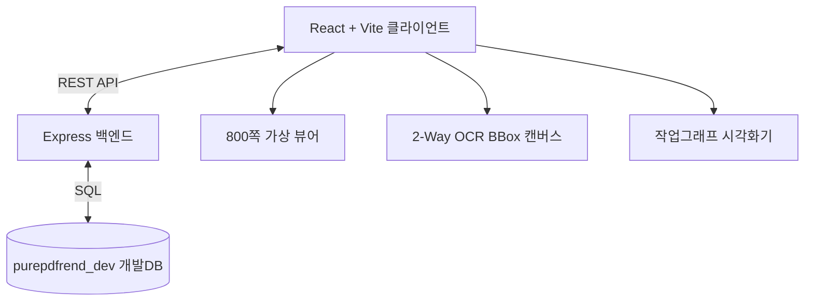

# 05. 설계 (Architecture & Design Specs) 요약 가이드

## 📋 폴더 개요
시스템 전체 아키텍처, 800쪽 대용량 가상화, 데이터베이스 스키마, 작업그래프 뷰어 및 UI 컴포넌트 설계 명세서를 보관합니다.

## 📑 하위 문서 목록
| 문서번호 | 파일명 | 문서 제목 | 주요 내용 요약 |
| :--- | :--- | :--- | :--- |
| `05-01` | `05-01_전체_아키텍처_및_가상화_설계.md` | 전체 아키텍처 및 800쪽 가상화 | 가상화 뷰어, 2-Way BBox, TOC 트리, 주석 툼스톤 동기화 설계 |
| `05-02` | `05-02_데이터베이스_아키텍처_설계.md` | 개발DB 아키텍처 및 스키마 | purepdfrend_dev 개발DB 및 aiagent 6대 핵심 테이블 구조 |
| `05-03` | `05-03_작업그래프_관리_및_시각화_설계.md` | 작업그래프 관리 및 시각화 거버넌스 | 다중 계층 동시선택 뷰모드, 완료/진행/대기 필터 및 카드 간격 설정 |
| `05-04` | `05-04_세션스토어격리_및_동적DB영속화_설계.md` | 세션 스토어 격리 및 동적 DB 영속화 | 세션단위 스토어 격리 생명주기 및 3계층 하네스 동적 교차검증 파이프라인 |
| `05-05` | `05-05_DB인덱스_및_체크포인트_대화턴_영속화_설계.md` | DB 인덱스 최적화 및 체크포인트 영속화 | 복합 인덱스 가속화, 감사컬럼 기본값 설정 및 생명주기 체크포인트 턴 영속화 파이프라인 |
| `05-06` | `05-06_모바일반응형UX_및_3대도메인_IA그룹화_설계.md` | 모바일 반응형 UX 및 3대 도메인 IA 설계 | 3대 도메인 8대 뷰 아키텍처, Navbar 인터랙션 컴포넌트, 모바일 터치 가드레일 |
| `05-21` | `05-21_오프라인_인증토큰_문서검증_및_커스텀툴바_상세설계서.md` | 오프라인 인증토큰·문서검증 및 커스텀툴바 상세설계 | 30일 슬라이딩 토큰, 로컬 뷰어 권한 분리, SHA-256 주석 락, 아이콘 전용 툴바 가로 슬라이더 |
| `05-22` | `05-22_화면프로그램ID체계표_및_정보구조_IA_설계서.md` | 화면 프로그램 ID 체계표 및 정보구조(IA) 상세설계 | 관리자 14개(PG-ADM-01~14), 사용자 9개(PG-USR-01~09), 에이전트 4개(PG-AGT-01~04) 전수 매핑 및 계층 라우팅 |
| `05-23` | `05-23_PG_USR_06_가상스크롤_PDF뷰어_3탭상좌배치_및_도구속성바_설계서.md` | PG-USR-06 가상 뷰어 연동, 3탭 상단/좌측 배치 및 도구속성바 상세설계 | PG-USR-05 서재 연동, 도서 메타데이터·진척도 툴바, 3탭 상단/좌측 배치 토글, 8대 모드 및 인라인 도구속성 미니바 상세설계 |
| `05-24` | `05-24_오프라인_IndexedDB큐_및_3Way_충돌머지_엔진_설계서.md` | 오프라인 작업 정리 및 리소스·문서모드 충돌머지 엔진 설계서 | PG-USR-08 오프라인 작업 정리 화면 아키텍처, 리소스모드 vs 문서모드 듀얼 구조, 통합 뷰어 vs 별도 뷰어 어댑터 검토, PDF 히든 주석 각인 규격, 주석 비교 및 한쪽 반영(Local/Remote) 머지 알고리즘 |

```mermaid
graph TD
    Client[React + Vite 클라이언트] <-->|REST API| Server[Express 백엔드]
    Server <-->|SQL| DB[(purepdfrend_dev 개발DB)]
    Client --> Comp1[800쪽 가상 뷰어]
    Client --> Comp2[2-Way OCR BBox 캔버스]
    Client --> Comp3[작업그래프 시각화기]
```
