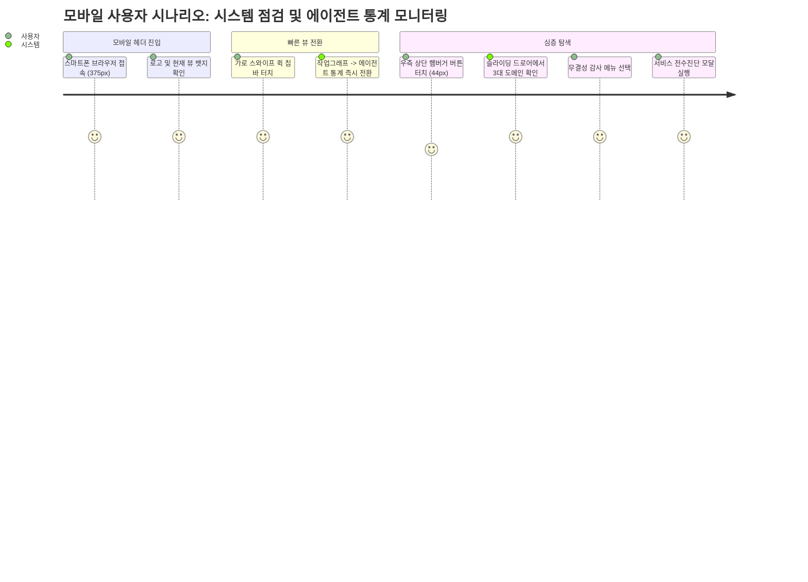

# 06-01. 모바일 반응형 UI/UX 및 표준 오브젝트 기획서

## 📋 편집 이력 (Revision History)

| 버전 | 개정일자 | 개정자 | 작업 구분 | 주요 개정 내용 |
| :--- | :--- | :--- | :--- | :--- |
| v1.0 | 2026-09-21 | gemini | 최초 제정 | 모바일 8대 뷰 사용자 여정, 5대 표준 오브젝트 UI 명세서 및 인터랙션 시나리오 |

---

## 🎯 1. 기획 배경 및 목표

엔지니어와 운영자가 모바일 단말기(스마트폰, 태블릿)에서도 이동 중에 대용량 스캔 PDF 교정 상태, 에이전트 하네스 작업 진행 상황 및 100점 무결성 감사 상태를 안정적으로 모니터링하고 제어할 수 있도록 최적화된 모바일 반응형 인터페이스를 기획합니다.

---

## 📱 2. 사용자 여정 시나리오 (User Journey)

---

## 🎨 3. 5대 표준 오브젝트 UI 기획 명세

### [OBJ-01] GlobalNavbar (글로벌 네비게이션)
- **데스크톱**:
  - 3대 도메인 탭: `[하네스 거버넌스]`, `[추적 및 지식창고]`, `[PDF 스튜디오]`
  - 서브 칩 바: 활성 도메인 소속 뷰 목록 (`activeView` 하이라이트)
  - 우측: 실시간 DB 상태 알약 뱃지, `[서비스 정밀점검]` 4단계 진단 버튼
- **모바일**:
  - 상단 56px 바: 로고, 현재 활성 뷰 뱃지, 햄버거 버튼(44px)
  - 퀵 칩 바: 8대 뷰 가로 스크롤 칩 (좌우 여백 12px, 패딩 10px)
  - 드로어: 우측 288px 오프캔버스 드로어, 딤 배경 터치 시 닫힘

### [OBJ-02] CardPanel (반응형 카드 패널)
- 모바일: `p-4 rounded-xl border border-slate-800 bg-slate-900/80`
- 데스크톱: `p-6 rounded-xl border border-slate-800 bg-slate-900/80`
- 내부 자식 블록: `rounded-lg`

### [OBJ-03] StandardButton (표준 액션 버튼)
- 모바일: `min-h-[44px] min-w-[44px] px-4 py-2.5 text-xs font-semibold rounded-lg`
- 버튼 텍스트 단일 라인(`whitespace-nowrap`) 고정

### [OBJ-04] StatusBadgePill (상태 알약 뱃지)
- `h-6 px-2.5 text-xs rounded-full whitespace-nowrap inline-flex items-center gap-1.5`
- 상태별 색상 (정상: Emerald, 주의: Amber, 위험: Rose, 중립: Slate)

### [OBJ-05] ScrollWrapper (반응형 가로스크롤 래퍼)
- `w-full overflow-x-auto -webkit-overflow-scrolling-touch touch-pan-x`
- 테이블 내부 셀 넘침 방어 및 터치 스와이프 부드러운 가속 지원
