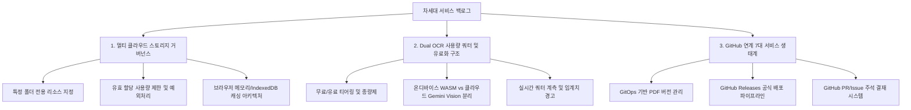
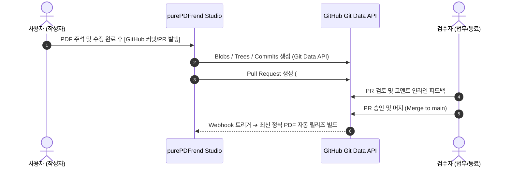

# [06-04] 차세대 서비스 백로그 기획서: 멀티 클라우드 리소스 거버넌스, OCR 과금/사용량 제한 및 GitHub 연계 서비스

> **문서 번호**: `06-04`  
> **프로젝트**: purePDFrend (Dual OCR & Smart PDF Studio)  
> **작성 일자**: 2026-09-29  
> **상태**: 백로그 등록 및 기획 검토 (Backlog Defined)  
> **우선순위**: 차기 스프린트 로드맵 반영  
> **관련 문서**: `docs/06.기획/06-01_모바일반응형_UIUX_오브젝트_표준기획서.md`, `docs/06.기획/06-02_에이전트_사용량_거버넌스_및_쿼터관리_기획서.md`

---

## 📌 1. 백로그 개요 및 추진 배경

본 문서는 사용자의 요구사항과 화면 UI 우선 검토 원칙에 따라, 즉시 복잡한 백엔드 로직으로 진입하지 않고 기획적 타당성과 아키텍처를 사전에 엄밀히 정의하는 3대 차세대 핵심 서비스 백로그입니다.

---

## 🗄️ 2. [백로그-01] 멀티 클라우드 스토리지 리소스 거버넌스

### 2.1. 기획 배경 및 요구사항
- 사용자가 연결한 다중 클라우드 스토리지(Google Drive, Dropbox, OneDrive, AWS S3 등)를 무제한으로 방만하게 동기화하지 않고, 순수 PDF 렌더링 및 뷰어 작업에 필요한 리소스로 한정하여 안전하고 빠른 성능을 보장합니다.
- **프로필 레이어 UI 통합 표시 원칙**:
  - 개별 클라우드별 복잡한 상태를 개별 나열하지 않고 통합 합산 계획량/사용량으로 요약 노출.
  - 레이어 오픈 시 로딩 프로그레스 바로 비동기 조회 후 일정 시간(기본 5분) 로컬 캐시값 유지.
  - 상세 설정 및 용량 배정은 `PG-USR-09`(환경설정 > 스토리지) 전용 화면 링크를 통해 처리.

### 2.2. 세부 명세 및 기능 요구사항

| 기능 항목 | 요구 명세 | 처리 정책 및 예외 상황 |
| :--- | :--- | :--- |
| **전용 리소스 폴더 지정** | 각 클라우드 루트가 아닌 특정 지정 폴더만 탐색 (예: `/MyDrive/purePDFrend_Resources/`) | 지정 폴더 외부 파일에 대한 접근 권한 요청 배제, 권한 최소화(Principle of Least Privilege) |
| **사용량 한도 (Quota Limit)** | 사용자 설정에 따라 클라우드별 허용 최대 용량 지정 (예: Google Drive 5GB, Dropbox 2GB) | 합산 계획량(122GB 등) 기준으로 표시하되, 실제 클라우드 가용량과의 오차를 명시하는 참고치 안내 문구 표기 |
| **초과 방지 및 예외처리** | 허용량의 90% 이상 도달 시 경고 배지 노출, 100% 도달 시 신규 PDF 저장 및 캐시 생성 차단 | `STORAGE_QUOTA_EXCEEDED` 에러 코드 반환 및 UI 알림, 로컬 임시 저장소로 자동 우회 안내 |
| **성능 최적화 캐시 파이프라인** | 클라우드 파일 매번 원격 다운로드 방지 | **작업 중 1차**: 브라우저 인메모리 ArrayBuffer 캐시 **2차**: IndexedDB / CacheStorage 로컬 지속성 캐시 **3차**: 백그라운드 Web Worker 비동기 청크 다운로드 |

---

## 🔍 3. [백로그-02] Dual OCR 사용량 제한 및 유료화/과금 구조

### 3.1. 기획 배경
- purePDFrend는 고속의 로컬 Tesseract.js(온디바이스 WASM)와 초고정밀 Google Gemini Vision API(서버/클라우드)의 듀얼 OCR 엔진을 탑재하고 있습니다.
- 클라우드 API 호출에 따른 인프라 비용을 제어하고, 일반 사용자와 전문가/기업 사용자를 구분하는 지속 가능한 과금 모델(Monetization)을 수립합니다.

### 3.2. 티어별 쿼터 및 유료화 모델 설계안

| 티어 (Tier) | 월 이용료 | 기본 OCR (Tesseract.js WASM) | 프리미엄 OCR (Gemini Vision API) | 저장 공간 및 부가 혜택 |
| :--- | :--- | :--- | :--- | :--- |
| **Free (기본)** | 무료 | **무제한 (로컬 CPU/GPU)** | 일일 **50회** 무료 제공 | 5GB 리소스 폴더, 워터마크 없음 |
| **Pro (개인전문가)** | 9,900원/월 | **무제한 (멀티스레드)** | 월 **1,500회** (추가 시 10원/회 종량) | 50GB 통합 스토리지, 표 인식 CSV 추출 |
| **Enterprise (기업)** | 문의/구독 | **무제한 (전용 워커)** | 월 **10,000회+** (SLA 보장, 커스텀 모델) | 무제한 스토리지, 전용 감사 로그, SSO |

### 3.3. 시스템 예외처리 및 UX 방어 정책
1. **일일 쿼터 소진 시**:
   - 에러 모달 노출 대신 온디바이스 Tesseract WASM 모드로 자동 무중단 폴백(Graceful Fallback).
   - "오늘의 무료 Gemini Vision 50회가 모두 소진되어 온디바이스 Tesseract 엔진으로 연속 처리됩니다." 안내.
2. **비식별화 마스킹 사전 검사**:
   - 클라우드 Vision API 전송 전 주민번호/카드번호 등 민감정보 로컬 자동 마스킹 후 전송(보안 정책 03-09 준수).

---

## 🐙 4. [백로그-03] GitHub 연계 7대 서비스 생태계

### 4.1. 기획 배경
- 엔지니어, 법무 검토관, 학술 연구원 등 고신뢰 문서 작업을 수행하는 사용자층을 위해, GitHub의 GitOps 버전 관리 체계 및 개발자 API를 PDF 문서 워크플로우에 결합합니다.

### 4.2. 7대 세부 서비스 아이디어 및 백로그 명세

1. **[SVC-GH-01] GitOps 기반 PDF 버전 관리 및 Git LFS 연동**:
   - Git Database API(`/git/blobs`, `/git/trees`, `/git/commits`)를 통해 PDF 문서의 버전 히스토리(v1.0, v1.1 등)를 원격 레포에 투명하게 커밋/푸시.
   - 대용량 PDF 바이너리는 Git LFS(Large File Storage) 포인터로 분리하여 저장소 경량화.
2. **[SVC-GH-02] GitHub Releases 기반 공식 문서 배포 자동화**:
   - 승인된 최종 PDF(원본/주석본/보안본)를 GitHub Releases의 정식 릴리즈 에셋으로 자동 첨부 및 퍼머링크 발급.
3. **[SVC-GH-03] GitHub Issues & PR 연동 PDF 주석 검수/승인 파이프라인**:
   - 문서 뷰어의 특정 주석 및 하이라이트 영역을 GitHub Issue 또는 PR 코멘트와 양방향 동기화.
   - 코드 리뷰처럼 PDF 문서를 2인 이상 상호 결재 후 최종 머지.
4. **[SVC-GH-04] 대용량 검색 가능 PDF 생성을 위한 CI/CD 자동화 (GitHub Actions)**:
   - 클라이언트 부담을 줄이기 위해 스캔 PDF 업로드 시 GitHub Actions 워크플로우가 클라우드 러너에서 고해상도 OCR 및 텍스트 레이어 삽입 후 산출물 환류.
5. **[SVC-GH-05] GitHub Gist 연동 1-클릭 스니펫/주석 공유**:
   - 문서 내 발췌 텍스트, OCR 추출 표(Markdown/CSV), 주석 XFDF 데이터를 GitHub Gist로 단 1초 만에 비밀/공개 공유.
6. **[SVC-GH-06] GitHub Pages & purePDFrend 정적 뷰어 호스팅**:
   - 포트폴리오, 공개 백서, 표준 규격서를 별도 서버 없이 GitHub Pages를 통해 purePDFrend 뷰어 임베드 형태로 전 세계 무료 배포.
7. **[SVC-GH-07] GitHub App 및 Webhook 기반 실시간 동기화**:
   - 문서 레포지토리 변경 시 purePDFrend 웹훅 수신 ➔ 대시보드 라이브러리 자동 갱신.

---

## 📅 5. 향후 일정 및 로드맵 연계

1. **Phase 1 (현재 진행)**:
   - 프로필 레이어 통합 클라우드 UI 및 50:50 분할 퀵설정 위치편집 UX 정밀 검증.
   - 문서 카드 긴 제목 가로 슬라이드 인터랙션 완성.
2. **Phase 2 (차기 스프린트)**:
   - `PG-USR-09` 스토리지 관리 화면 내 클라우드별 폴더 지정 및 용량 임계치 슬라이더 UI 프로토타이핑.
   - Dual OCR 일일 사용량 게이지 및 Free/Pro 전환 팝업 디자인.
3. **Phase 3 (확장 스프린트)**:
   - GitHub Git Data API 연동 및 백로그 항목 우선순위화 구현.
